<p align="center">
  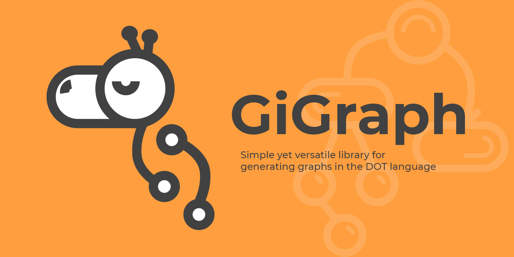
</p>

------

**GiGraph DOT** is a solution for generating graphs in the <a href="https://en.wikipedia.org/wiki/DOT_(graph_description_language)" target="_blank">DOT language</a>. The output generated by this library is a textual script that can be visualized and/or converted to an image with the help of external tools. A handy one is for instance a plugin for <a href="https://code.visualstudio.com" target="_blank">Visual Studio Code</a>, named <a href="https://marketplace.visualstudio.com/items?itemName=EFanZh.graphviz-preview" target="_blank">Graphviz Preview</a> (you will need to install <a href="https://www.graphviz.org/download" target="_blank">Graphviz</a> as well). There are also online tools like <a href="http://www.webgraphviz.com" target="_blank">WebGraphviz</a>, where you can paste the generated script to view your graph.

For the complete documentation of the DOT language, and the visualization capabilities of the available software, please go to <a href="https://graphviz.gitlab.io/documentation" target="_blank">Graphviz - Graph Vizualization Software</a>.

###### Built with [.NET Standard 2.0](https://docs.microsoft.com/en-US/dotnet/standard/net-standard#net-implementation-support) (compatible with *.NET Core 2.0* and above, *.NET Framework 4.6.1* and above).

###### Available on NuGet: [](https://www.nuget.org/packages/GiGraph.Dot/)


# Generating a graph

For a basic case, create a new **DotGraph** instance, and just add an edge to its *Edges* collection, or a node to its *Nodes* collection. To generate the output DOT script, call the ***Build*** extension method on the graph.

Here's a simple *Hello World!* graph example with two nodes joined by an edge.

```c#
using GiGraph.Dot.Entities.Graphs;
using GiGraph.Dot.Extensions; // Build(), SaveToFile()
using System;

namespace GiGraph.Examples
{
    internal class Program
    {
        private static void Main(string[] args)
        {
            // create a new graph (directed or undirected)
            var graph = new DotGraph(isDirected: true);
            
            // add an edge that joins the two specified nodes
            // (you don't have to add the nodes to the node collection of the graph
            // unless you need to specify some attributes for them)
            graph.Edges.Add("Hello", "World!");

            // write it to console as string
            Console.WriteLine(graph.Build());
            
            // or save it to a file (.gv and .dot are the default extensions)
            graph.SaveToFile("example.gv");
        }
    }
}
```

Here's what you get on the console and in the file:

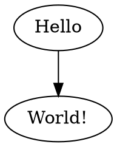

Here's how the script is visualized:

<p align="center">
  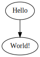
</p>
And here's an example of an undirected version of the same graph:

```c#
var graph = new DotGraph(isDirected: false);
```

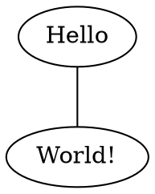

<p align="center">
  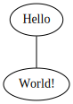
</p>


## Customizing styles

Graph nodes and edges can by styled globally, locally, and individually.

- To set their attributes globally, for the whole graph, use *NodeDefaults* and *EdgeDefaults* on the graph instance.
- To set them locally, for a group of nodes and edges, use a subgraph or a cluster, and set above properties on the subgraph/cluster instance (see the [subgraph](#subgraph) and the [cluster](#cluster) sections to learn when to use which).
- To set them individually, use the *Attributes* property on the edge and/or node instances directly.

Apart from those, the graph itself, and a cluster, also have their own collections of attributes that you can set. These are for instance background color, style, label, etc.

The example below presents how individual elements can be styled. At the beginning, the global node shape is set to rectangular, and the style to filled, so that their fill color can be set. The example nodes have set a plain color fill, a striped/wedged fill (with custom stripe/wedge proportions), a gradient fill, or a two-color fill with proportions. Edges, on the other hand, have the 'vee' shape set globally, and custom styles set individually: plain color, multicolor series or splines, and a dotted style.


<p align="center">
  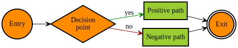
</p>


*In the example, groups of elements are embedded in subgraphs only to control the order they are visualized (for clarity). In one case, a subgraph is used as an example of setting style locally, for a group of elements.*


```c#
using System;
using System.Drawing;
using GiGraph.Dot.Entities.Attributes.Enums;
using GiGraph.Dot.Entities.Graphs;
using GiGraph.Dot.Entities.Types.Colors;
using GiGraph.Dot.Extensions; // Build(), SaveToFile()

namespace GiGraph.Examples
{
    internal class Program
    {
        private static void Main(string[] args)
        {
            var graph = new DotGraph(isDirected: true);

            // set left to right layout direction of the graph using graph attributes
            graph.Attributes.LayoutDirection = DotRankDirection.LeftToRight;

            // set the defaults for all nodes of the graph
            graph.NodeDefaults.Shape = DotShape.Rectangle;
            graph.NodeDefaults.Style = DotStyle.Filled;
            graph.NodeDefaults.FillColor = DotColorDefinition.From(Color.Turquoise, Color.RoyalBlue);

            // set the defaults for all edges of the graph
            graph.EdgeDefaults.ArrowHead
                = graph.EdgeDefaults.ArrowTail
                    = DotArrowType.Vee;


            // -- (subgraphs are used here only to control the order in which elements are visualized) --

            graph.Subgraphs.Add(sg =>
            {
                // a dotted edge
                sg.Edges.Add("G", "H", attrs =>
                {
                    attrs.Label = "dotted";
                    attrs.Style = DotStyle.Dotted;
                });
            });

            graph.Subgraphs.Add(sg =>
            {
                // edges rendered as parallel splines
                sg.Edges.Add("E", "F", attrs =>
                {
                    attrs.Label = "parallel splines";
                    attrs.ArrowDirection = DotArrowDirection.Both;

                    // this will render two parallel splines (but more of them can be added by adding further colors)
                    attrs.Color = DotColorDefinition.From(Color.Turquoise, Color.RoyalBlue);
                });
            });

            graph.Subgraphs.Add(sg =>
            {
                // nodes with a two-color fill; fill proportions specified by the weight parameter
                sg.Nodes.Add("C").Attributes.FillColor = DotColorDefinition.From(Color.RoyalBlue, Color.Turquoise, weight2: 0.25);
                sg.Nodes.Add("D").Attributes.FillColor = DotColorDefinition.From(Color.Navy, Color.RoyalBlue, weight1: 0.25);

                sg.Edges.Add("C", "D", attrs =>
                {
                    attrs.Label = "multicolor series";
                    attrs.ArrowDirection = DotArrowDirection.Both;

                    // this will render a multicolor edge, where each color may optionally have a proportion specified by the weight parameter
                    attrs.Color = DotColorDefinition.From(
                        new DotWeightedColor(Color.Turquoise, 0.33),
                        new DotWeightedColor(Color.Gray, 0.33),
                        Color.Navy);
                });
            });

            graph.Subgraphs.Add(sg =>
            {
                // a rectangular node with a striped fill
                sg.Nodes.Add("Striped", attrs =>
                {
                    // set style to striped
                    attrs.Style = DotStyle.Filled | DotStyle.Striped;

                    attrs.Color = Color.Transparent;

                    // set the colors of individual stripes and their proportions
                    attrs.FillColor = DotColorDefinition.From(
                        new DotWeightedColor(Color.Navy, 0.1),
                        Color.RoyalBlue,
                        Color.Turquoise,
                        Color.Orange);
                });

                // a circular node with a wedged fill
                sg.Nodes.Add("Wedged", attrs =>
                {
                    attrs.Shape = DotShape.Circle;

                    // set wedged style
                    attrs.Style = DotStyle.Filled | DotStyle.Wedged;

                    attrs.Color = Color.Transparent;

                    // set the colors of individual wedges and their proportions
                    attrs.FillColor = DotColorDefinition.From(
                        Color.Orange,
                        Color.RoyalBlue,
                        new DotWeightedColor(Color.Navy, 0.1),
                        Color.Turquoise);
                });

                sg.Edges.Add("Striped", "Wedged");
            });

            // a subgraph example – to override the default attributes for a group of nodes and/or edges
            graph.Subgraphs.Add(sg =>
            {
                sg.NodeDefaults.Color = Color.RoyalBlue;
                sg.NodeDefaults.FillColor = Color.Orange;
                sg.NodeDefaults.Shape = DotShape.Circle;

                sg.EdgeDefaults.Color = Color.RoyalBlue;

                sg.Edges.Add("A", "B").Attributes.Label = "plain color";
            });
            
            // build a graph as string
            Console.WriteLine(graph.Build());

            // or save it to a file (.gv and .dot are the default extensions)
            graph.SaveToFile(@"example.gv");
        }
    }
}
```

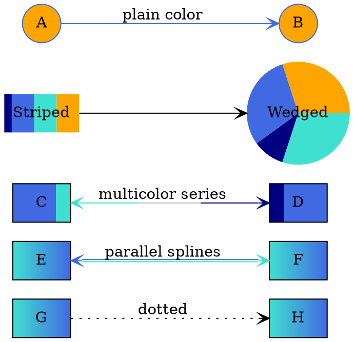


## Grouping nodes visually

In order to group nodes visually by displaying them in a rectangle, embed them in a [cluster](#cluster). Below is an example where two clusters are used to group several nodes.

<p align="center">
  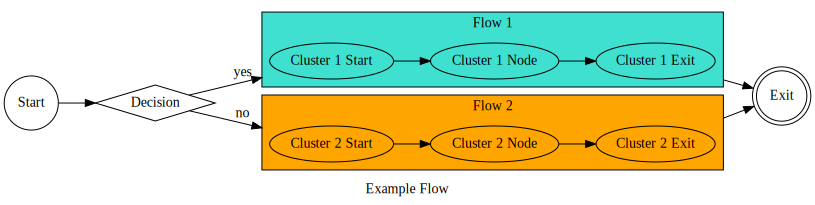
</p>

And here's the code to generate it:

```c#
using System;
using System.Drawing;
using GiGraph.Dot.Entities.Attributes.Enums;
using GiGraph.Dot.Entities.Graphs;
using GiGraph.Dot.Extensions; // Build(), SaveToFile()

namespace GiGraph.Examples
{
    internal class Program
    {
        private static void Main(string[] args)
        {
            var graph = new DotGraph(isDirected: true);

            // set graph attributes
            graph.Attributes.Label = "Example Flow";
            graph.Attributes.LayoutDirection = DotRankDirection.LeftToRight;
            graph.Attributes.Compound = true;

            // set individual node styles
            graph.Nodes.Add("Start").Attributes.Shape = DotShape.Circle;
            graph.Nodes.Add("Decision").Attributes.Shape = DotShape.Diamond;
            graph.Nodes.Add("Exit").Attributes.Shape = DotShape.DoubleCircle;


            // --- define edges ---

            graph.Edges.Add("Start", "Decision");

            // (!) Note that CROSS-DIAGRAM EDGES SHOULD BE DEFINED IN THE COMMON PARENT LEVEL GRAPH/SUBGRAPH
            // (which is the root graph in this case)
            graph.Edges.Add("Decision", "Cluster 1 Start", attrs =>
            {
                attrs.Label = "yes";

                // attach the arrow to cluster border
                attrs.LogicalHead = "Flow 1";
            });

            graph.Edges.Add("Decision", "Cluster 2 Start", attrs =>
            {
                attrs.Label = "no";

                // attach the arrow to cluster border
                attrs.LogicalHead = "Flow 2";
            });

            graph.Edges.Add("Cluster 1 Exit", "Exit").Attributes.LogicalTail = "Flow 1";
            graph.Edges.Add("Cluster 2 Exit", "Exit").Attributes.LogicalTail = "Flow 2";


            // --- add clusters ---

            // (!) Note that even though clusters do not require an identifier, when you don't specify it
            // for multiple of them, or specify the same identifier for multiple clusters,
            // they will be treated as one cluster when visualized.

            graph.Clusters.Add(id: "Flow 1", cluster =>
            {
                cluster.Attributes.BackgroundColor = Color.Turquoise;
                cluster.Attributes.Label = "Flow 1";

                cluster.Edges.AddSequence("Cluster 1 Start", "Cluster 1 Node", "Cluster 1 Exit");
            });

            graph.Clusters.Add(id: "Flow 2", cluster =>
            {
                cluster.Attributes.Label = "Flow 2";
                cluster.Attributes.BackgroundColor = Color.Orange;

                cluster.Edges.AddSequence("Cluster 2 Start", "Cluster 2 Node", "Cluster 2 Exit");
            });


            // build a graph as string
            Console.WriteLine(graph.Build());

            // or save it to a file (.gv and .dot are the default extensions)
            graph.SaveToFile("example.gv");
        }
    }
}
```

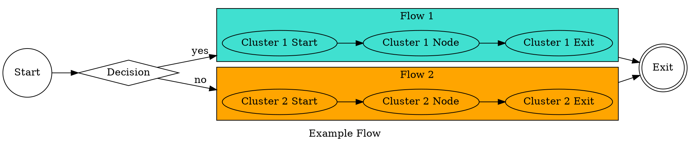


## Customizing node layout

In order to customize the layout of certain groups of nodes, and/or to [change the style](#customizing-styles) of a group of nodes and/or edges, you can use [subgraphs](#subgraph).

Consider the following graph with no layout customizations applied:

<p align="center">
  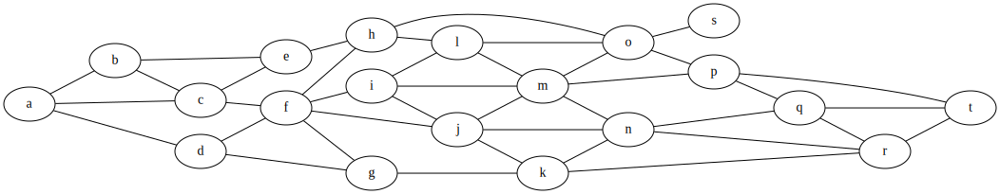
</p>


By using subgraphs with a **rank attribute**, you can change the way individual node groups are visualized:

<p align="center">
  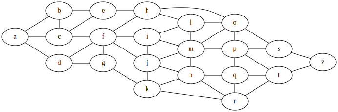
</p>

The nodes embedded in subgraphs with a rank *DotRank.Same* are visualized in the same rows. The nodes *p* and *t* in the subgraph with a rank *DotRank.Max* are pushed together towards a border. The groups are vertical in these examples because the graph layout direction is left-to-right. When you change it to the default top-to-bottom setting, the groups will be oriented horizontally.

The second example above is generated by the following code. When you remove the lines of code where subgraphs are added, you will get the layout from the first example above.

```c#
using System;
using GiGraph.Dot.Entities.Attributes.Enums;
using GiGraph.Dot.Entities.Graphs;
using GiGraph.Dot.Extensions; // Build(), SaveToFile()

namespace GiGraph.Examples
{
    internal class Program
    {
        private static void Main(string[] args)
        {
            var graph = new DotGraph(isDirected: false);

            // see also how this attribute affects the layout of the nodes
            graph.Attributes.LayoutDirection = DotRankDirection.LeftToRight;

            graph.Edges.Add("e", "h");
            graph.Edges.Add("g", "k");
            graph.Edges.Add("r", "t");

            graph.Edges.AddOneToMany("a", "b", "c", "d");
            graph.Edges.AddOneToMany("b", "c", "e");
            graph.Edges.AddOneToMany("c", "e", "f");
            graph.Edges.AddOneToMany("d", "f", "g");
            graph.Edges.AddOneToMany("f", "h", "i", "j", "g");
            graph.Edges.AddOneToMany("h", "o", "l");
            graph.Edges.AddOneToMany("i", "l", "m", "j");
            graph.Edges.AddOneToMany("j", "m", "n", "k");
            graph.Edges.AddOneToMany("k", "n", "r");
            graph.Edges.AddOneToMany("l", "o", "m");
            graph.Edges.AddOneToMany("m", "o", "p", "n");
            graph.Edges.AddOneToMany("n", "q", "r");
            graph.Edges.AddOneToMany("o", "s", "p");
            graph.Edges.AddOneToMany("p", "t", "q");
            graph.Edges.AddOneToMany("q", "t", "r");

            // add subgraphs to control the layout of individual node groups
            // (when you remove these lines, you will get the first visualization example)
            graph.Subgraphs.Add(DotRank.Same, "b", "c", "d");
            graph.Subgraphs.Add(DotRank.Same, "e", "f", "g");
            graph.Subgraphs.Add(DotRank.Same, "h", "i", "j", "k");
            graph.Subgraphs.Add(DotRank.Same, "l", "m", "n");
            graph.Subgraphs.Add(DotRank.Same, "q", "r");
            graph.Subgraphs.Add(DotRank.Max, "o", "s", "p");


            // write it to console as string
            Console.WriteLine(graph.Build());

            // or save it to a file (.gv and .dot are the default extensions)
            graph.SaveToFile("example.gv");
        }
    }
}
```

And here's the complete DOT output with subgraphs:

```DOT
graph
{
    rankdir = LR

    {
        rank = same

        b
        c
        d
    }

    {
        rank = same

        e
        f
        g
    }

    {
        rank = same

        h
        i
        j
        k
    }

    {
        rank = same

        l
        m
        n
    }

    {
        rank = same

        q
        r
    }

    {
        rank = max

        o
        s
        p
    }

    e -- h
    g -- k
    r -- t
    a -- { b c d }
    b -- { c e }
    c -- { e f }
    d -- { f g }
    f -- { h i j g }
    h -- { o l }
    i -- { l m j }
    j -- { m n k }
    k -- { n r }
    l -- { o m }
    m -- { o p n }
    n -- { q r }
    o -- { s p }
    p -- { t q }
    q -- { t r }
}
```


# Graph building blocks

There are five basic types that are the building blocks of a graph in this library:

- **DotGraph** – the *root* graph,
- **DotNode** – a node (vertex) of the graph,
- **DotEdge** – an edge that joins two nodes (endpoints),
- **DotSubgraph** – a subgraph that groups nodes together *logically* and allows you to control their layout against other nodes in the graph; may also be used as a collection of nodes to be used as edge endpoints.
- **DotCluster** – a special type of subgraph that groups nodes together *visually* by placing them inside a rectangle.


Auxiliary types:

- **DotNodeGroup** – a group of nodes that share a common list of attributes. Useful when you want to set attributes for multiple nodes at once. It is rendered as a single DOT script statement—a list of nodes followed by a list of attributes if specified.
- **DotEdge<*TTail*, *THead*>** – a custom edge (or a group of edges), where *TTail* and *THead* can either be a single node (**DotEndpoint**) or multiple nodes of a subgraph (**DotEndpointGroup**).
- **DotEdgeSequence** – a sequence of edges composed of **DotEndpoint** and/or **DotEndpointGroup** instances. Used to join consecutive nodes and/or groups of nodes with one another. All edges in the sequence share a common list of attributes, and are rendered as a single DOT script statement with a list of nodes and/or subgraphs joined by edges, and followed by a list of attributes if specified.
- **DotOneToManyEdgeGroup** – a group of edges that join a single node with nodes of a subgraph (it is actually a descendant of **DotEdge<DotEndpoint, DotEndpointGroup>**).
- **DotManyToOneEdgeGroup** – a group of edges that join nodes of a subgraph with a single node (it is actually a descendant of **DotEdge<DotEndpointGroup, DotEndpoint>**).
- **DotManyToManyEdgeGroup** – a group of edges that join nodes of a subgraph with nodes of another subgraph (it is actually a descendant of **DotEdge<DotEndpointGroup, DotEndpointGroup>**).


There are also attributes based on the type of the value they specify for a given key. There are quite a lot of them, but just to mention a few basic ones:

- **DotStringAttribute** – a string value attribute,

- **DotShapeAttribute** – a shape attribute (node shape),

- **DotColorAttribute** – a color attribute,

- **DotBoolAttribute** – a boolean attribute.


## Graph

Graph is represented by the **DotGraph** class which is the root graph that the output DOT script is based on. There are two types of graphs:

- **directed** (the edges are presented as arrows),
- **undirected** (the edges are presented as lines).

```c#
var graph = new DotGraph(isDirected: false);
```

A graph may also be *strict*. Strict graph forbids the creation of multi-edges. For example, there may be at most one edge with a given tail node and head node in the directed case.

```c#
var graph = new DotGraph(isStrict: true);
```


Graph has its own attributes, which you can set by using its *Attributes* property.

```c#
graph.Attributes.LayoutDirection = DotRankDirection.LeftToRight;
graph.Attributes.BackgroundColor = Color.LightGray;
```


### Default attributes

A graph, a subgraph, and a cluster may have node and edge defaults specified. When you set them, they affect all nodes and/or edges encompassed by the graph, subgraph, or cluster respectively. They can be overridden by attributes set on individual graph elements.

```c#
graph.NodeDefaults.Color = Color.Yellow;
```

```c#
graph.EdgeDefaults.Color = Color.Red;
```


## Subgraph

A subgraph, represented by the **DotSubgraph** class, is a collection of nodes constrained with a rank attribute, that determines their layout. Use a subgraph when you want to have more granular control on the **layout** of specific groups of nodes, and/or the **style** of specific groups of nodes and edges.

**Subgraph does not have any border or fill**, as opposed to cluster subgraph, represented by the **DotCluster** class, which supports them.

As mentioned, subgraph supports setting a common style of nodes and edges within it, as well as the layout of the nodes. The layout may be adjusted by using the **rank attribute**. To see an example how it works, jump to the [customizing node layout](#customizing-node-layout) section.

There are several ways you can add a subgraph to a graph, and the code below presents some of them.

```c#
// add a subgraph with any number of nodes
graph.Subgraphs.Add(DotRank.Same, "a", "b", "c");

// you can also create a new instance, and initialize it manually
var subgraph = new DotSubgraph(DotRank.Same);
subgraph.Nodes.Add("d", "e", "f");

// or use a factory method to add nodes more easily
subgraph = DotSubgraph.FromNodes(DotRank.Same, "d", "e", "f");

// style settings are accepted as well for the elements inside
subgraph.NodeDefaults.Shape = DotShape.Box;

graph.Subgraphs.Add(subgraph);
```

A subgraph may also be used as a group of endpoints to facilitate adding multiple edges at once. For details refer to [edge groups](#edge-group) and [edge sequences](#edge-sequence).


## Cluster

A cluster is represented by the **DotCluster** class. It is a special type of subgraph whose appearance can be customized (as opposed to the subgraph represented by the **DotSubgraph** class). If supported, the layout engine used to render a cluster subgraph, will do the layout so that the nodes belonging to the cluster are drawn together, with the entire drawing of the cluster contained within a bounding rectangle. 

*Note that cluster subgraphs are not part of the DOT language, but solely a syntactic convention adhered to by certain of the layout engines.*

Cluster subgraphs do not support setting custom node layout the way normal subgraphs do, but they do support setting common style of nodes and edges within them.

There are several ways you can add a cluster to a graph, and the code below presents some of them.

```c#
// add a cluster with any number of nodes
graph.Clusters.Add("My cluster 1", "a", "b", "c");

// you can also create a new instance, and initialize it manually
var cluster = new DotCluster("My cluster 2");
cluster.Nodes.Add("d", "e", "f");

// or use a factory method to add nodes more easily
cluster = DotCluster.FromNodes("My cluster 2", "e", "d", "f");

// style settings are accepted as well for the elements inside
cluster.NodeDefaults.Shape = DotShape.Box;

graph.Clusters.Add(cluster);
```


## Node

Nodes are distinguished by their **identifiers**. The identifiers are used by edges to refer to a head and a tail node (endpoint) that they join. If you don't specify a **label** attribute for a node, the identifier will also be used as a label by default, when the node is visualized.

```c#
// add the node to the nodes collection of the graph (or subgraph/cluster)
graph.Nodes.Add("MyNodeId1", attrs =>
{
    attrs.Label = "Hello World!";
    attrs.Shape = DotShape.Hexagon;
});
```

The code above is equivalent to:

```c#
var node = new DotNode("MyNodeId1");
node.Attributes.Label = "Hello World!";
node.Attributes.Shape = DotShape.Hexagon;

graph.Nodes.Add(node);
```


### Node group

When adding nodes to a graph, subgraph or cluster, you can use a node group that has a single list of attributes for all the nodes within it. You can do it in a couple of ways, and one of them is an overload of the *Add* method, that accepts multiple node identifiers.

```c#
graph.Nodes.Add
(
    attrs =>
    {
        attrs.Color = Color.Red;
        attrs.Shape = DotShape.Hexagon;
    },
    "MyNodeId1", "MyNodeId2", "MyNodeId3"
);
```

You can also do it this way:

```c#
var nodeGroup = new DotNodeGroup("MyNodeId1", "MyNodeId2", "MyNodeId3");
nodeGroup.Attributes.Color = Color.Red;
nodeGroup.Attributes.Shape = DotShape.Hexagon;

graph.Nodes.Add(nodeGroup);
```

Note that there is also an ***AddRange*** method available on the node collection, and it differs from the mentioned *Add* overload in that it adds multiple nodes with individual lists of attributes for each.


Have in mind that **a node does not necessarily have to be added to the nodes collection** of the graph, subgraph or cluster if you are not going to set its attributes or its layout. As long as it is not an isolated node, which means that any edge uses it as an endpoint, it will be visualized.


## Edge

Edges **join two nodes**: a tail node and a head node (this naming convention is used in the library even though a graph may be undirected, in which case these terms are not relevant). Edges refer to nodes by their identifiers (note that the nodes do not necessarily have to exist in the nodes collection of a graph, subgraph or cluster).

Edges support customizing which side of the node (and/or cell, when record nodes are used) the head and/or tail of the edge is attached to.

```c#
// add an edge that joins MyNode1 with MyNode2
var edge = graph.Edges.Add("MyNode1", "MyNode2", attrs =>
{
    attrs.Label = "Foo";
    attrs.Color = Color.Blue;
});

// the tail of the edge will be attached to the top of the node
edge.Tail.CompassPoint = DotCompassPoint.North;

// the head of the edge will be attached to the bottom of the node
edge.Head.CompassPoint = DotCompassPoint.South;
```

You can also manually instantiate an edge with endpoints, and add it to the collection:

```c#
// create an edge that joins MyNode1 with MyNode2
var edge = new DotEdge("MyNode1", "MyNode2");

// and optionally set the compass points as in the previous example
edge.Tail.CompassPoint = DotCompassPoint.North;
edge.Head.CompassPoint = DotCompassPoint.South;

// or yet another way
edge = new DotEdge(
    new DotEndpoint("MyNodeId1", DotCompassPoint.North),
    new DotEndpoint("MyNodeId2", DotCompassPoint.South));

edge.Attributes.Label = "Foo";
edge.Attributes.Color = Color.Blue;

graph.Edges.Add(edge);

// or simply add the edge instance to the collection,
// and initialize the attributes with a lambda expression
graph.Edges.Add(edge, attrs =>
{
    attrs.Label = "Foo";
    attrs.Color = Color.Blue;
});
```


### Edge group

Edge groups join a single node with multiple nodes, multiple nodes with a single node, or multiple nodes with multiple nodes. The examples below present each of these use cases.

```c#
// join one node with multiple nodes
var edgeGroup = new DotOneToManyEdgeGroup("MyNode Src", "MyNode Dst 1", "MyNode Dst 2");

// or another way
edgeGroup = new DotOneToManyEdgeGroup(
    new DotEndpoint("MyNode Src"),
    new DotEndpointGroup("MyNode Dst 1", "MyNode Dst 2"));

graph.Edges.Add(edgeGroup);

// which is equivalent to
graph.Edges.AddOneToMany("MyNode Src", "MyNode Dst 1", "MyNode Dst 2");
```

```c#
// join multiple nodes with one node
var edgeGroup = new DotManyToOneEdgeGroup("MyNode Dst", "MyNode Src 1", "MyNode Src 2");

// or another way
edgeGroup = new DotManyToOneEdgeGroup(
    new DotEndpointGroup("MyNode Dst 1", "MyNode Dst 2"),
    new DotEndpoint("MyNode Src"));

graph.Edges.Add(edgeGroup);

// which is equivalent to
graph.Edges.AddManyToOne("MyNode Dst", "MyNode Src 1", "MyNode Src 2");
```

```c#
// join multiple nodes with multiple nodes
var edgeGroup = new DotManyToManyEdgeGroup(
    new DotEndpointGroup("MyNode Src 1", "MyNode Src 2"),
    new DotEndpointGroup("MyNode Dst 1", "MyNode Dst 2"));

graph.Edges.Add(edgeGroup);

// which is equivalent to
graph.Edges.AddManyToMany(
    new DotEndpointGroup("MyNode Src 1", "MyNode Src 2"),
    new DotEndpointGroup("MyNode Dst 1", "MyNode Dst 2"));
```


Each group used in the above examples supports attributes. You can set them either directly on a group instance, or by using a lambda expression passed by an argument of the *AddOneToMany*, *AddManyToOne*, *AddManyToMany* methods, on the *Edges* collection.


### Edge sequence

An edge sequence lets you join a sequence of consecutive nodes an/or node groups represented by subgraphs. The examples below present two use cases:

- when the sequence is composed of single nodes only (they will be joined with one another consecutively when visualized), 
- when the sequence is composed of a mix of single nodes and groups of nodes (subgraphs). 

```c#
// join a sequence of consecutive nodes
var edgeSequence = new DotEdgeSequence("MyNode1", "MyNode2", "MyNode3");
graph.Edges.Add(edgeSequence);

// or simply
graph.Edges.AddSequence("MyNode1", "MyNode2", "MyNode3");
```

```c#
// join a sequence of consecutive nodes and groups of nodes
var edgeSequence = new DotEdgeSequence(
    new DotEndpoint("MyNode1"),
    new DotEndpointGroup("MyNode2", "MyNode3", "MyNode4"),
    new DotEndpoint("MyNode5"));

graph.Edges.Add(edgeSequence);

// or simply
graph.Edges.AddSequence(
    new DotEndpoint("MyNode1"),
    new DotEndpointGroup("MyNode2", "MyNode3", "MyNode4"),
    new DotEndpoint("MyNode5"));
```


Sequences support attributes too. You can set them either directly on the attributes collection of a sequence instance, or by using a lambda expression passed by an argument of the *AddSequence* method on the *Edges* collection.


## Attribute

Every element of the graph, including the graph itself, may have **attributes**. These are for instance background color, style, node shape, arrow head shape and so on. An attribute is composed of a key and a value. The key is DOT language specific, and the value is dependent on the type of attribute (for example it may be a string, a boolean value, a node shape enumerable, etc.).

Every element supports only attributes that are specific to it. For example arrow head can be specified only for edges, shape can be specified only for nodes, etc. Some of them, on the other hand, are supported by multiple types of elements.

```c#
node.Attributes.Label = "My node label";
```

```c#
edge.Attributes.Label = "My edge label";
```

You can set attributes as shown above, by assigning a value to a property, or by adding an attribute instance to the collection. The latter approach may be useful when an attribute is not supported directly by the library. In such case, however, you have to know what key to use, and what value format is valid for it ([see documentation](https://www.graphviz.org/doc/info/attrs.html)).

```c#
// this is equivalent to setting the Label property on the attributes collection
var attribute = new DotStringAttribute("label", "My node label");
node.Attributes.Set(attribute);

// you can achieve the same without creating an instance explicitly
node.Attributes.Set("label", "My node label");
```

In such case consider also the **DotCustomAttribute** class. What is specific about it is that its value is rendered in the output DOT script directly, with **no special character escaping** (which is not the case for the above mentioned **DotStringAttribute**). Therefore, it should be used with care, and the value should always follow the DOT syntax rules. Otherwise the visualization tool you use may be unable to parse it. In most cases, hower, you won't need either of these, and if any, **DotStringAttribute** will most probably be the right choice.

```c#
var attribute = new DotCustomAttribute("fillcolor", "yellow:blue");
node.Attributes.Set(attribute);

// or without creating an instance explicitly
node.Attributes.SetCustom("fillcolor", "yellow:blue");
```


# Custom output formatting

The DOT generation engine supports setting some custom preferences for generating the output. These include **syntax preferences**, and **formatting preferences**. 


## Formatting preferences

Formatting preferences can be modified using the **DotFormattingOptions** class. If you want to change the indentation level, the indentation character, set a custom line break character/sequence, or generate the output as a single line, pass a customized formatting options instance to the **Build** or **SaveToFile** method on a graph instance.

```c#
...
using GiGraph.Dot.Output.Options;

...

var options = new DotFormattingOptions()
{
    SingleLineOutput = true
};

Console.WriteLine(graph.Build(options));

graph.SaveToFile("example.gv", options);
```

The hello world example from the [earlier chapter](#generating-a-graph) of the text, would render like this:


## Syntax preferences

Syntax preferences, on the other hand, can be modified using the **DotGenerationOptions** class. You can, for example, force statement delimiters (*;*) at the end of lines, or require identifiers to be quoted, even when it is not required.

```c#
...
using GiGraph.Dot.Output.Options;

...

var options = DotGenerationOptions.Custom(o =>
{
    o.PreferQuotedIdentifiers = true;
    o.PreferStatementDelimiter = true;

    o.Attributes.PreferQuotedValue = true;
});

Console.WriteLine(graph.Build(generationOptions: options));

graph.SaveToFile("example.gv", generationOptions: options);
```

An example graph output based on the code above would be: 

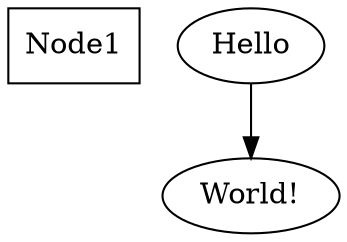

And the same graph output without any custom preferences specified would be:


### Sorting elements of the DOT script

Using mentioned **DotGenerationOptions** and its *OrderElements* property you can enable sorting elements of the output script alphabetically. This comes in handy when the graph is built based on input elements the order of which changes each time you generate the graph. Sometimes you need to compare the output to its other versions, and in such cases you want to see only the actual differences, not the lines that only moved from one place of the file to another, without actually changing. When you enable this setting, all attribute lists, the lists of edges, nodes, subgraphs, and clusters, will always be ordered alphabetically. This way you should get more consistent outputs on every build.

*Have in mind, however, that even though this feature does not affect the structure of the graph, it may affect the locations of some elements when the graph is visualized—but most probably it doesn't matter in the described case.*

