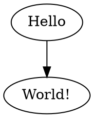
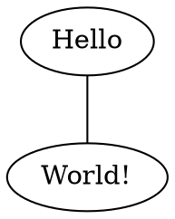
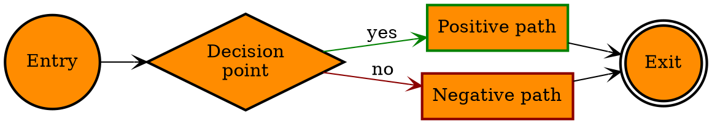
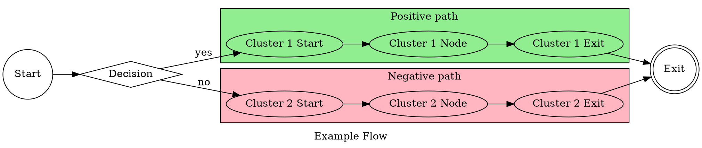
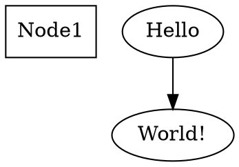

<p align="center">
  
</p>

------

**GiGraph DOT** is a solution for generating graphs in the <a href="https://en.wikipedia.org/wiki/DOT_(graph_description_language)" target="_blank">DOT language</a>. The output generated by this library is a textual script that can be visualized and/or converted to an image with the help of external tools. A handy one is a plugin for <a href="https://code.visualstudio.com" target="_blank">Visual Studio Code</a>, named <a href="https://marketplace.visualstudio.com/items?itemName=EFanZh.graphviz-preview" target="_blank">Graphviz Preview</a> (you will need to install <a href="https://www.graphviz.org/download" target="_blank">Graphviz</a> as well). There are also online tools like <a href="http://www.webgraphviz.com" target="_blank">WebGraphviz</a>, where you can paste the generated script to view your graph.

For the complete documentation of the DOT language, and the visualization capabilities of the available software, please go to <a href="https://graphviz.gitlab.io/documentation" target="_blank">Graphviz - Graph Vizualization Software</a>.

###### Built with [.NET Standard 2.0](https://docs.microsoft.com/en-US/dotnet/standard/net-standard#net-implementation-support) (compatible with *.NET Core 2.0* and above, *.NET Framework 4.6.1* and above).

###### Available on NuGet: [](https://www.nuget.org/packages/GiGraph.Dot/)


# Generating a graph

Create a new **DotGraph** instance, and add some edges to its *Edges* collection. To generate the output graph script, call the ***Build*** extension method on the graph instance as follows. Here's a simple *Hello World!* graph example with two nodes joined by an edge.

```c#
using GiGraph.Dot.Entities.Graphs;
using GiGraph.Dot.Extensions; // Build(), SaveToFile()
using System;

namespace GiGraph.Examples
{
    internal class Program
    {
        private static void Main(string[] args)
        {
            // create a new graph (directed or undirected)
            var graph = new DotGraph(isDirected: true);
            
            // add an edge that joins the two specified nodes
            // (you don't have to add the nodes to the node collection of the graph
            // unless you need to specify some attributes for them)
            graph.Edges.Add("Hello", "World!");

            // write it to console as string
            Console.WriteLine(graph.Build());
            
            // or save it to a file (.gv and .dot are the default extensions)
            graph.SaveToFile(@"C:\MyGraphs\example.gv");
            
            Console.Read();
        }
    }
}
```


Here's what you get on the console, and in the file:




Here's how the script is visualized:

<p align="center">
  
</p>


And here's an example of an undirected version of the same graph:

```c#
var graph = new DotGraph(isDirected: false);
```



<p align="center">
  
</p>


## Customizing style

Graph nodes and edges can by styled globally, locally, and individually.

- To set their attributes globally, for the whole graph, use *NodeDefaults* and *EdgeDefaults* on the graph instance.
- To set them locally, for a group of nodes and edges, use a subgraph or a cluster, and set above properties on the subgraph/cluster instance (see the examples below to learn about the difference between a [subgraph](#subgraph) and a [cluster](#cluster).
- To set them individually for edges and nodes, use the *Attributes* property on the edge/node instances directly.

```c#
using GiGraph.Dot.Entities.Attributes.Enums;
using GiGraph.Dot.Entities.Graphs;
using GiGraph.Dot.Extensions; // Build(), SaveToFile()
using System;
using System.Drawing;

namespace GiGraph.Examples
{
    internal class Program
    {
        private static void Main(string[] args)
        {
            var graph = new DotGraph(isDirected: true);

            // set left to right layout direction of the graph using graph attributes
            graph.Attributes.LayoutDirection = DotRankDirection.LeftToRight;


            // set the defaults for all nodes of the graph
            graph.NodeDefaults.Shape = DotShape.Rectangle;
            graph.NodeDefaults.Style = DotStyle.Filled | DotStyle.Bold;
            graph.NodeDefaults.FillColor = Color.DarkOrange;

            // set the defaults for all edges of the graph
            graph.EdgeDefaults.ArrowHead = DotArrowType.Vee;


            // -- add nodes --

            // the Add method returns the newly added node, so you can easily access its attributes
            graph.Nodes.Add("Entry").Attributes.Shape = DotShape.Circle;

            // or you can set the attributes using a delegate
            graph.Nodes.Add("Decision", attrs =>
            {
                attrs.Shape = DotShape.Diamond;
                attrs.Label = $"Decision{Environment.NewLine}point";
            });

            graph.Nodes.Add("Option1", attrs =>
            {
                attrs.Color = Color.Green;
                attrs.Label = "Positive path";
            });

            graph.Nodes.Add("Option2", attrs =>
            {
                attrs.Color = Color.DarkRed;
                attrs.Label = "Negative path";
            });

            graph.Nodes.Add("Exit").Attributes.Shape = DotShape.DoubleCircle;


            // -- add edges --

            // join the nodes by edges
            graph.Edges.Add("Entry", "Decision");

            // you can set custom attributes for the added edge the same way you can do it for nodes
            graph.Edges.Add("Decision", "Option1", attrs =>
            {
                attrs.Color = Color.Green;
                attrs.Label = "yes";
            });

            graph.Edges.Add("Decision", "Option2", attrs =>
            {
                attrs.Color = Color.DarkRed;
                attrs.Label = "no";
            });

            // this is a shorthand for adding two edges at once, that join multiple nodes with one node
            graph.Edges.AddManyToOne("Exit", "Option1", "Option2");


            // build a graph as string
            var graphString = graph.Build();
            Console.WriteLine(graphString);

            // or save it to a file (.gv and .dot are the default extensions)
            graph.SaveToFile(@"C:\MyGraphs\example.gv");

            Console.ReadLine();
        }
    }
}
```



<p align="center">
  
</p>


## Grouping nodes visually

In order to group nodes visually by displaying them in a rectangle, embed them in a [cluster](#cluster).

```c#
using GiGraph.Dot.Entities.Attributes.Enums;
using GiGraph.Dot.Entities.Graphs;
using GiGraph.Dot.Extensions; // Build(), SaveToFile()
using System;
using System.Drawing;

namespace GiGraph.Examples
{
    internal class Program
    {
        private static void Main(string[] args)
        {
            var graph = new DotGraph(isDirected: true);

            // set graph attributes
            graph.Attributes.Label = "Example Flow";
            graph.Attributes.LayoutDirection = DotRankDirection.LeftToRight;

            // set individual node styles
            graph.Nodes.Add("Start").Attributes.Shape = DotShape.Circle;
            graph.Nodes.Add("Decision").Attributes.Shape = DotShape.Diamond;
            graph.Nodes.Add("Exit").Attributes.Shape = DotShape.DoubleCircle;


            // --- define edges ---

            graph.Edges.Add("Start", "Decision");

            // (!) Note that CROSS-DIAGRAM EDGES SHOULD BE DEFINED IN THE COMMON PARENT LEVEL GRAPH/SUBGRAPH
            // (which is the root graph in this case)
            graph.Edges.Add("Decision", "Cluster 1 Start").Attributes.Label = "yes";
            graph.Edges.Add("Decision", "Cluster 2 Start").Attributes.Label = "no";

            graph.Edges.Add("Cluster 1 Exit", "Exit");
            graph.Edges.Add("Cluster 2 Exit", "Exit");


            // --- add clusters ---

            // (!) Note that even though clusters do not require an identifier, when you don't specify it
            // for multiple of them, or specify the same identifier for multiple clusters,
            // they will be treated as one cluster when visualized.

            graph.Clusters.Add(id: "Positive path", cluster =>
            {
                cluster.Attributes.BackgroundColor = Color.LightGreen;
                cluster.Attributes.Label = "Positive path";

                cluster.Edges.AddSequence("Cluster 1 Start", "Cluster 1 Node", "Cluster 1 Exit");
            });

            graph.Clusters.Add(id: "Negative path", cluster =>
            {
                cluster.Attributes.Label = "Negative path";
                cluster.Attributes.BackgroundColor = Color.LightPink;

                cluster.Edges.AddSequence("Cluster 2 Start", "Cluster 2 Node", "Cluster 2 Exit");
            });


            // build a graph as string
            var graphString = graph.Build();
            Console.WriteLine(graphString);

            // or save it to a file (.gv and .dot are the default extensions)
            graph.SaveToFile(@"C:\MyGraphs\example.gv");

            Console.ReadLine();
        }
    }
}
```



<p align="center">
  
</p>


## Customizing node layout

In order to customize the layout of certain node groups, and/or to change the style of a group of nodes and/or edges, you can use [subgraphs](#subgraph).

Consider the following graph with no layout settings applied:

<p align="center">
  
</p>


By using subgraphs with a **rank attribute** you can change the way individual node groups are visualized:

<p align="center">
  
</p>

The nodes embedded in subgraphs with a rank *DotRank.Same* are visualized in the same rows. The nodes *p* and *t* in the subgraph with a rank *DotRank.Max* are pushed together towards a border.


The second example is generated by the following code. When you remove the lines of code where subgraphs are added, you will get the layout from the first example above.

```c#
using GiGraph.Dot.Entities.Attributes.Enums;
using GiGraph.Dot.Entities.Graphs;
using GiGraph.Dot.Extensions; // Build(), SaveToFile()
using System;

namespace GiGraph.Examples
{
    internal class Program
    {
        private static void Main(string[] args)
        {
            var graph = new DotGraph(isDirected: false);

            // see also how this attribute affects the layout of the nodes
            graph.Attributes.LayoutDirection = DotRankDirection.LeftToRight;

            graph.Edges.Add("e", "h");
            graph.Edges.Add("g", "k");
            graph.Edges.Add("r", "t");

            graph.Edges.AddOneToMany("a", "b", "c", "d");
            graph.Edges.AddOneToMany("b", "c", "e");
            graph.Edges.AddOneToMany("c", "e", "f");
            graph.Edges.AddOneToMany("d", "f", "g");
            graph.Edges.AddOneToMany("f", "h", "i", "j", "g");
            graph.Edges.AddOneToMany("h", "o", "l");
            graph.Edges.AddOneToMany("i", "l", "m", "j");
            graph.Edges.AddOneToMany("j", "m", "n", "k");
            graph.Edges.AddOneToMany("k", "n", "r");
            graph.Edges.AddOneToMany("l", "o", "m");
            graph.Edges.AddOneToMany("m", "o", "p", "n");
            graph.Edges.AddOneToMany("n", "q", "r");
            graph.Edges.AddOneToMany("o", "s", "p");
            graph.Edges.AddOneToMany("p", "t", "q");
            graph.Edges.AddOneToMany("q", "t", "r");

            // add subgraphs to control the layout of individual node groups
            // (when you remove these lines, you will get the first visualization example)
            graph.Subgraphs.Add(DotRank.Same, "b", "c", "d");
            graph.Subgraphs.Add(DotRank.Same, "e", "f", "g");
            graph.Subgraphs.Add(DotRank.Same, "h", "i", "j", "k");
            graph.Subgraphs.Add(DotRank.Same, "l", "m", "n");
            graph.Subgraphs.Add(DotRank.Same, "q", "r");
            graph.Subgraphs.Add(DotRank.Max, "o", "s", "p");


            // write it to console as string
            Console.WriteLine(graph.Build());

            // or save it to a file (.gv and .dot are the default extensions)
            graph.SaveToFile(@"C:\MyGraphs\example.gv");

            Console.Read();
        }
    }
}
```

And here's the complete DOT output with subgraphs:

```DOT
graph
{
    rankdir = LR

    e -- h
    g -- k
    r -- t
    a -- { b c d }
    b -- { c e }
    c -- { e f }
    d -- { f g }
    f -- { h i j g }
    h -- { o l }
    i -- { l m j }
    j -- { m n k }
    k -- { n r }
    l -- { o m }
    m -- { o p n }
    n -- { q r }
    o -- { s p }
    p -- { t q }
    q -- { t r }

    {
        rank = same

        b, c, d
    }

    {
        rank = same

        e, f, g
    }

    {
        rank = same

        h, i, j, k
    }

    {
        rank = same

        l, m, n
    }

    {
        rank = same

        o, s, q, r
    }

    {
        rank = max

        p, t
    }
}
```


# Graph building blocks

There are five basic types that are the building blocks of a graph in this library:

- **DotGraph** - the *root* graph,
- **DotNode** - a node (vertex) of the graph,
- **DotEdge** - an edge that joins two nodes (endpoints),
- **DotSubgraph** - groups nodes together *logically* and allows you to control their layout against other nodes in the graph,
- **DotCluster** - a special type of subgraph that groups nodes together *visually* by placing them inside a rectangle.


Auxiliary types:

- **DotNodeGroup** - a group of nodes that share a common list of attributes. Useful when you want to set attributes for multiple nodes at once. This will render as a single DOT script statement with a list of nodes, and a list of attributes if specified.
- **DotEdge<*TTail*, *THead*>** - a custom edge (or a group of edges), where *TTail* and *THead* can either be a single node (**DotEndpoint**) or multiple nodes of a subgraph (**DotEndpointGroup**).
- **DotEdgeSequence** - a sequence of edges composed of **DotEndpoint** and/or **DotEndpointGroup** instances. Used to join consecutive nodes and/or groups of nodes with one another. All edges in the sequence share a common list of attributes, and will render as a single DOT script statement with a list of nodes and/or subgraphs joined by edges, and a list of attributes if specified.
- **DotOneToManyEdgeGroup** - a group of edges that join a single node with nodes of a subgraph (this is actually a descendant of **DotEdge<DotEndpoint, DotEndpointGroup>**).
- **DotManyToOneEdgeGroup** - a group of edges that join nodes of a subgraph with a single node (this is actually a descendant of **DotEdge<DotEndpointGroup, DotEndpoint>**).
- **DotManyToManyEdgeGroup** - a group of edges that join nodes of a subgraph with nodes of another subgraph (this is actually a descendant of **DotEdge<DotEndpointGroup, DotEndpointGroup>**).


There are also attributes based on the type of the value they specify for a key. There are quite a lot of them, but just to mention a few basic ones:

- DotStringAttribute - a string value attribute,

- DotShapeAttribute - a shape attribute (node shape),

- DotColorAttribute - a color attribute,

- DotBoolAttribute - a boolean attribute.

  

## Graph

Graph is represented by the **DotGraph** class, which is the root graph that the output DOT script is based on. There are two types of graphs:

- **directed** (the edges are presented as arrows),
- **undirected** (the edges are presented as lines).

```c#
var graph = new DotGraph(isDirected: false);
```


A graph may also be *strict*. Strict graph forbids the creation of multi-edges. For example, there may be at most one edge with a given tail node and head node in the directed case.

```c#
var graph = new DotGraph(isStrict: true);
```


Graph has its own attributes, which you can set by using the *Attributes* property.

```c#
graph.Attributes.LayoutDirection = DotRankDirection.LeftToRight;
graph.Attributes.BackgroundColor = Color.LightGray;
```


### Default attributes

A graph, a subgraph, and a cluster may have node and edge defaults specified. When you set them, they affect all nodes and/or edges encompassed by the graph, subgraph, or cluster.

```c#
graph.NodeDefaults.Color = Color.Yellow;
```

```c#
graph.EdgeDefaults.Color = Color.Red;
```


### Subgraph

A subgraph, represented by the **DotSubgraph** class, is a collection of nodes constrained with a rank attribute, that determines their layout. Use a subgraph when you want to have more granular control on the layout and style of specific nodes.

Subgraph does not have any border or fill, as opposed to cluster subgraph, represented by the **DotCluster** class, which supports them.

A subgraph supports setting common style of nodes and edges within it, as well as the layout of nodes (by the **rank attribute**).

```c#
// add a subgraph with any number of nodes
graph.Subgraphs.Add(DotRank.Same, "a", "b", "c");

// you can also create a new instance, and initialize it manually
var subgraph = new DotSubgraph(DotRank.Same);
subgraph.Nodes.Add("d", "e", "f");

// or use a factory method to add nodes more easily
subgraph = DotSubgraph.FromNodes(DotRank.Same, "d", "e", "f");

subgraph.NodeDefaults.Shape = DotShape.Box;
graph.Subgraphs.Add(subgraph);
```


### Cluster

A cluster is represented by the **DotCluster** class. It is a special type of subgraph whose appearance can be customized (as opposed to the subgraph represented by the **DotSubgraph** class). If supported, the layout engine used to render a cluster subgraph, will do the layout so that the nodes belonging to the cluster are drawn together, with the entire drawing of the cluster contained within a bounding rectangle. 

*Note that cluster subgraphs are not part of the DOT language, but solely a syntactic convention adhered to by certain of the layout engines.*

Cluster subgraphs do not support setting custom node layout the way normal subgraphs do, but they do support setting common style of nodes and edges within them.

```c#
// add a cluster with any number of nodes
graph.Clusters.Add("My cluster 1", "a", "b", "c");

// you can also create a new instance, and initialize it manually
var cluster = new DotCluster("My cluster 2");
cluster.Nodes.Add("d", "e", "f");

// or use a factory method to add nodes more easily
cluster = DotCluster.FromNodes("My cluster 2", "e", "d", "f");

cluster.NodeDefaults.Shape = DotShape.Box;
graph.Clusters.Add(cluster);
```


## Node

Nodes are distinguished by their **identifiers**. The identifiers are used by edges to refer to a head and a tail node that they join. If you don't specify a **label** attribute for a node, the identifier will also be used as a label when the node is visualized.

```c#
// add the node to the nodes collection of the graph (or subgraph/cluster)
graph.Nodes.Add("MyNodeId1", attrs =>
{
    attrs.Label = "Hello World!";
    attrs.Shape = DotShape.Hexagon;
});
```

The code above is equivalent to:

```c#
var node = new DotNode("MyNodeId1");
node.Attributes.Label = "Hello World!";
node.Attributes.Shape = DotShape.Hexagon;

graph.Nodes.Add(node);
```


You can also use a node group, that shares a common list of attributes:

```c#
graph.Nodes.Add
(
    attrs =>
    {
        attrs.Color = Color.Red;
        attrs.Shape = DotShape.Hexagon;
    },
    "MyNodeId1", "MyNodeId2", "MyNodeId3"
);
```

Which is equivalent to:

```c#
var nodeGroup = new DotNodeGroup("MyNodeId1", "MyNodeId2", "MyNodeId3");
nodeGroup.Attributes.Color = Color.Red;
nodeGroup.Attributes.Shape = DotShape.Hexagon;

graph.Nodes.Add(nodeGroup);
```


*Note that **a node does not necessarily have to be added to the nodes collection** of the graph or subgraph when it is referenced by an edge in the collection of edges (as long as there is no need to specify any attributes for the node, for example).*


## Edge

Edges **join two nodes** by referring to their identifiers. They support customizing which side and/or cell (when records are used) of the node the head and tail of the edge is attached to.

```c#
var edge = graph.Edges.Add("MyNodeId1", "MyNodeId2", attrs =>
{
    attrs.Label = "Foo";
    attrs.Color = Color.Blue;
});

// the tail of the edge will be attached to the top of the node
edge.Tail.CompassPoint = DotCompassPoint.North;

// the head of the edge will be attached to the bottom of the node
edge.Head.CompassPoint = DotCompassPoint.South;
```


You can also manually instantiate an edge with endpoints, and add it to the collection:

```c#
var edge = new DotEdge("MyNodeId1", "MyNodeId2");
edge.Tail.CompassPoint = DotCompassPoint.North;
edge.Head.CompassPoint = DotCompassPoint.South;

// or another way
edge = new DotEdge(
    new DotEndpoint("MyNodeId1", DotCompassPoint.North),
    new DotEndpoint("MyNodeId2", DotCompassPoint.South));

edge.Attributes.Label = "Foo";
edge.Attributes.Color = Color.Blue;

graph.Edges.Add(edge);

// or simply
graph.Edges.Add(edge, attrs =>
{
    attrs.Label = "Foo";
    attrs.Color = Color.Blue;
});
```


### Edge group

Edge groups join a single node with multiple nodes, or multiple nodes with multiple nodes.

```c#
// join one node with multiple nodes
var edgeGroup = new DotOneToManyEdgeGroup("MyNode Src", "MyNode Dst 1", "MyNode Dst 2");

// or another way
edgeGroup = new DotOneToManyEdgeGroup(
    new DotEndpoint("MyNode Src"),
    new DotEndpointGroup("MyNode Dst 1", "MyNode Dst 2"));

graph.Edges.Add(edgeGroup);

// which is equivalent to
graph.Edges.AddOneToMany("MyNode Src", "MyNode Dst 1", "MyNode Dst 2");
```

```c#
// join multiple nodes with one node
var edgeGroup = new DotManyToOneEdgeGroup("MyNode Dst", "MyNode Src 1", "MyNode Src 2");

// or another way
edgeGroup = new DotManyToOneEdgeGroup(
    new DotEndpointGroup("MyNode Dst 1", "MyNode Dst 2"),
    new DotEndpoint("MyNode Src"));

graph.Edges.Add(edgeGroup);

// which is equivalent to
graph.Edges.AddManyToOne("MyNode Dst", "MyNode Src 1", "MyNode Src 2");
```

```c#
// join multiple nodes with multiple nodes
var edgeGroup = new DotManyToManyEdgeGroup(
    new DotEndpointGroup("MyNode Src 1", "MyNode Src 2"),
    new DotEndpointGroup("MyNode Dst 1", "MyNode Dst 2"));

graph.Edges.Add(edgeGroup);

// which is equivalent to
graph.Edges.AddManyToMany(
    new DotEndpointGroup("MyNode Src 1", "MyNode Src 2"),
    new DotEndpointGroup("MyNode Dst 1", "MyNode Dst 2"));
```


Each group used in the above examples supports attributes. You can set them either directly on a group instance, or by using a delegate passed by an argument of the *AddOneToMany*, *AddManyToOne*, *AddManyToMany* methods on the *Edges* collection.


### Edge sequence

An edge sequence lets you join a sequence of consecutive nodes an/or node groups represented by subgraphs.

```c#
// join a sequence of consecutive nodes
var edgeSequence = new DotEdgeSequence("MyNodeId1", "MyNodeId2", "MyNodeId3");
graph.Edges.Add(edgeSequence);

// or simply
graph.Edges.AddSequence("MyNodeId1", "MyNodeId2", "MyNodeId3");
```

```c#
// join a sequence of consecutive nodes and groups of nodes
var edgeSequence = new DotEdgeSequence(
    new DotEndpoint("MyNodeId1"),
    new DotEndpointGroup("MyNodeId2", "MyNodeId3", "MyNodeId4"),
    new DotEndpoint("MyNodeId5"));

graph.Edges.Add(edgeSequence);

// or simply
graph.Edges.AddSequence(
    new DotEndpoint("MyNodeId1"),
    new DotEndpointGroup("MyNodeId2", "MyNodeId3", "MyNodeId4"),
    new DotEndpoint("MyNodeId5"));
```


Sequences support attributes too. You can set them either directly on a sequence instance, or by using a delegate passed by an argument of the *AddSequence* method on the *Edges* collection.


## Attribute

Every element of the graph, including the graph itself, may have **attributes**. These are for instance background color, style, node shape, arrow head shape and so on. An attribute is composed of a key and a value. The key is DOT language specific, and the value is dependent on the type of attribute (for example it may be a string, a boolean value, a node shape enumerable, etc.).

Every element supports only attributes that are specific to it. For example arrow head can be specified only for edges, shape can be specified only for nodes, etc. Some of them, on the other hand, are shared between different types of elements.

```c#
node.Attributes.Label = "My node label";
```

```c#
edge.Attributes.Label = "My edge label";
```


It is also possible to create a new attribute instance, and add it to the collection. This is useful when an attribute is not supported directly by the library, and recommended only in such cases.

```c#
var attribute = new DotStringAttribute("label", "My node label");
node.Attributes.Set(attribute);

// or still with specifying the key, but without creating an instance explicitly
node.Attributes.Set("label", "My node label");
```


In case there is a **complex attribute** that you want to set manually in a way accepted by a DOT script visualization tool, use a **DotCustomAttribute**. What is specific about it is that its value is rendered in the output script directly, with no special character escaping. Therefore, it should be used with care, and the value should always follow the DOT syntax rules. Otherwise the visualization tool you use may be unable to parse it.

```c#
var attribute = new DotCustomAttribute("myattrkey", "myattrvalue");
node.Attributes.Set(attribute);

// or still with specifying the key, but without creating an instance explicitly
node.Attributes.SetCustom("myattrkey", "myattrvalue");
```


# Custom output formatting

The DOT generation engine supports setting some custom preferences for generating the output. These include syntax preferences, and formatting preferences. 

## Formatting preferences

Formatting preferences can be modified using the **DotFormattingOptions** class. If you want to change the indentation level, the indentation character, set a custom line break character/sequence, or generate the output as a single line, pass a customized formatting options instance to the **Build** or **SaveToFile** method on a graph instance.

```c#
...
using GiGraph.Dot.Writers.Options;

...

var formatting = new DotFormattingOptions()
{
    SingleLineOutput = true
};

Console.WriteLine( graph.Build(formatting) );

graph.SaveToFile( @"C:\MyGraphs\hello-world.gv", formatting );
```

The hello world example from the earlier chapter of the text would render like this:


## Syntax preferences

Syntax preferences, on the other hand, can be modified using the **DotGenerationOptions** class. You can, for example, force statement delimiters (*;*) at the end of lines, or require identifiers to be quoted, even when it is not required.

```c#
...
using GiGraph.Dot.Generators.Options;

...

var options = DotGenerationOptions.Custom(o =>
{
    o.PreferQuotedIdentifiers = true;
    o.PreferStatementDelimiter = true;

    o.Attributes.PreferQuotedValue = true;
});

Console.WriteLine( graph.Build(generationOptions: options) );

graph.SaveToFile( @"C:\MyGraphs\example.gv", generationOptions: options );
```

An example graph output based on the code above: 



And the same graph output with the default preferences:


### Sorting elements of the DOT script

Using mentioned **DotGenerationOptions**, and its *OrderElements* property, you can also enable sorting elements of the output script alphabetically. This comes in handy when the graph is built based on some input elements the order of which changes each time you generate the graph. Sometimes you need to compare the output to its other versions, and in such cases you want to see only actual differences, not the lines that only moved from one place of the file to another, without actually changing. When you enable this setting, all attribute lists, the lists of edges, nodes, and subgraphs/clusters, will always be ordered alphabetically. This way you should get more consistent outputs on every build.

Have in mind, however, that even though this feature does not affect the structure of the graph, it may affect the locations of some elements when the graph is visualized, but in the described scenario this will probably be of no importance.
