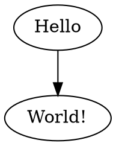
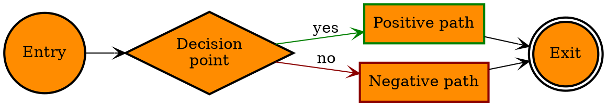
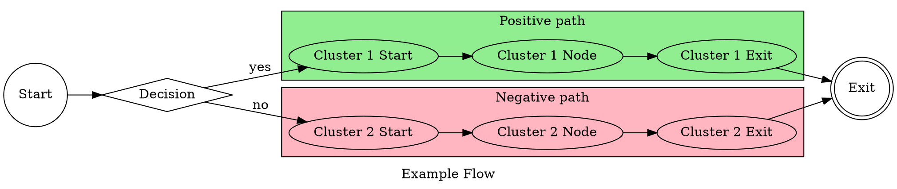
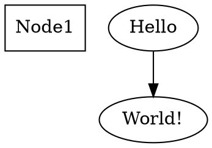

# GiGraph

<p align="center">
  
</p>

------

A simple solution for generating graphs in the <a href="https://en.wikipedia.org/wiki/DOT_(graph_description_language)" target="_blank">DOT language</a>. The output generated by this library is a textual script that can be visualized and/or converted to an image with the help of external tools. A handy one is a plugin for <a href="https://code.visualstudio.com" target="_blank">Visual Studio Code</a>, named <a href="https://marketplace.visualstudio.com/items?itemName=EFanZh.graphviz-preview" target="_blank">Graphviz Preview</a> (you will need to install <a href="https://www.graphviz.org/download" target="_blank">Graphviz</a> as well). There are also online tools like <a href="http://www.webgraphviz.com" target="_blank">WebGraphviz</a>, where you can paste the generated script to view your graph.


###### Built with [.NET Standard 2.0](https://docs.microsoft.com/en-US/dotnet/standard/net-standard#net-implementation-support) (compatible with *.NET Core 2.0* and above, *.NET Framework 4.6.1* and above).

###### Available on NuGet: [](https://www.nuget.org/packages/GiGraph.Dot/)


# Intro

### Building blocks

There are three basic types that are the building blocks of a graph:

- **DotGraph** - the *root* graph itself,
- **DotNode** - a node of the graph,
- **DotEdge** - an edge that connects two nodes (or more, when subgraphs are used).

In some cases **subgraphs** come in handy, and there are two types of them:

- **DotSubgraph** - groups nodes together *logically* and allows you to control their layout against other nodes in the graph,
- **DotCluster** - a special type of subgraph that groups nodes together *visually* by placing them inside a rectangle.


### Attributes

Each individual element described above may have **attributes**, like background color, style, node shape, arrow head shape and so on. You don't have to specify them, however, and if you don't, the visualizing tool will use its own style defaults for rendering them.

```c#
myElement.Attributes.Label = "This is a label";
```


### Default attributes

The root graph and the subgraphs allow you to set **global defaults** for all nodes and/or edges within them, so that you don't have to set them individually for every element they contain.

```c#
myGraph.NodeDefaults.Color = Color.Yellow;
```

```c#
myGraph.EdgeDefaults.Color = Color.Red;
```


## Graph

Graphs contains nodes (vertices) and edges, and may optionally have some attributes set, that determine their style, layout etc.


There are two types of graphs:

- **directed** (the edges are presented as arrows),
- **undirected** (the edges are presented as lines).

```c#
myGraph.IsDirected = true;
```


When you want to forbid creating multi-edges, use the *IsStrict* property. In strict graphs there can be at most one edge with a given tail node and head node in the directed case.

```c#
myGraph.IsStrict = true;
```


## Node

Nodes are distinguished by their **identifiers**. The identifiers are used by edges to refer to a head and a tail node that they connect. If you don't specify a **label** attribute for a node, the identifier will also be used as a label when visualized.

```c#
myGraph.Nodes.Add("MyNodeId1", node =>
{
    node.Attributes.Label = "Hello World!";
    node.Attributes.Shape = DotShape.Hexagon;
});
```


*Note that **a node does not necessarily have to be added to the nodes collection** of the graph or subgraph when it is referenced by an edge in the collection of edges (as long as there is no need to specify any attributes for the node, for example).*


## Edge

Edges **connect two nodes** by referring to their identifiers. Edges may also **connect two subgraphs** or **a single node with a subgraph** (or the other way round). In both these cases such connection is interpreted as a many-to-many or a one-to-many connection respectively, between the nodes within the subgraphs or between the single node, and the nodes in the subgraph.

```c#
myGraph.Edges.Add("MyNodeId1", "MyNodeId2");
```


# Generating a graph

To generate a graph script, just call the ***Build*** extension method on a graph instance as follows:

```c#
using GiGraph.Dot.Entities.Graphs;
using GiGraph.Dot.Extensions; // Build(), SaveToFile()
using System;

namespace GiGraph.Examples
{
    internal class Program
    {
        private static void Main(string[] args)
        {
            var graph = new DotGraph(isDirected: true);
            
            // add an edge that connects the two specified nodes
            // (you don't have to add the nodes to the node collection of the graph
            // unless you need to specify some attributes for them)
            graph.Edges.Add("Hello", "World!");

            // write it to console as string
            Console.WriteLine( graph.Build() );
            
            // or save it to a file (.gv and .dot are the default extensions)
            graph.SaveToFile( @"C:\MyGraphs\hello-world.gv" );
            
            Console.Read();
        }
    }
}
```


Here's what you get on the console and in the file:




And when visualized, it looks like this:

<p align="center">
  
</p>


# Examples


## Defaults attributes example

This example shows the usage of default attributes of nodes and edges. When they are specified, there is no need to set them for individual elements, unless you want to override some of them. Both these scenarios are covered by the example.

```c#
using GiGraph.Dot.Entities.Attributes.Enums;
using GiGraph.Dot.Entities.Graphs;
using GiGraph.Dot.Extensions; // Build(), SaveToFile()
using System;
using System.Drawing;

namespace GiGraph.Examples
{
    internal class Program
    {
        private static void Main(string[] args)
        {
            var graph = new DotGraph(isDirected: true);

            // set left to right layout direction of the graph
            graph.Attributes.LayoutDirection = DotRankDirection.LeftToRight;


            // set the defaults for all nodes
            graph.NodeDefaults.Shape = DotShape.Rectangle;
            graph.NodeDefaults.Style = DotStyle.Filled | DotStyle.Bold;
            graph.NodeDefaults.FillColor = Color.DarkOrange;

            // set the defaults for all edges
            graph.EdgeDefaults.ArrowHead = DotArrowType.Vee;


            // -- add some nodes --

            graph.Nodes.Add("Entry").Attributes.Shape = DotShape.Circle;

            graph.Nodes.Add("Decision", attrs =>
            {
                attrs.Shape = DotShape.Diamond;
                attrs.Label = $"Decision{Environment.NewLine}point";
            });

            graph.Nodes.Add("Option1", attrs =>
            {
                attrs.Color = Color.Green;
                attrs.Label = "Positive path";
            });

            graph.Nodes.Add("Option2", attrs =>
            {
                attrs.Color = Color.DarkRed;
                attrs.Label = "Negative path";
            });

            graph.Nodes.Add("Exit").Attributes.Shape = DotShape.DoubleCircle;


            // join the nodes with edges
            graph.Edges.Add("Entry", "Decision");

            graph.Edges.Add("Decision", "Option1", attrs =>
            {
                attrs.Color = Color.Green;
                attrs.Label = "yes";
            });

            graph.Edges.Add("Decision", "Option2", attrs =>
            {
                attrs.Color = Color.DarkRed;
                attrs.Label = "no";
            });

            graph.Edges.AddManyToOne("Exit", "Option1", "Option2");


            // build a graph as string
            var graphString = graph.Build();
            Console.WriteLine(graphString);

            // or save it to a file (.gv and .dot are the default extensions)
            graph.SaveToFile(@"C:\MyGraphs\defaults-example.gv");

            Console.ReadLine();
        }
    }
}
```



<p align="center">
  
</p>


------


## Clusters example

A cluster subgraph represented by the **DotCluster** class is a special type of subgraph whose appearance can be customized (as opposed to a normal subgraph, represented by the **DotSubgraph** class). If supported, the layout engine used to render it, will do the layout so that the nodes belonging to the cluster are drawn together, with the entire drawing of the cluster contained within a bounding rectangle. 

*Note that cluster subgraphs are not part of the DOT language, but solely a syntactic convention adhered to by certain of the layout engines.*

Cluster subgraphs do not support setting custom node layout the way normal subgraphs do, but they do support setting common style of nodes and edges within it.

```c#
using GiGraph.Dot.Entities.Attributes.Enums;
using GiGraph.Dot.Entities.Graphs;
using GiGraph.Dot.Extensions; // Build(), SaveToFile()
using System;
using System.Drawing;

namespace GiGraph.Examples
{
    internal class Program
    {
        private static void Main(string[] args)
        {
            var graph = new DotGraph(isDirected: true);

            graph.Attributes.Label = "Example Flow";
            graph.Attributes.LayoutDirection = DotRankDirection.LeftToRight;

            graph.Nodes.Add("Start").Attributes.Shape = DotShape.Circle;
            graph.Nodes.Add("Decision").Attributes.Shape = DotShape.Diamond;
            graph.Nodes.Add("Exit").Attributes.Shape = DotShape.DoubleCircle;

            // --- define edges ---

            graph.Edges.Add("Start", "Decision");

            // (!) Note that CROSS-DIAGRAM EDGES SHOULD BE DEFINED IN THE COMMON PARENT LEVEL GRAPH/SUBGRAPH
            // (which is the root graph in this case)
            graph.Edges.Add("Decision", "Cluster 1 Start").Attributes.Label = "yes";
            graph.Edges.Add("Decision", "Cluster 2 Start").Attributes.Label = "no";

            graph.Edges.Add("Cluster 1 Exit", "Exit");
            graph.Edges.Add("Cluster 2 Exit", "Exit");


            // --- add clusters ---

            // (!) Note that clusters do not require an identifier, but when you don't specify it
            // for multiple of them, or specify the same identifier for multiple clusters,
            // they will be treated as one cluster when visualized.

            graph.Subgraphs.AddCluster(id: "Positive path", cluster =>
            {
                cluster.Attributes.BackgroundColor = Color.LightGreen;
                cluster.Attributes.Label = "Positive path";

                cluster.Edges.Add("Cluster 1 Start", "Cluster 1 Node", "Cluster 1 Exit");
            });

            graph.Subgraphs.AddCluster(id: "Negative path", cluster =>
            {
                cluster.Attributes.Label = "Negative path";
                cluster.Attributes.BackgroundColor = Color.LightPink;

                cluster.Edges.Add("Cluster 2 Start", "Cluster 2 Node", "Cluster 2 Exit");
            });

            // build a graph as string
            var graphString = graph.Build();
            Console.WriteLine(graphString);

            // or save it to a file (.gv and .dot are the default extensions)
            graph.SaveToFile(@"C:\MyGraphs\clusters-example.gv");

            Console.ReadLine();
        }
    }
}
```



<p align="center">
  
</p>


# Custom output formatting

The DOT generation engine supports setting some custom preferences for generating the output. These include syntax preferences, and formatting preferences. 

### Formatting preferences

Formatting preferences can be modified using the **DotFormattingOptions** class. If you want to change the indentation level or generate the output as a single line, pass a customized formatting options instance to the **Build** or **SaveToFile** method on a graph instance.

```c#
...
using GiGraph.Dot.Writers.Options;

var formatting = new DotFormattingOptions()
{
    SingleLineOutput = true
};

Console.WriteLine( graph.Build(formatting) );

graph.SaveToFile( @"C:\MyGraphs\hello-world.gv", formatting );
```


The hello world example from the earlier chapter of the text would render like this:


### Syntax preferences

Syntax preferences can be modified using the **DotFormattingOptions** class. You can for example force statement delimiters (*;*) at the end of lines or require identifiers to be quoted even when that is not required.

```c#
var options = DotGenerationOptions.Custom(o =>
{
    o.PreferQuotedIdentifiers = true;
    o.PreferStatementDelimiter = true;

    o.Attributes.PreferQuotedValue = true;
});

Console.WriteLine( graph.Build(generationOptions: options) );

graph.SaveToFile( @"C:\MyGraphs\example.gv", generationOptions: options);
```

An example graph output based on the code above: 



The same graph output with the default preferences:


