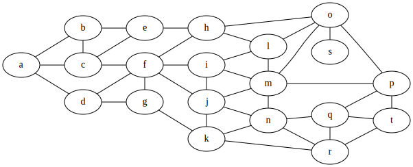

<p align="center">
  
</p>

------

**GiGraph DOT** is a solution for generating graphs in the <a href="https://en.wikipedia.org/wiki/DOT_(graph_description_language)" target="_blank">DOT language</a>. The output generated by this library is a textual script that may be visualized and/or converted to an image with the help of external tools. A handy one is for instance a plugin for <a href="https://code.visualstudio.com" target="_blank">Visual Studio Code</a>, named <a href="https://marketplace.visualstudio.com/items?itemName=EFanZh.graphviz-preview" target="_blank">Graphviz Preview</a> (you will need to install <a href="https://www.graphviz.org/download" target="_blank">Graphviz</a> as well). There are also online tools like <a href="http://www.webgraphviz.com" target="_blank">WebGraphviz</a>, where you may paste the generated script to view your graph.

For the complete documentation of the DOT language, and the visualization capabilities of the available software, please go to <a href="https://graphviz.gitlab.io/documentation" target="_blank">Graphviz - Graph Vizualization Software</a>.


**Built with** <a href="https://docs.microsoft.com/en-US/dotnet/standard/net-standard#net-implementation-support" target="_blank">.NET Standard 2.0</a> (compatible with *.NET Core 2.0* and above, *.NET Framework 4.6.1* and above).

**Available on NuGet**: [](https://www.nuget.org/packages/GiGraph.Dot/)


**Special thanks** to <a href="https://www.jetbrains.com/?from=GiGraphDot" target="_blank">JetBrains</a> for providing me free of charge with their fantastic Rider IDE and tools!


<p align="center">
  
</p>


**‼️ If you have any suggestions or comments, feel free to create an issue. ‼️**


# Generating a graph

For a basic case, create a new **DotGraph** instance, and use its *Edges* collection to define connections between nodes. In order to generate the output DOT script, call the ***Build*** extension method on the graph instance.

*There is also a node collection on the graph, but you don't have to add any nodes there unless they are isolated or unless you need to customize them.*

Here's a simple *Hello World!* graph example with two nodes joined by an edge.

```c#
using GiGraph.Dot.Entities.Graphs;
using GiGraph.Dot.Extensions; // Build(), SaveToFile()
using System;

namespace GiGraph.Dot.Examples
{
    internal class Program
    {
        private static void Main(string[] args)
        {
            // create a new graph (directed or undirected)
            var graph = new DotGraph(isDirected: true);
            
            // add an edge that joins the two specified nodes
            // (you don't have to add the nodes to the node collection of the graph
            // unless you need to specify some attributes for them)
            graph.Edges.Add("Hello", "World!");

            // write it to console as string
            Console.WriteLine(graph.Build());
            
            // or save it to a file (.gv and .dot are the default extensions)
            graph.SaveToFile("example.gv");
        }
    }
}
```

Here's what you get on the console and in the file:


Here's how the script is visualized:

<p align="center">
  
</p>
And here's an example of an undirected version of the same graph:

```c#
var graph = new DotGraph(isDirected: false);
```


<p align="center">
  
</p>


# Graph building blocks

There are five basic types that are the building blocks of a graph in this library:

- **DotGraph** – the *root* graph,
- **DotNode** – a node (vertex) of the graph,
- **DotEdge** – an edge that joins two nodes (endpoints),
- **DotSubgraph** – a subgraph that groups nodes together *logically* and allows you to control their layout against other nodes in the graph; may also be used as a collection of nodes to be used as multiple edge endpoints.
- **DotCluster** – a special type of subgraph that groups nodes together *visually* by placing them inside a rectangle.


Auxiliary types:

- **DotNodeGroup** – a group of nodes that share a common list of attributes. Useful when you want to set attributes for multiple nodes at once. It is rendered as a single DOT script statement—a list of nodes followed by a list of attributes if specified.
- **DotEdge<*TTail*, *THead*>** – a custom edge (or a group of edges), where *TTail* and *THead* may either be single nodes (**DotEndpoint**) or multiple nodes of a subgraph (**DotEndpointGroup**).
- **DotEdgeSequence** – a sequence of edges composed of **DotEndpoint** and/or **DotEndpointGroup** instances. Used to join consecutive nodes and/or groups of nodes with one another. All edges in the sequence share a common list of attributes, and are rendered as a single DOT script statement with a list of nodes and/or subgraphs joined by edges, and followed by a list of attributes if specified.
- **DotOneToManyEdgeGroup** – a group of edges that join a single node with nodes of a subgraph (it is actually a descendant of **DotEdge<DotEndpoint, DotEndpointGroup>**).
- **DotManyToOneEdgeGroup** – a group of edges that join nodes of a subgraph with a single node (it is actually a descendant of **DotEdge<DotEndpointGroup, DotEndpoint>**).
- **DotManyToManyEdgeGroup** – a group of edges that join nodes of a subgraph with nodes of another subgraph (it is actually a descendant of **DotEdge<DotEndpointGroup, DotEndpointGroup>**).


There are also attributes based on the type of the value they specify for a given key. There are quite a lot of them, but just to mention a few basic ones:

- **DotStringAttribute** – a string value attribute,
- **DotBoolAttribute** – a boolean attribute,
- **DotIntAttribute** – an integer value attribute,
- **DotDoubleAttribute** – an double precision value attribute,
- **DotColorAttribute** – a color attribute,
- **DotNodeShapeAttribute** – a node shape attribute.


## Graph

The graph is represented by the **DotGraph** class. There are two types of graphs:

- **directed** (the edges are presented as arrows),
- **undirected** (the edges are presented as lines).

```c#
var graph = new DotGraph(isDirected: false);
```

A graph may also be *strict*. Strict graph forbids the creation of multi-edges. For example, there may be at most one edge with a given tail node and head node in the directed case.

```c#
var graph = new DotGraph(isStrict: true);
```


## Attributes

Every element of the graph, including the graph itself, has **attributes**. These are for instance: background color, style, node shape, arrow head shape and so on. When you don't specify attributes explicitly, their default values depend on the graph visualization engine you use (see [documentation](http://www.graphviz.org/doc/info/attrs.html)).

```c#
graph.Attributes.Label = "My graph";
graph.Attributes.LayoutDirection = DotLayoutDirection.LeftToRight;
graph.Attributes.BackgroundColor = Color.LightGray;
```

```c#
graph.Nodes.Add("Foo", attrs =>
{
    attrs.Label = "My Foo node";
    attrs.Style = DotStyles.Filled;
    attrs.FillColor = Color.Blue;
});
```

```c#
graph.Edges.Add("Foo", "Bar", edge =>
{
    edge.Attributes.Label = "My Foo-Bar edge";
    edge.Attributes.Color = Color.Red;
});
```

There are dozens attributes that may be set on different graph elements, but the library supports only a subset of them. By exposing properties on the attribute collections of elements (as in the examples above), the libary ensures that the strongly-typed value you provide is correctly converted to string in a format understood by visualization engines. However, you may also set any attribute by providing its key and value directly, as string (see the example below). This approach should be used with care, and the value should always follow the DOT syntax rules specific to the attribute you set (see [documentation](https://www.graphviz.org/doc/info/attrs.html)). Otherwise the visualization tool you use may be unable to process it correctly.

```c#
node.Attributes.Set("fillcolor", "red:blue");
```

Under the hood, the overload of the *Set* method in above example adds a *DotStringAttribute* instance to the collection of attributes:

```c#
var attribute = new DotStringAttribute("fillcolor", "red:blue");
node.Attributes.Set(attribute);
```

*DotStringAttribute* may be used for any type of property. Its *value* is rendered in the output DOT script exactly the way it is provided (without any further processing like escaping).


***‼️ If you come across an attribute that is not exposed as a property, and you find it necessary for your use case, please let me know by opening an issue. ‼️***


### Global attributes

Node and edge attributes may be specified on graph, subgraph, or cluster level. This way the attributes (by the library desing), apply to all elements on that level, and you don't have to specify them individually, per element. This approach comes in handy when you want to apply certain styling, for instance, to all elements of the graph or subgraph/cluster at once. Attributes may be set directly on individual elements at the same time to override or extend the attributes set globally.

```c#
// node attributes on graph level (they apply to all nodes of the graph)
graph.Nodes.Attributes.Color = Color.Orange;
```

```c#
// edge attributes on graph level (they apply to all edges of the graph)
graph.Edges.Attributes.Color = Color.Red;
```

```dot
digraph
{
    node [ color = "orange" ]
    edge [ color = "red" ]
}
```

In some cases, when setting global attributes, you will want to restore the attributes of specific elements to their *default* values used by the visualization engine. It may be achieved for some types of attributes by assigning them a blank value. The libraray, however, is designed in such a way that it does not render attributes with *null* values assigned to their corresponding properties. But there is a workaround: you may use the *SetNull* method on a collection of attributes, and specify the attribute to nullify either by a lambda expression (recommended), or by its key.

Consider the following example:

```c#
// global node color set on graph level
graph.Nodes.Attributes.Color = Color.Orange;

// this node will have the globally set color
graph.Nodes.Add("orange");

// this node will have a blank value assigned to the 'color' attribute
graph.Nodes.Add("restored", attrs =>
{
    // assign null to the attribute by using a lambda expression (recommended)
    attrs.SetNull(a => a.Color);
  
    // or by specifying its key explicitly
    attrs.SetNull("color");

    // the following wouldn't do the trick because it removes the attribute from the collection, so it wouldn't appear in the output DOT script
    // attrs.Color = null;
});
```


<p align="center">
  
</p>


### Label

Label is a textual attribute you may assign to the root graph and clusters (as a title), to nodes (as the text displayed within them), and to edges (as the text displayed next to them). It may either be plain text, or formatted text; you may also justify its individual lines.

#### Label formatting

The text assigned to any [escString](http://www.graphviz.org/doc/info/attrs.html#k:escString) type attribute (mainly label) may contain special escape sequences. On graph visualization they are replaced with, for example, the graph identifier, the identifier of the current node, the definition of the current edge etc. You may use them in text by concatenating fragments of the text with predefined escape sequences exposed by the *DotEscapeString* class, or simply use the *DotTextFormatter* class to build your text.

*⚠️ Note that if you prefer using string concatenation, the escape sequences provided by the DotEscapeString class should not be used as parameters of the string.Format method or of an interpolated string. The result text will be invalid in such cases.*

Below is an example presenting labels with element-specific escape sequences embedded, replaced with actual element identifiers on graph visualization.

```c#
var graph = new DotGraph("Label formatting");

// use text formatter
graph.Attributes.Label = new DotTextFormatter("Graph title: ")
    .AppendGraphId() // graph ID escape sequence
    .ToFormattedText();

// or string concatenation
graph.Attributes.Label = "Graph title: " + DotEscapeString.GraphId;


graph.Nodes.Add("Foo", attrs =>
{
    // use text formatter
    attrs.Label = new DotTextFormatter("Node ")
        .AppendNodeId() // node ID escape sequence
        .ToFormattedText();

    // or string concatenation
    attrs.Label = "Node " + DotEscapeString.NodeId;
});


graph.Edges.Add("Foo", "Bar", edge =>
{
    // use text formatter
    edge.Attributes.Label = new DotTextFormatter("From ")
        .AppendEdgeTailNodeId() // tail node ID escape sequence
        .Append(" to ")
        .AppendEdgeHeadNodeId() // head node ID escape sequence
        .ToFormattedText();

    // or string concatenation
    edge.Attributes.Label = "From " + DotEscapeString.EdgeTailNodeId +
        " to " + DotEscapeString.EdgeHeadNodeId;
});
```


<p align="center">
  
</p>


#### Label justification

The DOT [escString](http://www.graphviz.org/doc/info/attrs.html#k:escString) type also supports escape sequences that left- or right-justify individual lines of label text. Below is an example how to format text using them implicitly (by *DotTextFormatter*) or explicitly (by string concatenation).

```c#
graph.Nodes.Add("Foo", attrs =>
{
    attrs.Shape = DotNodeShape.Box;
    attrs.Width = 3;

    // use text formatter
    attrs.Label = new DotTextFormatter()
        .AppendLine("Centered line")
        .AppendLineLeftJustified("Left-justified line")
        .AppendLineRightJustified("Right-justified line")
        .ToFormattedText();

    // or string concatenation
    attrs.Label = "Centered line" + DotEscapeString.LineBreak +
        DotEscapeString.JustifyLeft("Left-justified line") +
        DotEscapeString.JustifyRight("Right-justified line");
});
```


<p align="center">
  
</p>


## Nodes

Nodes are distinguished by their **identifiers**. The identifiers are used by edges to refer to them as the endpoints they join. Node identifier is also used as a label by default if you don't specify a *label* attribute explicitly.

A node may be added to the node collection of the root graph, of a subgraph, or of a cluster, but does not have to. It is necessary when you want to set its attributes or when the node is an isolated node (not used as an endpoint of any edge). When an edge referes to a node that is not present in any node collection, the node will still be visualized, with its default and/or global attributes applied.

```c#
// adding a node to the node collection of the graph
graph.Nodes.Add("Foo", attrs =>
{
    attrs.Label = "Hello World!";
    attrs.Shape = DotNodeShape.Hexagon;
});
```

The code above is equivalent to:

```c#
var node = new DotNode("Foo");
node.Attributes.Label = "Hello World!";
node.Attributes.Shape = DotNodeShape.Hexagon;

graph.Nodes.Add(node);
```

And renders:


<p align="center">
  
</p>


### Record nodes

The shape of a node is determined by the *Shape* attribute. By default it is an ellipse with a label, but you may change it to any other shape accepted by your DOT visualization tool. The standard shapes are available under the *DotNodeShape* enumeration, and two of them represent the record shape: *DotNodeShape.Record* and *DotNodeShape.RoundedRecord*. When you use either of these as the *Shape* attribute, you may assign a record type label (*DotRecord*) to the node.

```c#
using GiGraph.Dot.Extensions; // ToRecord
...

// use the ToRecord or ToRoundedRecord extension method on a node
graph.Nodes.Add("Foo").ToRecord("Hello", "World!");

// or set shape and label explicitly
graph.Nodes.Add("Foo", attrs =>
{
    attrs.Shape = DotNodeShape.Record;
    attrs.Label = new DotRecord("Hello", "World!");
});
```


<p align="center">
  
</p>


#### Sub-records

A *DotRecord* may be composed of textual fields (*DotRecordTextField*), as well as record fields (*DotRecord*), when you want to embed a sub-record inside a record. A record or a sub-record may also be flipped to change the orientation of its fields. By default, sub-records have an orientation opposite to the orientation of their parent record. The orientation of the root record, on the other hand, is dependent on the layout direction of the graph.

```c#
using GiGraph.Dot.Extensions; // ToRecord
...

// note that string is implicitly converted to DotRecordTextField here
graph.Nodes.Add("Foo").ToRecord("Foo", new DotRecord("Bar", "Baz"), "Qux");
```


<p align="center">
  
</p>


#### Record builder

The *DotRecordBuilder* class facilitates building complex record nodes. To give you an idea how to use it, consider the following examples that generate the same output script as the [previous example](#sub-records).

```c#
var builder = new DotRecordBuilder()
   .AppendField("Foo")
   .AppendRecord("Bar", "Baz")
   .AppendField("Qux");

graph.Nodes.Add("Bar").ToRecord(builder.ToRecord());
```

```c#
graph.Nodes.Add("Bar").ToRecord(rb =>
{
    rb.AppendField("Foo")
      .AppendRecord("Bar", "Baz")
      .AppendField("Qux");
});
```


#### Customizing edge placement

The fields of record nodes may have a **port** specified as well. The port may have an individual name that you may refer to when defining an edge (see the [edges](#edges) section). This way you may decide which field of the record an edge tail or head is attached to. In the following example the field labeled 'Fred' has a port assigned, named 'port1'. The edge that joins the two nodes refers to that port name to attach the tail to it.

<p align="center">
  
</p>


And the code to generate it:

```c#
graph.Nodes.Add("Baz").ToRecord(rb1 => rb1
   .AppendField($"Foo{Environment.NewLine}Bar")
   .AppendRecord(rb2 => rb2
       .AppendField(tf => tf.AppendLineLeftJustified("Baz"))
       .AppendRecord(rb3 => rb3
           .AppendFields("Garply", "Waldo")
           .AppendField("Fred", "port1")
        )
       .AppendField(tf => tf.AppendLineRightJustified("Plugh"))
    )
   .AppendFields("Qux", "Quux")
);

graph.Edges.Add("Foo", "Bar", edge =>
{
    edge.Head.Port.Name = "port1";
    edge.Head.Port.CompassPoint = DotCompassPoint.NorthEast;
});
```


❕ Note that you can either use the *Port* property of edge *Tail* and *Head* for setting port parameters as in the example above, or the *TailPort* and *HeadPort* attributes of the edge itself, with the same effect.

See also a similar example in the [HTML nodes](#html-nodes) section.


### HTML nodes

Nodes may have an HTML label assigned. This way you can handle more complex node content arrangement and styling scenarios than in a record node for instance. The HTML grammar is Graphviz specific, and is described in the <a href="http://www.graphviz.org/doc/info/shapes.html#html" target="_blank">documentation</a>. In general, tables, text styles, and images are the main valid markups that may be used for an HTML node label.

```c#
using GiGraph.Dot.Extensions; // ToHtml
...

// use the ToHtml extension method on a node
graph.Nodes.Add("Bar").ToHtml
(
    @"<TABLE BORDER=""0"" CELLBORDER=""1"" CELLSPACING=""0"" CELLPADDING=""4"">
        <TR>
            <TD ROWSPAN=""3"">Foo<BR/>Bar</TD>
            <TD COLSPAN=""3"" ALIGN=""LEFT"">Baz</TD>
            <TD ROWSPAN=""3"">Qux</TD>
            <TD ROWSPAN=""3"">Quux</TD>
        </TR>
        <TR>
            <TD>Garply</TD>
            <TD>Waldo</TD>
            <TD PORT=""port1"">Fred</TD>
        </TR>
        <TR>
            <TD COLSPAN=""3"" ALIGN=""RIGHT"">Plugh</TD>
        </TR>
    </TABLE>"
);

// the code above is equivalent to
graph.Nodes.Add("Bar", attrs =>
{
    attrs.Shape = DotNodeShape.Plain;
    attrs.Label = (DotHtmlLabel) @"<TABLE BORDER=""0"" CELLBORDER=""1"" CELLSPACING=""0"" CELLPADDING=""4"">
        ... ommitted ...
        </TABLE>";
});
```

The code above renders:


<p align="center">
  
</p>


#### Customizing edge placement

Similarly to the record node case, you can specify *ports* within the HTML table. As already mentioned, the port may have an individual name that you may refer to when defining an edge (see the [edge](#edges) section). This way you may decide which field of the HTML table an edge tail or head is attached to. In the example above the field labeled 'Fred' has a port assigned, named 'port1', so it can be referred to by its name from an edge. See the following example that extends the code above with an edge.

```c#
...

// add an edge whose head is attached to the port1 port
graph.Edges.Add("Foo", "Bar").Attributes.HeadPort = new DotEndpointPort("port1", DotCompassPoint.NorthEast);

// you can also set the port this way, achieving a slightly different output, but the same visualization
graph.Edges.Add("Foo", "Bar").Head.Port = new DotEndpointPort("port1", DotCompassPoint.NorthEast);
```

And the output generated by the code is similar to:

```dot
digraph
{
    Bar [ label = <<TABLE BORDER="0" CELLBORDER="1" CELLSPACING="0" CELLPADDING="4">
    // ... ommitted ...
    </TABLE>>, shape = plain ]

    // the first method of defining port (as an attribute)
    Foo -> Bar [ headport = "port1:ne" ]
    
    // the second method of defining port (as edge head parameters)
    Foo -> Bar:port1:ne
}
```

<p align="center">
  
</p>


### Node groups

When adding nodes to a graph, subgraph or cluster, you may use a node group that has a shared list of attributes for all the nodes within it. To do it, use one of the overloads of the *Add* method that accepts multiple node identifiers. Note that it is only a shorthand for adding multiple nodes that share one list of attributes.

```c#
graph.Nodes.Add
(
    attrs =>
    {
        attrs.Color = Color.Orange;
        attrs.Shape = DotNodeShape.Hexagon;
    },
    "Foo", "Bar", "Baz"
);
```

You may also do it this way:

```c#
var nodeGroup = new DotNodeGroup("Foo", "Bar", "Baz");
nodeGroup.Attributes.Color = Color.Orange;
nodeGroup.Attributes.Shape = DotNodeShape.Hexagon;

graph.Nodes.Add(nodeGroup);
```

And the code renders:


<p align="center">
  
</p>


Note that there is also an ***AddRange*** method available on the node collection, and it differs from the mentioned *Add* overload in that it adds multiple nodes with individual lists of attributes for each. The following script differs, but renders an identical visualization:


The code to generate it:

```c#
graph.Nodes.AddRange
(
    node =>
    {
        node.Attributes.Color = Color.Orange;
        node.Attributes.Shape = DotNodeShape.Hexagon;
    },
    "Foo", "Bar", "Baz"
);
```


## Edges

Edges **join two nodes**: a tail node and a head node (this naming convention is used in the library even though a graph may be undirected, in which case these terms are not relevant). Edges refer to nodes by their identifiers (note that the nodes do not necessarily have to exist in the node collection of a graph, subgraph or cluster, and they will still be visualized).

```c#
graph.Edges.Add("Foo", "Bar");
```

Edges have attributes, and *label* is probably one of those that you will use most often. Edges support customizing which side of a node (and/or cell, when record nodes are used) the head and/or tail of the edge is attached to. This can be done in two ways: by using attributes, or by using the *Port* properties on edge tail or head. The difference is that the attributes may be set globally, as opposed to the *Port* properties on individual endpoints.

The code below applies attributes to an edge, and also specifies on which sides of its endpoints it should be attached to.

```c#
graph.Edges.Add("Foo", "Bar", edge =>
{
    edge.Attributes.Label = "Baz";
    edge.Attributes.Color = Color.Blue;

    // the tail and the head of the edge will be attached to the left side of the nodes
    edge.Tail.Port.CompassPoint = DotCompassPoint.West;
    edge.Head.Port.CompassPoint = DotCompassPoint.West;

    // it may as well be done by using attributes
    edge.Attributes.TailPort = DotCompassPoint.West;
    edge.Attributes.HeadPort = DotCompassPoint.West;
});
```


<p align="center">
  
</p>


An edge may as well be created and added to an edge collection explicitly:

```c#
// create an edge
var edge = new DotEdge("Foo", "Bar");

// optionally set the compass points as in the previous example,
// to change the points on the node where the edge should be attached
edge.Tail.Port.CompassPoint = DotCompassPoint.West;
edge.Head.Port.CompassPoint = DotCompassPoint.West;

// or slightly easier
edge = new DotEdge(
    new DotEndpoint("Foo", DotCompassPoint.North),
    new DotEndpoint("Bar", DotCompassPoint.South));


edge.Attributes.Label = "Baz";
edge.Attributes.Color = Color.Blue;

graph.Edges.Add(edge);
```


### Arrowhead shapes

An edge may have an arrowhead next to its head and/or tail node. By default, in a directed graph, an arrowhead appears only near the head node, but this behavior may be modified by setting the *ArrowDirection* property directly on an edge, or globally in global edge attributes. By setting this property you may choose whether the arrowhead appears next to the head node, next to the tail node, on both sides of the edge, or not at all.

The shape of the arrowhead may be [customized](http://www.graphviz.org/doc/info/arrows.html), and there are 42 possible combinations of shapes, based on the set of 11 basic shapes. The combinations include:

- a filled and an empty version of a shape,
- side clipping, that leaves visible only the part to the left or to the right of an edge.

What's more, the end of an edge may be composed of **multiple arrowheads**, each customized independently.

The example code below presents a few possible combinations of arrowheads:

```c#
// an edge with arrowheads on both sides
graph.Edges.Add("Foo", "Bar", edge =>
{
    edge.Attributes.ArrowDirections = DotArrowDirections.Both;

    edge.Attributes.ArrowTail = DotArrowheadShape.Diamond;
    edge.Attributes.ArrowHead = DotArrowheadShape.Crow;
});

// some basic arrowhead variants 
graph.Edges.Add("Foo", "Bar").Attributes.ArrowHead = DotArrowhead.Empty();
graph.Edges.Add("Foo", "Bar").Attributes.ArrowHead = DotArrowhead.Empty(DotArrowheadParts.Right);
graph.Edges.Add("Foo", "Bar").Attributes.ArrowHead = DotArrowhead.Filled(DotArrowheadParts.Left);

// a composition of multiple arrowheads
graph.Edges.Add("Foo", "Bar").Attributes.ArrowHead = new DotCompositeArrowhead
(
    DotArrowheadShape.Tee,
    DotArrowheadShape.None, // may be used as a separator
    DotArrowhead.Empty(DotArrowheadShape.Diamond, DotArrowheadParts.Left)
);
```


<p align="center">
  
</p>


### Edge groups

Edge groups join a single node with multiple nodes, multiple nodes with a single node, or multiple nodes with multiple nodes. The examples below present each of these use cases. An edge group may be understood as a simpler approach to specifying multiple edges, with the assumption that all of them share one list of attributes. The other way is adding individual edges to an edge collection separately, with the head or tail node repeated multiple times.


❕ Note that *DotEndpoint* is implicitly convertible from *string*, whereas *DotEndpointGroup* is implicitly convertible from *string[]*.


#### Joining one node with multiple nodes

```c#
graph.Edges.AddOneToMany("Foo", "Bar", "Baz");

// the line above is equivalent to
var edgeGroup = new DotOneToManyEdgeGroup("Foo", "Bar", "Baz");

// and also equivalent to
edgeGroup = new DotOneToManyEdgeGroup(
    new DotEndpoint("Foo"), // or just "Foo" (implicitly convertible to DotEndpoint)
    new DotEndpointGroup("Bar", "Baz")); // or new [] { "Foo", "Bar" } (implicitly convertible to DotEndpointGroup)

graph.Edges.Add(edgeGroup);
```


<p align="center">
  
</p>


#### Joining multiple nodes with one node


```c#
graph.Edges.AddManyToOne("Baz", "Foo", "Bar");

// the line above is equivalent to
var edgeGroup = new DotManyToOneEdgeGroup("Baz", "Foo", "Bar");

// and also equivalent to
edgeGroup = new DotManyToOneEdgeGroup(
    new DotEndpointGroup("Foo", "Bar"),
    new DotEndpoint("Baz"));

graph.Edges.Add(edgeGroup);
```


<p align="center">
  
</p>


#### Joining multiple nodes with multiple nodes


```c#
graph.Edges.AddManyToMany(
    new DotEndpointGroup("Foo", "Bar"),
    new DotEndpointGroup("Baz", "Qux"));

// the code above is equivalent to
var edgeGroup = new DotManyToManyEdgeGroup(
    new DotEndpointGroup("Foo", "Bar"),
    new DotEndpointGroup("Baz", "Qux"));

graph.Edges.Add(edgeGroup);
```


<p align="center">
  
</p>


#### Group attributes

Each group used in the above examples supports attributes. You may set them either directly on a group instance, or by using a lambda expression passed by an argument of the *AddOneToMany*, *AddManyToOne*, *AddManyToMany* methods, on the *Edges* collection.

```c#
graph.Edges.AddManyToMany(
    new DotEndpointGroup("Foo", "Bar"),
    new DotEndpointGroup("Baz", "Qux"),
    edge =>
    {
        edge.Attributes.Color = Color.Red;
    });
```


<p align="center">
  
</p>


### Edge sequences

An edge sequence lets you join a sequence of consecutive nodes an/or node groups (the latter are represented by subgraphs). Similarly to edge groups, a sequence may be understood as a simpler approach to specifying multiple edges at once, with a shared list of attributes. The other way is adding consecutive edges to an edge collection separately.


#### A sequence of consecutive nodes

```c#
graph.Edges.AddSequence("Foo", "Bar", "Baz");

// the code above is equivalent to
var edgeSequence = new DotEdgeSequence("Foo", "Bar", "Baz");
graph.Edges.Add(edgeSequence);
```

```dot
digraph
{
    Foo -> Bar -> Baz
}
```

<p align="center">
  
</p>


#### A sequence of consecutive nodes and groups of nodes

```c#
graph.Edges.AddSequence(
    new DotEndpoint("Foo"),
    new DotEndpointGroup("Bar", "Baz", "Qux"),
    new DotEndpoint("Quux"));

// the code above is equivalent to
var edgeSequence = new DotEdgeSequence(
    new DotEndpoint("Foo"),
    new DotEndpointGroup("Bar", "Baz", "Qux"),
    new DotEndpoint("Quux"));

graph.Edges.Add(edgeSequence);
```

```dot
digraph
{
    Foo -> { Bar Baz Qux } -> Quux
}
```

<p align="center">
  
</p>


#### Sequence attributes

Sequences support attributes too. You may set them either directly on the attribute collection of a sequence instance, or by using a lambda expression passed by an argument of the *AddSequence* method on the *Edges* collection.

```c#
graph.Edges.AddSequence
(
    edge =>
    {
        // set attributes (they affect all edges in the sequence)
        edge.Attributes.Color = Color.Red;
    },
    "Foo",
    new DotEndpointGroup("Bar", "Baz", "Qux"),
    new DotEndpoint("Quux", DotCompassPoint.North)
);
```

```dot
digraph
{
    Foo -> { Bar Baz Qux } -> Quux:n [ color = red ]
}
```

<p align="center">
  
</p>


## Subgraphs

A subgraph, represented by the **DotSubgraph** class, is a collection of nodes constrained with a rank attribute, that determines their layout. Use a subgraph when you want to have more granular control on the **layout** of specific groups of nodes, and/or the **style** of specific groups of nodes and edges.

**Subgraph does not have any border or fill**, as opposed to [cluster subgraph](#clusters) represented by the **DotCluster** class, which supports them.

As mentioned, subgraph supports setting a common style of nodes and edges within it, as well as the layout of the nodes. The layout may be adjusted by using the **rank attribute**. To see an example how it works, jump to the [customizing node layout](#customizing-node-layout) section.

There are several ways you may add a subgraph to a graph, and the code below presents some of them.

```c#
// add a subgraph with any number of nodes
graph.Subgraphs.Add(DotRank.Same, "a", "b", "c");

// you may also create a new instance, and initialize it manually
var subgraph = new DotSubgraph(DotRank.Same);
subgraph.Nodes.Add("d", "e", "f");

// or use a factory method to add nodes more easily
subgraph = DotSubgraph.FromNodes(DotRank.Same, "d", "e", "f");

// style settings are accepted as well for the elements inside
subgraph.Nodes.Attributes.Shape = DotNodeShape.Box;

graph.Subgraphs.Add(subgraph);
```

```dot
digraph
{
    {
        rank = same

        a
        b
        c
    }
}
```


A subgraph may also be used as a group of endpoints (for details refer to [edge groups](#edge-groups) and [edge sequences](#edge-sequences)).


## Clusters

A cluster is represented by the **DotCluster** class. It is a special type of [subgraph](#subgraphs), whose appearance may be customized (as opposed to subgraph represented by the **DotSubgraph** class). If supported, the layout engine used to render a cluster subgraph, will do the layout so that the nodes belonging to the cluster are drawn together, with the entire drawing of the cluster contained within a bounding rectangle. To see an example, go to [grouping nodes visually](#grouping-nodes-visually).

*⚠️ Note that cluster subgraphs are not part of the DOT language, but solely a syntactic convention adhered to by certain of the layout engines.*

*❕ When using clusters, make sure the ClusterMode attribute on graph level is DotClusterMode.Bounded (this is the default value, and does not have to be set explicitly).*

Cluster subgraphs do not support setting custom node layout the way normal subgraphs do, but they do support setting common style of nodes and edges within them.

There are several ways you may add a cluster to a graph, and the code below presents some of them.

```c#
// add a cluster with any number of nodes
graph.Clusters.Add("My cluster 1", "a", "b", "c");

// you may also create a new instance, and initialize it manually
var cluster = new DotCluster("My cluster 2");
cluster.Nodes.Add("d", "e", "f");

// or use a factory method to add nodes more easily
cluster = DotCluster.FromNodes("My cluster 2", "e", "d", "f");

// style settings are accepted as well for the elements inside
cluster.Nodes.Attributes.Shape = DotNodeShape.Box;

graph.Clusters.Add(cluster);
```

```dot
digraph
{
    subgraph "cluster My cluster 1"
    {
        a
        b
        c
    }
}
```


# Examples

This chapter presents examples of styling, grouping nodes in clusters, and customizing graph layout.


## Customizing styles

The example below presents how individual graph elements may be customized. The initial lines of the source code set global node shape to rectangular, and its style to filled, so that a fill color may be applied. The nodes have: plain color fill, striped/wedged fill (with custom stripe/wedge proportions), gradient fill, and also dual color fill with custom area proportions. Edges, on the other hand, have the 'vee' shape set globally, and custom styles set individually: plain color, multicolor series or splines, and a dotted style.


<p align="center">
  
</p>


*❕ In the example, groups of elements are embedded in subgraphs only to control the order they are visualized (for clarity). One of the subgraphs, however, is actually meaningful, and is used as an example of setting style for a custom group of elements.*


```c#
using System;
using System.Drawing;
using GiGraph.Dot.Entities.Attributes.Enums;
using GiGraph.Dot.Entities.Graphs;
using GiGraph.Dot.Entities.Types.Colors;
using GiGraph.Dot.Extensions; // Build(), SaveToFile()

namespace GiGraph.Dot.Examples
{
    internal class Program
    {
        private static void Main(string[] args)
        {
            var graph = new DotGraph(isDirected: true);

            // set left to right layout direction of the graph using graph attributes
            graph.Attributes.LayoutDirection = DotLayoutDirection.LeftToRight;
            graph.Attributes.FontName = "Helvetica";

            // set global node attributes (for all nodes of the graph)
            graph.Nodes.Attributes.Shape = DotNodeShape.Rectangle;
            graph.Nodes.Attributes.SetFilled(new DotGradientColor(Color.Turquoise, Color.RoyalBlue));
            graph.Nodes.Attributes.FontName = graph.Attributes.FontName;

            // set global edge attributes (for all edges of the graph)
            graph.Edges.Attributes.ArrowHead = graph.Edges.Attributes.ArrowTail = DotArrowheadShape.Vee;
            graph.Edges.Attributes.FontName = graph.Attributes.FontName;
            graph.Edges.Attributes.FontSize = 10;


            // -- (subgraphs are used here only to control the order the elements are visualized in the example, and do not actually have to be used) --

            graph.Subgraphs.Add(sg =>
            {
                // a dotted edge
                sg.Edges.Add("G", "H", edge =>
                {
                    edge.Attributes.Label = "DOTTED";
                    edge.Attributes.Style = DotStyles.Dotted;
                });
            });

            graph.Subgraphs.Add(sg =>
            {
                // edges rendered as parallel splines
                sg.Edges.Add("E", "F", edge =>
                {
                    edge.Attributes.Label = "PARALLEL SPLINES";
                    edge.Attributes.ArrowDirections = DotArrowDirections.Both;

                    // this will render two parallel splines (but more of them may be added by adding further colors)
                    edge.Attributes.Color = new DotMultiColor(Color.Turquoise, Color.RoyalBlue);
                });
            });

            graph.Subgraphs.Add(sg =>
            {
                // nodes with dual color fill; fill proportions specified by the weight parameter
                sg.Nodes.Add("C").Attributes.FillColor = new DotDualColor(Color.RoyalBlue, Color.Turquoise, weight2: 0.25);
                sg.Nodes.Add("D").Attributes.FillColor = new DotDualColor(Color.Navy, Color.RoyalBlue, weight1: 0.25);

                sg.Edges.Add("C", "D", edge =>
                {
                    edge.Attributes.Label = "MULTICOLOR SERIES";
                    edge.Attributes.ArrowDirections = DotArrowDirections.Both;

                    // this will render a multicolor edge, where each color may optionally have an area proportion determined by the weight parameter
                    edge.Attributes.Color = new DotMultiColor(
                        new DotWeightedColor(Color.Turquoise, 0.33),
                        new DotWeightedColor(Color.Gray, 0.33),
                        Color.Navy);
                });
            });

            graph.Subgraphs.Add(sg =>
            {
                // a rectangular node with a striped fill
                sg.Nodes.Add("STRIPED", attrs =>
                {
                    // set style to striped
                    attrs.Style = DotStyles.Filled | DotStyles.Striped;

                    attrs.Color = Color.Transparent;

                    // set the colors of individual stripes and their proportions
                    attrs.FillColor = new DotMultiColor(
                        new DotWeightedColor(Color.Navy, 0.1),
                        Color.RoyalBlue,
                        Color.Turquoise,
                        Color.Orange);
                });

                // a circular node with a wedged fill
                sg.Nodes.Add("WEDGED", attrs =>
                {
                    attrs.Shape = DotNodeShape.Circle;

                    // set wedged style
                    attrs.Style = DotStyles.Filled | DotStyles.Wedged;

                    attrs.Color = Color.Transparent;

                    // set the colors of individual wedges and their proportions
                    attrs.FillColor = new DotMultiColor(
                        Color.Orange,
                        Color.RoyalBlue,
                        new DotWeightedColor(Color.Navy, 0.1),
                        Color.Turquoise);
                });

                sg.Edges.Add("STRIPED", "WEDGED");
            });

            // a subgraph example – to override global attributes for a group of nodes and/or edges
            graph.Subgraphs.Add(sg =>
            {
                sg.Nodes.Attributes.Color = Color.RoyalBlue;
                sg.Nodes.Attributes.FillColor = Color.Orange;
                sg.Nodes.Attributes.Shape = DotNodeShape.Circle;

                sg.Edges.Attributes.Color = Color.RoyalBlue;

                sg.Edges.Add("A", "B").Attributes.Label = "PLAIN COLOR";
            });

            // build a graph as string
            Console.WriteLine(graph.Build());

            // or save it to a file (.gv and .dot are the default extensions)
            graph.SaveToFile("example.gv");
        }
    }
}
```

```dot
digraph
{
    fontname = Helvetica
    rankdir = LR

    node [ fillcolor = "turquoise:royalblue", fontname = Helvetica, shape = rectangle, style = filled ]
    edge [ arrowhead = vee, arrowtail = vee, fontname = Helvetica, fontsize = 10 ]

    {
        G -> H [ label = DOTTED, style = dotted ]
    }

    {
        E -> F [ color = "turquoise:royalblue", dir = both, label = "PARALLEL SPLINES" ]
    }

    {
        C [ fillcolor = "royalblue:turquoise;0.25" ]
        D [ fillcolor = "navy;0.25:royalblue" ]

        C -> D [ color = "turquoise;0.33:gray;0.33:navy", dir = both, label = "MULTICOLOR SERIES" ]
    }

    {
        STRIPED [ color = transparent, fillcolor = "navy;0.1:royalblue:turquoise:orange", style = "filled, striped" ]
        WEDGED [ color = transparent, fillcolor = "orange:royalblue:navy;0.1:turquoise", shape = circle, style = "filled, wedged" ]

        STRIPED -> WEDGED
    }

    {
        node [ color = royalblue, fillcolor = orange, shape = circle ]
        edge [ color = royalblue ]

        A -> B [ label = "PLAIN COLOR" ]
    }
}
```


## Grouping nodes visually

In order to group nodes visually by displaying them in a rectangle, embed them in a [cluster](#clusters). Below is an example where two clusters are used to group several nodes.

<p align="center">
  
</p>


And here's the code to generate it:

```c#
using System;
using System.Drawing;
using GiGraph.Dot.Entities.Attributes.Enums;
using GiGraph.Dot.Entities.Graphs;
using GiGraph.Dot.Extensions; // Build(), SaveToFile()

namespace GiGraph.Dot.Examples
{
    internal class Program
    {
        private static void Main(string[] args)
        {
            var graph = new DotGraph(isDirected: true);

            // set graph attributes
            graph.Attributes.Label = "Example Flow";
            graph.Attributes.LayoutDirection = DotLayoutDirection.LeftToRight;
            graph.Attributes.EdgesBetweenClusters = true;
            graph.Attributes.EdgeShape = DotEdgeShape.Orthogonal;

            // set individual node styles
            graph.Nodes.Add("Start").Attributes.Shape = DotNodeShape.Circle;
            graph.Nodes.Add("Decision").Attributes.Shape = DotNodeShape.Diamond;
            graph.Nodes.Add("Exit").Attributes.Shape = DotNodeShape.DoubleCircle;


            // --- define edges ---

            graph.Edges.Add("Start", "Decision");

            // (!) Note that CROSS-SUBGRAPH EDGES SHOULD BE DEFINED IN THE COMMON PARENT LEVEL GRAPH/SUBGRAPH
            // (which is the root graph in this case)
            graph.Edges.Add("Decision", "Cluster 1 Start", edge =>
            {
                edge.Attributes.Label = "yes";

                // attach the arrow to cluster border
                edge.Attributes.HeadClusterId = "Flow 1";
            });

            graph.Edges.Add("Decision", "Cluster 2 Start", edge =>
            {
                edge.Attributes.Label = "no";

                // attach the arrow to cluster border
                edge.Attributes.HeadClusterId = "Flow 2";
            });

            graph.Edges.Add("Cluster 1 Exit", "Exit").Attributes.TailClusterId = "Flow 1";
            graph.Edges.Add("Cluster 2 Exit", "Exit").Attributes.TailClusterId = "Flow 2";


            // --- add clusters ---

            // (!) Note that even though clusters do not require an identifier, when you don't specify it
            // for multiple of them, or specify the same identifier for multiple clusters,
            // they will be treated as one cluster when visualized.

            graph.Clusters.Add(id: "Flow 1", cluster =>
            {
                cluster.Attributes.BackgroundColor = Color.Turquoise;
                cluster.Attributes.Label = "Flow 1";

                cluster.Edges.AddSequence("Cluster 1 Start", "Cluster 1 Node", "Cluster 1 Exit");
            });

            graph.Clusters.Add(id: "Flow 2", cluster =>
            {
                cluster.Attributes.Label = "Flow 2";
                cluster.Attributes.BackgroundColor = Color.Orange;

                cluster.Edges.AddSequence("Cluster 2 Start", "Cluster 2 Node", "Cluster 2 Exit");
            });

            // build a graph as string
            Console.WriteLine(graph.Build());

            // or save it to a file (.gv and .dot are the default extensions)
            graph.SaveToFile("example.gv");
        }
    }
}
```

```dot
digraph
{
    compound = true
    label = "Example Flow"
    rankdir = LR
    splines = ortho

    subgraph "cluster Flow 1"
    {
        bgcolor = turquoise
        label = "Flow 1"

        "Cluster 1 Start" -> "Cluster 1 Node" -> "Cluster 1 Exit"
    }

    subgraph "cluster Flow 2"
    {
        bgcolor = orange
        label = "Flow 2"

        "Cluster 2 Start" -> "Cluster 2 Node" -> "Cluster 2 Exit"
    }

    Start [ shape = circle ]
    Decision [ shape = diamond ]
    Exit [ shape = doublecircle ]

    Start -> Decision
    Decision -> "Cluster 1 Start" [ label = yes, lhead = "cluster Flow 1" ]
    Decision -> "Cluster 2 Start" [ label = no, lhead = "cluster Flow 2" ]
    "Cluster 1 Exit" -> Exit [ ltail = "cluster Flow 1" ]
    "Cluster 2 Exit" -> Exit [ ltail = "cluster Flow 2" ]
}
```


## Customizing node layout

In order to customize the layout of certain groups of nodes, and/or to [change the style](#customizing-styles) of a group of nodes and/or edges, you may use [subgraphs](#subgraphs).

Consider the following graph with no layout customizations applied:

<p align="center">
  
</p>


By using subgraphs with a **rank attribute**, you may change the way individual node groups are visualized:

<p align="center">
  
</p>


The nodes embedded in subgraphs with the *DotRank.Same* rank are visualized in the same columns. The nodes *o*, *p*, and *t* in the subgraph with a rank *DotRank.Max* are pushed together towards the rightmost border.

*❕ The groups are vertical in these examples because the graph layout direction is left-to-right. When you change it to the default top-to-bottom setting, the groups will be oriented horizontally.*

The second example above is generated by the following code. When you remove the lines of code where subgraphs are added, you will get the layout from the first example above.

```c#
using System;
using GiGraph.Dot.Entities.Attributes.Enums;
using GiGraph.Dot.Entities.Graphs;
using GiGraph.Dot.Extensions; // Build(), SaveToFile()

namespace GiGraph.Dot.Examples
{
    internal class Program
    {
        private static void Main(string[] args)
        {
            var graph = new DotGraph(isDirected: false);

            // see also how this attribute affects the layout of the nodes
            graph.Attributes.LayoutDirection = DotLayoutDirection.LeftToRight;

            graph.Edges.Add("e", "h");
            graph.Edges.Add("g", "k");
            graph.Edges.Add("r", "t");

            graph.Edges.AddOneToMany("a", "b", "c", "d");
            graph.Edges.AddOneToMany("b", "c", "e");
            graph.Edges.AddOneToMany("c", "e", "f");
            graph.Edges.AddOneToMany("d", "f", "g");
            graph.Edges.AddOneToMany("f", "h", "i", "j", "g");
            graph.Edges.AddOneToMany("h", "o", "l");
            graph.Edges.AddOneToMany("i", "l", "m", "j");
            graph.Edges.AddOneToMany("j", "m", "n", "k");
            graph.Edges.AddOneToMany("k", "n", "r");
            graph.Edges.AddOneToMany("l", "o", "m");
            graph.Edges.AddOneToMany("m", "o", "p", "n");
            graph.Edges.AddOneToMany("n", "q", "r");
            graph.Edges.AddOneToMany("o", "s", "p");
            graph.Edges.AddOneToMany("p", "t", "q");
            graph.Edges.AddOneToMany("q", "t", "r");

            // add subgraphs to control the layout of individual node groups
            // (when you remove these lines, you will get the first visualization example)
            graph.Subgraphs.Add(DotRank.Same, "b", "c", "d");
            graph.Subgraphs.Add(DotRank.Same, "e", "f", "g");
            graph.Subgraphs.Add(DotRank.Same, "h", "i", "j", "k");
            graph.Subgraphs.Add(DotRank.Same, "l", "m", "n");
            graph.Subgraphs.Add(DotRank.Same, "q", "r");
            graph.Subgraphs.Add(DotRank.Max, "o", "s", "p");


            // write it to console as string
            Console.WriteLine(graph.Build());

            // or save it to a file (.gv and .dot are the default extensions)
            graph.SaveToFile("example.gv");
        }
    }
}
```

And here's the complete DOT output with subgraphs:

```dot
graph
{
    rankdir = LR

    {
        rank = same

        b
        c
        d
    }

    {
        rank = same

        e
        f
        g
    }

    {
        rank = same

        h
        i
        j
        k
    }

    {
        rank = same

        l
        m
        n
    }

    {
        rank = same

        q
        r
    }

    {
        rank = max

        o
        s
        p
    }

    e -- h
    g -- k
    r -- t
    a -- { b c d }
    b -- { c e }
    c -- { e f }
    d -- { f g }
    f -- { h i j g }
    h -- { o l }
    i -- { l m j }
    j -- { m n k }
    k -- { n r }
    l -- { o m }
    m -- { o p n }
    n -- { q r }
    o -- { s p }
    p -- { t q }
    q -- { t r }
}
```


# Custom output script formatting

The DOT generation engine supports setting custom preferences for generating the output. These include **syntax preferences**, and **formatting preferences**.


## Formatting preferences

Formatting preferences may be modified using the **DotFormattingOptions** class. If you want to change the indentation level, the indentation character, set a custom line break character/sequence, or generate the output as a single line, pass a customized formatting options instance to the **Build** or **SaveToFile** method on a graph instance.

```c#
...
using GiGraph.Dot.Output.Options;

...

var options = new DotFormattingOptions()
{
    SingleLine = true
};

Console.WriteLine(graph.Build(options));

graph.SaveToFile("example.gv", options);
```

The [hello world](#generating-a-graph) example would be rendered like this after applying above options:

```dot
digraph { Hello -> "World!" }
```


## Syntax preferences

Syntax preferences, on the other hand, may be modified using the **DotGenerationOptions** class. You may, for example, force statement delimiters (*;*) at the end of lines, or require identifiers to be quoted, even when it is not required.

```c#
...
using GiGraph.Dot.Output.Options;

...

var options = DotGenerationOptions.Custom(o =>
{
    o.PreferQuotedIdentifiers = true;
    o.PreferStatementDelimiter = true;

    o.Attributes.PreferQuotedValue = true;
});

Console.WriteLine(graph.Build(generationOptions: options));

graph.SaveToFile("example.gv", generationOptions: options);
```

An example graph output based on the code above would be: 

```dot
digraph
{
    "Node1" [ shape = "box" ];

    "Hello" -> "World!";
}
```

And the same graph output without any custom preferences specified would be:

```dot
digraph
{
    Node1 [ shape = box ]

    Hello -> "World!"
}
```


### Sorting elements of the DOT script

Using mentioned **DotGenerationOptions** and its *OrderElements* property you may enable sorting elements of the output script alphabetically. This comes in handy when the graph is built based on input elements the order of which changes each time you generate the graph. Sometimes you need to compare the output to its other versions, and in such cases you want to see only the actual differences, not the lines that only moved from one place of the file to another, without actually changing. When you enable this setting, all attribute lists, the lists of edges, nodes, subgraphs, and clusters, will always be ordered alphabetically. This way you should get more consistent outputs on every build.

*❕ Have in mind, however, that even though this feature does not affect the structure of the graph, it may affect the layout in some cases, but it won't probably matter for you in the described case.*


# Script subsections

By design, the library generates the output DOT script with elements written in the following order:

* global graph attributes,
* global node attributes,
* global edge attributes,
* subgraphs,
* clusters,
* nodes,
* edges.

The DOT grammar, however, lets you place individual elements in the script in any order. It may have impact on the way the graph is laid out, or what attributes are actually applied to specific elements on visualization.

The subsections, as they are called in the library, are separate groups of elements. They are written consecutively, one section after another, in the order they are added to the collection of subsections on the graph instance level. The elements in each such section, on the other hand, are written in the order mentioned earlier.

By using subsections you may split the DOT script into multiple sections, and, for instance, set different global attributes in any of them. Remember, however, that attributes set in one section have impact on the elements that follow them in the output script. So as long as sections are written consecutively, setting attributes in any of them has impact not only on the elements in that specific section, but also on elements in the sections that follow.

*❗️ Note that in most cases you won't probably need to split the DOT script into sections. They give you the flexibility to control the order individual elements or groups of elements are written, but it isn't usually necessary. When you want to specify attributes for specific groups of elements of the graph, you will probably prefer using [subgraphs](#subgraphs), as they give you more granular control over the elements they contain, without affecting others.*

Consider the following example to see how the primary section (on the graph instance level), and subsections, are rendered in the output DOT script, and how their attributes impact graph visualization.

```c#
// the primary section (on the graph instance level)
graph.Annotation = "the example graph (the primary section)";

graph.Nodes.Attributes.Annotation = "set node color and style globally";
graph.Nodes.Attributes.Color = Color.Orange;
graph.Nodes.Attributes.Style = DotStyle.Filled;

graph.Edges.Add("foo", "bar");

// the extra sections that will appear next
graph.Subsections.Add(subsection =>
{
    subsection.Annotation = "subsection 1 - override node color";
    subsection.Nodes.Attributes.Color = Color.Turquoise;
    subsection.Edges.Add("baz", "qux");
});

graph.Subsections.Add(subsection =>
{
    subsection.Annotation = "subsection 2 - set default edge style";
    subsection.Edges.Attributes.Style = DotStyle.Dashed;
    subsection.Edges.Add("quux", "fred");
});
```

```dot
// the example graph (the primary section)
digraph
{
    // set default node color and style
    node [ color = orange, style = filled ]

    foo -> bar

    /* subsection 1 - override node color */

    node [ color = turquoise ]

    baz -> qux

    /* subsection 2 - set default edge style */

    edge [ style = dashed ]

    quux -> fred
}
```

<p align="center">
  
</p>


# Script annotation

You can use script annotation (comments) simply by assigning text to the *Annotation* property of graph elements and collections. See an example code below.

```c#
// graph
graph.Annotation = "graph";
graph.Attributes.Annotation = "graph attributes";
graph.Attributes.Set(a => a.Label, "Foo Graph").Annotation = "label";

// node defaults
graph.Nodes.Attributes.Annotation = "global node attributes";
graph.Nodes.Attributes.Shape = DotNodeShape.Rectangle;

// nodes
graph.Nodes.Annotation = "nodes";
graph.Nodes.Add("foo", attrs =>
{
    attrs.Annotation = "node attributes";
    attrs.Set(a => a.Label, "foo").Annotation = "label";
}).Annotation = "node comment";

// edge defaults
graph.Edges.Attributes.Annotation = "global edge attributes";
graph.Edges.Attributes.ArrowHead = DotArrowheadShape.Curve;

// edges
graph.Edges.Annotation = "edges";
graph.Edges.Add("foo", "bar", edge =>
{
    edge.Head.Annotation = "head";
    edge.Tail.Annotation = "tail";

    edge.Attributes.Annotation = "edge attributes";
    edge.Attributes.Set(a => a.Color, Color.Red).Annotation = "color";
}).Annotation = "edge comment";

// subsections
graph.Subsections.Add(sub =>
{
    sub.Annotation = "subsection 1";

    // clusters
    sub.Clusters.Annotation = "clusters";
    sub.Clusters.Add("cluster 1").Annotation = "cluster";

    // subgraphs
    sub.Subgraphs.Annotation = "subgraphs";
    sub.Subgraphs.Add().Annotation = "subgraph";
});
```

```dot
// graph
digraph
{
    /* graph attributes */

    // label
    label = "Foo Graph"

    // global node attributes
    node [ shape = rectangle ]
    // global edge attributes
    edge [ arrowhead = curve ]

    /* nodes */

    // node comment
    foo [ /* node attributes */ /* label */ label = foo ]

    /* edges */

    // edge comment
    /* tail */ foo -> /* head */ bar [ /* edge attributes */ /* color */ color = red ]

    /* subsection 1 */

    /* subgraphs */

    // subgraph
    {
    }

    /* clusters */

    // cluster
    subgraph "cluster cluster 1"
    {
    }
}
```

