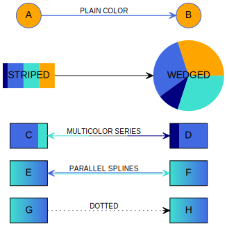

<p align="center">
  
</p>

------

**GiGraph DOT** is a solution for generating graphs in the <a href="https://en.wikipedia.org/wiki/DOT_(graph_description_language)" target="_blank">DOT language</a>. The output generated by this library is a textual script that may be visualized and/or converted to an image with the help of external tools. A handy one is for instance a plugin for <a href="https://code.visualstudio.com" target="_blank">Visual Studio Code</a>, named <a href="https://marketplace.visualstudio.com/items?itemName=EFanZh.graphviz-preview" target="_blank">Graphviz Preview</a> (you will need to install <a href="https://www.graphviz.org/download" target="_blank">Graphviz</a> as well). There are also online tools like <a href="http://www.webgraphviz.com" target="_blank">WebGraphviz</a>, where you may paste the generated script to view your graph.

For the complete documentation of the DOT language, and the visualization capabilities of the available software, please go to <a href="https://graphviz.gitlab.io/documentation" target="_blank">Graphviz - Graph Vizualization Software</a>.


**Built with** <a href="https://docs.microsoft.com/en-US/dotnet/standard/net-standard#net-implementation-support" target="_blank">.NET Standard 2.0</a> (compatible with *.NET Core 2.0* and above, *.NET Framework 4.6.1* and above).

**Available on NuGet**: [](https://www.nuget.org/packages/GiGraph.Dot/)


**Special thanks** to <a href="https://www.jetbrains.com/?from=GiGraphDot" target="_blank">JetBrains</a> for providing me free of charge with their fantastic Rider IDE and tools!


<p align="center">
  
</p>


# Generating a graph

For a basic case, create a new **DotGraph** instance, and just add an edge to its *Edges* collection, or a node to its *Nodes* collection. To generate the output DOT script, call the ***Build*** extension method on the graph.

Here's a simple *Hello World!* graph example with two nodes joined by an edge.

```c#
using GiGraph.Dot.Entities.Graphs;
using GiGraph.Dot.Extensions; // Build(), SaveToFile()
using System;

namespace GiGraph.Dot.Examples
{
    internal class Program
    {
        private static void Main(string[] args)
        {
            // create a new graph (directed or undirected)
            var graph = new DotGraph(isDirected: true);
            
            // add an edge that joins the two specified nodes
            // (you don't have to add the nodes to the node collection of the graph
            // unless you need to specify some attributes for them)
            graph.Edges.Add("Hello", "World!");

            // write it to console as string
            Console.WriteLine(graph.Build());
            
            // or save it to a file (.gv and .dot are the default extensions)
            graph.SaveToFile("example.gv");
        }
    }
}
```

Here's what you get on the console and in the file:


Here's how the script is visualized:

<p align="center">
  
</p>
And here's an example of an undirected version of the same graph:

```c#
var graph = new DotGraph(isDirected: false);
```


<p align="center">
  
</p>


## Customizing styles

Graph nodes and edges may by styled globally, locally, and individually.

- To set their attributes globally, for the whole graph, use *NodeDefaults* and *EdgeDefaults* on the graph instance.
- To set them locally, for a group of nodes and edges, use a subgraph or a cluster, and set above properties on the subgraph/cluster instance (see the [subgraph](#subgraph) and the [cluster](#cluster) sections to learn when to use which).
- To set them individually, use the *Attributes* property on the edge and/or node instances directly.

Apart from those, the graph itself, and a cluster, also have their own collections of attributes that you may set. These are for instance background color, style, label, etc.

The example below presents how individual elements may be styled. At the beginning, the global node shape is set to rectangular, and the style to filled, so that the fill color may be set. The example nodes have set plain color fill, striped/wedged fill (with custom stripe/wedge proportions), gradient fill, or dual color fill with proportions. Edges, on the other hand, have the 'vee' shape set globally, and custom styles set individually: plain color, multicolor series or splines, and a dotted style.


<p align="center">
  
</p>


*In the example, groups of elements are embedded in subgraphs only to control the order they are visualized (for clarity). In one case, a subgraph is used as an example of setting style locally, for a group of elements.*


```c#
using System;
using System.Drawing;
using GiGraph.Dot.Entities.Attributes.Enums;
using GiGraph.Dot.Entities.Graphs;
using GiGraph.Dot.Entities.Types.Colors;
using GiGraph.Dot.Extensions; // Build(), SaveToFile()

namespace GiGraph.Dot.Examples
{
    internal class Program
    {
        private static void Main(string[] args)
        {
            var graph = new DotGraph(isDirected: true);

            // set left to right layout direction of the graph using graph attributes
            graph.Attributes.LayoutDirection = DotRankDirection.LeftToRight;
            graph.Attributes.FontName = "Helvetica";

            // set the defaults for all nodes of the graph
            graph.NodeDefaults.Shape = DotNodeShape.Rectangle;
            graph.NodeDefaults.Style = DotStyle.Filled;
            graph.NodeDefaults.FontName = graph.Attributes.FontName;
            graph.NodeDefaults.FillColor = new DotGradientColor(Color.Turquoise, Color.RoyalBlue);

            // set the defaults for all edges of the graph
            graph.EdgeDefaults.ArrowHead = graph.EdgeDefaults.ArrowTail = DotArrowheadShape.Vee;
            graph.EdgeDefaults.FontName = graph.Attributes.FontName;
            graph.EdgeDefaults.FontSize = 10;


            // -- (subgraphs are used here only to control the order the elements are visualized, and may be removed) --

            graph.Subgraphs.Add(sg =>
            {
                // a dotted edge
                sg.Edges.Add("G", "H", edge =>
                {
                    edge.Attributes.Label = "DOTTED";
                    edge.Attributes.Style = DotStyle.Dotted;
                });
            });

            graph.Subgraphs.Add(sg =>
            {
                // edges rendered as parallel splines
                sg.Edges.Add("E", "F", edge =>
                {
                    edge.Attributes.Label = "PARALLEL SPLINES";
                    edge.Attributes.ArrowDirection = DotArrowDirection.Both;

                    // this will render two parallel splines (but more of them may be added by adding further colors)
                    edge.Attributes.Color = new DotMultiColor(Color.Turquoise, Color.RoyalBlue);
                });
            });

            graph.Subgraphs.Add(sg =>
            {
                // nodes with dual color fill; fill proportions specified by the weight parameter
                sg.Nodes.Add("C").Attributes.FillColor = new DotDualColor(Color.RoyalBlue, Color.Turquoise, weight2: 0.25);
                sg.Nodes.Add("D").Attributes.FillColor = new DotDualColor(Color.Navy, Color.RoyalBlue, weight1: 0.25);

                sg.Edges.Add("C", "D", edge =>
                {
                    edge.Attributes.Label = "MULTICOLOR SERIES";
                    edge.Attributes.ArrowDirection = DotArrowDirection.Both;

                    // this will render a multicolor edge, where each color may optionally have an area proportion determined by the weight parameter
                    edge.Attributes.Color = new DotMultiColor(
                        new DotWeightedColor(Color.Turquoise, 0.33),
                        new DotWeightedColor(Color.Gray, 0.33),
                        Color.Navy);
                });
            });

            graph.Subgraphs.Add(sg =>
            {
                // a rectangular node with a striped fill
                sg.Nodes.Add("STRIPED", attrs =>
                {
                    // set style to striped
                    attrs.Style = DotStyle.Filled | DotStyle.Striped;

                    attrs.Color = Color.Transparent;

                    // set the colors of individual stripes and their proportions
                    attrs.FillColor = new DotMultiColor(
                        new DotWeightedColor(Color.Navy, 0.1),
                        Color.RoyalBlue,
                        Color.Turquoise,
                        Color.Orange);
                });

                // a circular node with a wedged fill
                sg.Nodes.Add("WEDGED", attrs =>
                {
                    attrs.Shape = DotNodeShape.Circle;

                    // set wedged style
                    attrs.Style = DotStyle.Filled | DotStyle.Wedged;

                    attrs.Color = Color.Transparent;

                    // set the colors of individual wedges and their proportions
                    attrs.FillColor = new DotMultiColor(
                        Color.Orange,
                        Color.RoyalBlue,
                        new DotWeightedColor(Color.Navy, 0.1),
                        Color.Turquoise);
                });

                sg.Edges.Add("STRIPED", "WEDGED");
            });

            // a subgraph example – to override the default attributes for a group of nodes and/or edges
            graph.Subgraphs.Add(sg =>
            {
                sg.NodeDefaults.Color = Color.RoyalBlue;
                sg.NodeDefaults.FillColor = Color.Orange;
                sg.NodeDefaults.Shape = DotNodeShape.Circle;

                sg.EdgeDefaults.Color = Color.RoyalBlue;

                sg.Edges.Add("A", "B").Attributes.Label = "PLAIN COLOR";
            });

            // build a graph as string
            Console.WriteLine(graph.Build());

            // or save it to a file (.gv and .dot are the default extensions)
            graph.SaveToFile("example.gv");
        }
    }
}
```


## Grouping nodes visually

In order to group nodes visually by displaying them in a rectangle, embed them in a [cluster](#cluster). Below is an example where two clusters are used to group several nodes.

<p align="center">
  
</p>

And here's the code to generate it:

```c#
using System;
using System.Drawing;
using GiGraph.Dot.Entities.Attributes.Enums;
using GiGraph.Dot.Entities.Graphs;
using GiGraph.Dot.Extensions; // Build(), SaveToFile()

namespace GiGraph.Dot.Examples
{
    internal class Program
    {
        private static void Main(string[] args)
        {
            var graph = new DotGraph(isDirected: true);

            // set graph attributes
            graph.Attributes.Label = "Example Flow";
            graph.Attributes.LayoutDirection = DotRankDirection.LeftToRight;
            graph.Attributes.Compound = true;
            graph.Attributes.EdgeShape = DotEdgeShape.Orthogonal;

            // set individual node styles
            graph.Nodes.Add("Start").Attributes.Shape = DotNodeShape.Circle;
            graph.Nodes.Add("Decision").Attributes.Shape = DotNodeShape.Diamond;
            graph.Nodes.Add("Exit").Attributes.Shape = DotNodeShape.DoubleCircle;


            // --- define edges ---

            graph.Edges.Add("Start", "Decision");

            // (!) Note that CROSS-DIAGRAM EDGES SHOULD BE DEFINED IN THE COMMON PARENT LEVEL GRAPH/SUBGRAPH
            // (which is the root graph in this case)
            graph.Edges.Add("Decision", "Cluster 1 Start", edge =>
            {
                edge.Attributes.Label = "yes";

                // attach the arrow to cluster border
                edge.Attributes.LogicalHeadId = "Flow 1";
            });

            graph.Edges.Add("Decision", "Cluster 2 Start", edge =>
            {
                edge.Attributes.Label = "no";

                // attach the arrow to cluster border
                edge.Attributes.LogicalHeadId = "Flow 2";
            });

            graph.Edges.Add("Cluster 1 Exit", "Exit").Attributes.LogicalTailId = "Flow 1";
            graph.Edges.Add("Cluster 2 Exit", "Exit").Attributes.LogicalTailId = "Flow 2";


            // --- add clusters ---

            // (!) Note that even though clusters do not require an identifier, when you don't specify it
            // for multiple of them, or specify the same identifier for multiple clusters,
            // they will be treated as one cluster when visualized.

            graph.Clusters.Add(id: "Flow 1", cluster =>
            {
                cluster.Attributes.BackgroundColor = Color.Turquoise;
                cluster.Attributes.Label = "Flow 1";

                cluster.Edges.AddSequence("Cluster 1 Start", "Cluster 1 Node", "Cluster 1 Exit");
            });

            graph.Clusters.Add(id: "Flow 2", cluster =>
            {
                cluster.Attributes.Label = "Flow 2";
                cluster.Attributes.BackgroundColor = Color.Orange;

                cluster.Edges.AddSequence("Cluster 2 Start", "Cluster 2 Node", "Cluster 2 Exit");
            });

            // build a graph as string
            Console.WriteLine(graph.Build());

            // or save it to a file (.gv and .dot are the default extensions)
            graph.SaveToFile("example.gv");
        }
    }
}
```


## Customizing node layout

In order to customize the layout of certain groups of nodes, and/or to [change the style](#customizing-styles) of a group of nodes and/or edges, you may use [subgraphs](#subgraph).

Consider the following graph with no layout customizations applied:

<p align="center">
  
</p>


By using subgraphs with a **rank attribute**, you may change the way individual node groups are visualized:

<p align="center">
  
</p>

The nodes embedded in subgraphs with a rank *DotRank.Same* are visualized in the same rows. The nodes *p* and *t* in the subgraph with a rank *DotRank.Max* are pushed together towards a border. The groups are vertical in these examples because the graph layout direction is left-to-right. When you change it to the default top-to-bottom setting, the groups will be oriented horizontally.

The second example above is generated by the following code. When you remove the lines of code where subgraphs are added, you will get the layout from the first example above.

```c#
using System;
using GiGraph.Dot.Entities.Attributes.Enums;
using GiGraph.Dot.Entities.Graphs;
using GiGraph.Dot.Extensions; // Build(), SaveToFile()

namespace GiGraph.Dot.Examples
{
    internal class Program
    {
        private static void Main(string[] args)
        {
            var graph = new DotGraph(isDirected: false);

            // see also how this attribute affects the layout of the nodes
            graph.Attributes.LayoutDirection = DotRankDirection.LeftToRight;

            graph.Edges.Add("e", "h");
            graph.Edges.Add("g", "k");
            graph.Edges.Add("r", "t");

            graph.Edges.AddOneToMany("a", "b", "c", "d");
            graph.Edges.AddOneToMany("b", "c", "e");
            graph.Edges.AddOneToMany("c", "e", "f");
            graph.Edges.AddOneToMany("d", "f", "g");
            graph.Edges.AddOneToMany("f", "h", "i", "j", "g");
            graph.Edges.AddOneToMany("h", "o", "l");
            graph.Edges.AddOneToMany("i", "l", "m", "j");
            graph.Edges.AddOneToMany("j", "m", "n", "k");
            graph.Edges.AddOneToMany("k", "n", "r");
            graph.Edges.AddOneToMany("l", "o", "m");
            graph.Edges.AddOneToMany("m", "o", "p", "n");
            graph.Edges.AddOneToMany("n", "q", "r");
            graph.Edges.AddOneToMany("o", "s", "p");
            graph.Edges.AddOneToMany("p", "t", "q");
            graph.Edges.AddOneToMany("q", "t", "r");

            // add subgraphs to control the layout of individual node groups
            // (when you remove these lines, you will get the first visualization example)
            graph.Subgraphs.Add(DotRank.Same, "b", "c", "d");
            graph.Subgraphs.Add(DotRank.Same, "e", "f", "g");
            graph.Subgraphs.Add(DotRank.Same, "h", "i", "j", "k");
            graph.Subgraphs.Add(DotRank.Same, "l", "m", "n");
            graph.Subgraphs.Add(DotRank.Same, "q", "r");
            graph.Subgraphs.Add(DotRank.Max, "o", "s", "p");


            // write it to console as string
            Console.WriteLine(graph.Build());

            // or save it to a file (.gv and .dot are the default extensions)
            graph.SaveToFile("example.gv");
        }
    }
}
```

And here's the complete DOT output with subgraphs:

```DOT
graph
{
    rankdir = LR

    {
        rank = same

        b
        c
        d
    }

    {
        rank = same

        e
        f
        g
    }

    {
        rank = same

        h
        i
        j
        k
    }

    {
        rank = same

        l
        m
        n
    }

    {
        rank = same

        q
        r
    }

    {
        rank = max

        o
        s
        p
    }

    e -- h
    g -- k
    r -- t
    a -- { b c d }
    b -- { c e }
    c -- { e f }
    d -- { f g }
    f -- { h i j g }
    h -- { o l }
    i -- { l m j }
    j -- { m n k }
    k -- { n r }
    l -- { o m }
    m -- { o p n }
    n -- { q r }
    o -- { s p }
    p -- { t q }
    q -- { t r }
}
```


# Graph building blocks

There are five basic types that are the building blocks of a graph in this library:

- **DotGraph** – the *root* graph,
- **DotNode** – a node (vertex) of the graph,
- **DotEdge** – an edge that joins two nodes (endpoints),
- **DotSubgraph** – a subgraph that groups nodes together *logically* and allows you to control their layout against other nodes in the graph; may also be used as a collection of nodes to be used as edge endpoints.
- **DotCluster** – a special type of subgraph that groups nodes together *visually* by placing them inside a rectangle.


Auxiliary types:

- **DotNodeGroup** – a group of nodes that share a common list of attributes. Useful when you want to set attributes for multiple nodes at once. It is rendered as a single DOT script statement—a list of nodes followed by a list of attributes if specified.
- **DotEdge<*TTail*, *THead*>** – a custom edge (or a group of edges), where *TTail* and *THead* may either be a single node (**DotEndpoint**) or multiple nodes of a subgraph (**DotEndpointGroup**).
- **DotEdgeSequence** – a sequence of edges composed of **DotEndpoint** and/or **DotEndpointGroup** instances. Used to join consecutive nodes and/or groups of nodes with one another. All edges in the sequence share a common list of attributes, and are rendered as a single DOT script statement with a list of nodes and/or subgraphs joined by edges, and followed by a list of attributes if specified.
- **DotOneToManyEdgeGroup** – a group of edges that join a single node with nodes of a subgraph (it is actually a descendant of **DotEdge<DotEndpoint, DotEndpointGroup>**).
- **DotManyToOneEdgeGroup** – a group of edges that join nodes of a subgraph with a single node (it is actually a descendant of **DotEdge<DotEndpointGroup, DotEndpoint>**).
- **DotManyToManyEdgeGroup** – a group of edges that join nodes of a subgraph with nodes of another subgraph (it is actually a descendant of **DotEdge<DotEndpointGroup, DotEndpointGroup>**).


There are also attributes based on the type of the value they specify for a given key. There are quite a lot of them, but just to mention a few basic ones:

- **DotStringAttribute** – a string value attribute,

- **DotNodeShapeAttribute** – a node shape attribute,

- **DotColorAttribute** – a color attribute,

- **DotBoolAttribute** – a boolean attribute.


## Graph

Graph is represented by the **DotGraph** class which is the root graph that the output DOT script is based on. There are two types of graphs:

- **directed** (the edges are presented as arrows),
- **undirected** (the edges are presented as lines).

```c#
var graph = new DotGraph(isDirected: false);
```

A graph may also be *strict*. Strict graph forbids the creation of multi-edges. For example, there may be at most one edge with a given tail node and head node in the directed case.

```c#
var graph = new DotGraph(isStrict: true);
```


Graph has its own attributes, which you may set by using its *Attributes* property.

```c#
graph.Attributes.LayoutDirection = DotRankDirection.LeftToRight;
graph.Attributes.BackgroundColor = Color.LightGray;
```


### Default (global) attributes

A graph, a subgraph, and a cluster may have node and edge defaults specified. When you set them, they affect (by the library design) all nodes and/or edges encompassed by the graph, subgraph, or cluster respectively. They may be overridden, however, by attributes set on individual graph elements.

```c#
graph.NodeDefaults.Color = Color.Orange;
```

```c#
graph.EdgeDefaults.Color = Color.Red;
```

```dot
digraph
{
    node [ color = "orange" ]
    edge [ color = "red" ]
}
```

In some cases you will want to restore an attribute of an individual element to its original default value used by the visualization engine. Some attributes support that, and it may be achieved by assigning them an empty value in the DOT script. You may do that by calling the *SetNull* method that has two overloads:

* one requires a DOT key of the attribute to nullify,
* the other requires a lambda expression that points to a property to nullify (recommended).

Consider the following example:

```c#
graph.NodeDefaults.Color = Color.Orange;

graph.Nodes.Add("orange");
graph.Nodes.Add("restored", attrs =>
{
    // nullify the color attribute by specifying its DOT key explicitly
    attrs.SetNull("color");
  
    // or by specifying a lambda expression (recommended)
    attrs.SetNull(a => a.Color);

    // the following won't do the trick because it removes the attribute from the collection, so it won't appear in the output DOT script
    // attrs.Color = null;
});
```


<p align="center">
  
</p>


### Subsections

The root graph, subgraphs, and clusters may contain subsections. A subsection is understood as a group of graph elements and/or global attributes. Sections are rendered in the output script consecutively, so when you set global graph, node and/or edge attributes in the root section or in any subsection, they impact not only the section where they are set, but also the sections that follow it.

*Note that when you want to set global attributes of a specific group of elements, you will probably prefer [subgraphs](subgraph), as they give you more granular control over the elements inside a subgraph, without affecting other graph elements.*

Consider the following example to see how the root section and subsections are rendered in the output DOT script, and how their attributes impact visualization.

```c#
// the root section
graph.Annotation = "the example graph (the root section)";

graph.NodeDefaults.Annotation = "set default node color and style";
graph.NodeDefaults.Color = Color.Orange;
graph.NodeDefaults.Style = DotStyle.Filled;

graph.Edges.Add("foo", "bar");

// the subsections
graph.Subsections.Add(subsection =>
{
    subsection.Annotation = "subsection 1 - override node color";
    subsection.NodeDefaults.Color = Color.Turquoise;
    subsection.Edges.Add("baz", "qux");
});

graph.Subsections.Add(subsection =>
{
    subsection.Annotation = "subsection 2 - set default edge style";
    subsection.EdgeDefaults.Style = DotStyle.Dashed;
    subsection.Edges.Add("quux", "fred");
});
```


<p align="center">
  
</p>


The library always renders elements of a section in the following order:

* global graph attributes,
* global node attributes (*node defaults*),
* global edge attributes (*edge defaults*),
* subgraphs,
* clusters,
* nodes,
* edges.

When necessary, by using subsections you may customize the order graph elements appear in the script (in those cases when the order actually impacts visualization).


## Subgraph

A subgraph, represented by the **DotSubgraph** class, is a collection of nodes constrained with a rank attribute, that determines their layout. Use a subgraph when you want to have more granular control on the **layout** of specific groups of nodes, and/or the **style** of specific groups of nodes and edges.

**Subgraph does not have any border or fill**, as opposed to cluster subgraph, represented by the **DotCluster** class, which supports them.

As mentioned, subgraph supports setting a common style of nodes and edges within it, as well as the layout of the nodes. The layout may be adjusted by using the **rank attribute**. To see an example how it works, jump to the [customizing node layout](#customizing-node-layout) section.

There are several ways you may add a subgraph to a graph, and the code below presents some of them.

```c#
// add a subgraph with any number of nodes
graph.Subgraphs.Add(DotRank.Same, "a", "b", "c");

// you may also create a new instance, and initialize it manually
var subgraph = new DotSubgraph(DotRank.Same);
subgraph.Nodes.Add("d", "e", "f");

// or use a factory method to add nodes more easily
subgraph = DotSubgraph.FromNodes(DotRank.Same, "d", "e", "f");

// style settings are accepted as well for the elements inside
subgraph.NodeDefaults.Shape = DotNodeShape.Box;

graph.Subgraphs.Add(subgraph);
```

A subgraph may also be used as a group of endpoints to facilitate adding multiple edges at once. For details refer to [edge groups](#edge-group) and [edge sequences](#edge-sequence).


## Cluster

A cluster is represented by the **DotCluster** class. It is a special type of subgraph whose appearance may be customized (as opposed to the subgraph represented by the **DotSubgraph** class). If supported, the layout engine used to render a cluster subgraph, will do the layout so that the nodes belonging to the cluster are drawn together, with the entire drawing of the cluster contained within a bounding rectangle. To see an example, go to [grouping nodes visually](#grouping-nodes-visually).

*Note that cluster subgraphs are not part of the DOT language, but solely a syntactic convention adhered to by certain of the layout engines.*

Cluster subgraphs do not support setting custom node layout the way normal subgraphs do, but they do support setting common style of nodes and edges within them.

There are several ways you may add a cluster to a graph, and the code below presents some of them.

```c#
// add a cluster with any number of nodes
graph.Clusters.Add("My cluster 1", "a", "b", "c");

// you may also create a new instance, and initialize it manually
var cluster = new DotCluster("My cluster 2");
cluster.Nodes.Add("d", "e", "f");

// or use a factory method to add nodes more easily
cluster = DotCluster.FromNodes("My cluster 2", "e", "d", "f");

// style settings are accepted as well for the elements inside
cluster.NodeDefaults.Shape = DotNodeShape.Box;

graph.Clusters.Add(cluster);
```


## Node

Nodes are distinguished by their unique **identifiers**. The identifiers are used by edges to refer to a head and a tail node (endpoint) that they join. If you don't specify a **label** attribute for a node, the identifier will also be used as a label by default, when the node is visualized.

A node does not necessarily have to be added to the nodes collection of the graph, subgraph or cluster if you are not going to set its attributes or its layout. As long as it is not an isolated node, which means that any edge uses it as an endpoint, it will be presented on the visualization.

```c#
// add the node to the nodes collection of the graph (or subgraph/cluster)
graph.Nodes.Add("Foo", attrs =>
{
    attrs.Label = "Hello World!";
    attrs.Shape = DotNodeShape.Hexagon;
});
```

The code above is equivalent to:

```c#
var node = new DotNode("Foo");
node.Attributes.Label = "Hello World!";
node.Attributes.Shape = DotNodeShape.Hexagon;

graph.Nodes.Add(node);
```

And renders:


<p align="center">
  
</p>


### Record nodes

The shape of a node is determined by the *Shape* attribute. By default it is a circle with a label, but you may change it to any other shape accepted by the DOT visualization tool. The standard shapes are available under the *DotNodeShape* enumeration, and two of them represent the record shape: *DotNodeShape.Record* and *DotNodeShape.RoundedRecord*. When you use any of these as the *Shape* attribute, you may assign a record label (*DotRecord*) to the node.

A *DotRecord* may be composed of textual fields (*DotRecordTextField*), as well as record fields (*DotRecord*), when you want to embed a record inside a record. A record or a sub-record may also be flipped to change the orientation of its fields. By default sub-records have an orientation opposite to their parent record. The orientation of the root record, on the other hand, is dependent on the layout direction of the graph.

Below is a node record visualization generated by the following script:


<p align="center">
  
</p>

And here is the code to generate it:

```c#
using GiGraph.Dot.Extensions; // ToRecord
...

graph.Nodes.Add("Foo", attrs =>
{
    attrs.Shape = DotNodeShape.Record;
    attrs.Label = new DotRecord("Hello", "World!");
});

// or simply
graph.Nodes.Add("Foo").ToRecord("Hello", "World!");
```


As mentioned, you may also embed a record in another record:


<p align="center">
  
</p>

And here is the code to achieve it:

```c#
using GiGraph.Dot.Extensions; // ToRecord
...

graph.Nodes.Add("Foo").ToRecord("Foo", new DotRecord("Bar", "Baz"), "Qux");
```


Note that *string* is implicitly convertible to *DotRecordTextField*.


#### Customizing edge placement

The fields of record nodes may have a **port** specified as well. The port may have an individual name that you may refer to when defining an edge (see the [edge](#edge) section). This way you may decide which field of the record an edge tail or head is attached to. In the following example the field labeled 'Fred' has a port assigned, named 'port1'. The edge that joins the two nodes refers to that port name to attach the tail to it.

<p align="center">
  
</p>


And the code to generate it:

```c#
graph.Nodes.Add("Bar").ToRecord
(
    $"Foo{Environment.NewLine}Bar",
    new DotRecord
    (
        DotEscapeString.JustifyLeft("Baz"), // the text may be justified
        new DotRecord
        (
            "Garply",
            "Waldo",
            new DotRecordTextField("Fred", portName: "port1")
        ),
        DotEscapeString.JustifyRight("Plugh")
    ),
    "Qux",
    "Quux"
);

graph.Edges.Add("Foo", "Bar", edge =>
{
    edge.Head.Port.Name = "port1";
    edge.Head.Port.CompassPoint = DotCompassPoint.NorthEast;
});
```

Note that you can either use the *Port* property of edge *Tail* and *Head* for setting port parameters as in the example above, or you can use the *TailPort* and *HeadPort* attributes of the edge itself with the same effect.

See also a similar example in the [HTML nodes](#html-nodes) section.


### HTML nodes

Nodes may have an HTML label assigned. This way you can handle more complex node content arrangement and styling scenarios than in a record node for instance. The HTML grammar is Graphviz specific, and is described in the <a href="http://www.graphviz.org/doc/info/shapes.html#html" target="_blank">documentation</a>. In general, tables, text styles, and images are the main valid markups that may be used for an HTML node label.

```c#
using GiGraph.Dot.Extensions; // ToHtml
...

graph.Nodes.Add("Bar").ToHtml
(
    @"<TABLE BORDER=""0"" CELLBORDER=""1"" CELLSPACING=""0"" CELLPADDING=""4"">
        <TR>
            <TD ROWSPAN=""3"">Foo<BR/>Bar</TD>
            <TD COLSPAN=""3"" ALIGN=""LEFT"">Baz</TD>
            <TD ROWSPAN=""3"">Qux</TD>
            <TD ROWSPAN=""3"">Quux</TD>
        </TR>
        <TR>
            <TD>Garply</TD>
            <TD>Waldo</TD>
            <TD PORT=""port1"">Fred</TD>
        </TR>
        <TR>
            <TD COLSPAN=""3"" ALIGN=""RIGHT"">Plugh</TD>
        </TR>
    </TABLE>"
);

// the code above is equivalent to
graph.Nodes.Add("Bar", attrs =>
{
    attrs.Shape = DotNodeShape.Plain;
    attrs.Label = (DotHtmlLabel) @"<TABLE BORDER=""0"" CELLBORDER=""1"" CELLSPACING=""0"" CELLPADDING=""4"">
        ... ommitted ...
        </TABLE>";
});
```

The code above renders:


<p align="center">
  
</p>


#### Customizing edge placement

Similarly to the record node case, you can specify *ports* within the HTML table. As already mentioned, the port may have an individual name that you may refer to when defining an edge (see the [edge](#edge) section). This way you may decide which field of the HTML table an edge tail or head is attached to. In the example above the field labeled 'Fred' has a port assigned, named 'port1', so it can be referred to by its name from an edge. See the following example that extends the code above with an edge.

```c#
...

// add an edge whose head is attached to the port1 port
graph.Edges.Add("Foo", "Bar").Attributes.HeadPort = new DotEndpointPort("port1", DotCompassPoint.NorthEast);

// you can also set the port this way, achieving a slightly different output, but the same visualization
graph.Edges.Add("Foo", "Bar").Head.Port = new DotEndpointPort("port1", DotCompassPoint.NorthEast);
```

And the output generated by the code is similar to:

```dot
digraph
{
    Bar [ label = <<TABLE BORDER="0" CELLBORDER="1" CELLSPACING="0" CELLPADDING="4">
    // ... ommitted ...
    </TABLE>>, shape = plain ]

    // the first method of defining port (as an attribute)
    Foo -> Bar [ headport = "port1:ne" ]
    
    // the second method of defining port (as edge head parameters)
    Foo -> Bar:port1:ne
}
```

<p align="center">
  
</p>

See also a similar example in the [record nodes](#record-nodes) section.


### Node groups

When adding nodes to a graph, subgraph or cluster, you may use a node group that has a shared list of attributes for all the nodes within it. To do it, use one of the overloads of the *Add* method that accepts multiple node identifiers. Note that it is only a shorthand for adding multiple nodes at once (assuming that all of them should have the same attributes or no attributes).

```c#
graph.Nodes.Add
(
    attrs =>
    {
        attrs.Color = Color.Orange;
        attrs.Shape = DotNodeShape.Hexagon;
    },
    "Foo", "Bar", "Baz"
);
```

You may also do it this way:

```c#
var nodeGroup = new DotNodeGroup("Foo", "Bar", "Baz");
nodeGroup.Attributes.Color = Color.Orange;
nodeGroup.Attributes.Shape = DotNodeShape.Hexagon;

graph.Nodes.Add(nodeGroup);
```

And the code renders:


<p align="center">
  
</p>


Note that there is also an ***AddRange*** method available on the node collection, and it differs from the mentioned *Add* overload in that it adds multiple nodes with individual lists of attributes for each. The following script differs, but renders an identical visualization:


The code to generate it:

```c#
graph.Nodes.AddRange
(
    node =>
    {
        node.Attributes.Color = Color.Orange;
        node.Attributes.Shape = DotNodeShape.Hexagon;
    },
    "Foo", "Bar", "Baz"
);
```


## Edge

Edges **join two nodes**: a tail node and a head node (this naming convention is used in the library even though a graph may be undirected, in which case these terms are not relevant). Edges refer to nodes by their identifiers (note that the nodes do not necessarily have to exist in the nodes collection of a graph, subgraph or cluster).

Edges support customizing which side of the node (and/or cell, when record nodes are used) the head and/or tail of the edge is attached to.

```c#
// add an edge that joins a Foo node with a Bar node
graph.Edges.Add("Foo", "Bar", edge =>
{
    edge.Attributes.Label = "Baz";
    edge.Attributes.Color = Color.Blue;

    // the tail and the head of the edge will be attached to the left side of the nodes
    edge.Tail.Port.CompassPoint = DotCompassPoint.West;
    edge.Head.Port.CompassPoint = DotCompassPoint.West;
});
```

<p align="center">
  
</p>


An edge may also be created and added to the collection explicitly:

```c#
// create an edge that joins a Foo node with a Bar node
var edge = new DotEdge("Foo", "Bar");

// optionally set the compass points as in the previous example,
// to change the points on the node where the edge should be attached
edge.Tail.Port.CompassPoint = DotCompassPoint.West;
edge.Head.Port.CompassPoint = DotCompassPoint.West;

// or slightly easier
edge = new DotEdge(
    new DotEndpoint("Foo", DotCompassPoint.North),
    new DotEndpoint("Bar", DotCompassPoint.South));


edge.Attributes.Label = "Baz";
edge.Attributes.Color = Color.Blue;

graph.Edges.Add(edge);
```


### Edge group

Edge groups join a single node with multiple nodes, multiple nodes with a single node, or multiple nodes with multiple nodes. The examples below present each of these use cases. An edge group may be understood as a simpler approach to specifying multiple edges at once, with the same properties for all. You may as well add each of them individually to achieve the same effect.


#### Joining one node with multiple nodes

```c#
graph.Edges.AddOneToMany("Foo", "Bar", "Baz");

// the line above is equivalent to
var edgeGroup = new DotOneToManyEdgeGroup("Foo", "Bar", "Baz");

// and also equivalent to
edgeGroup = new DotOneToManyEdgeGroup(
    new DotEndpoint("Foo"),
    new DotEndpointGroup("Bar", "Baz"));

graph.Edges.Add(edgeGroup);
```


<p align="center">
  
</p>


#### Joining multiple nodes with one node


```c#
graph.Edges.AddManyToOne("Baz", "Foo", "Bar");

// the line above is equivalent to
var edgeGroup = new DotManyToOneEdgeGroup("Baz", "Foo", "Bar");

// and also equivalent to
edgeGroup = new DotManyToOneEdgeGroup(
    new DotEndpointGroup("Foo", "Bar"),
    new DotEndpoint("Baz"));

graph.Edges.Add(edgeGroup);
```


<p align="center">
  
</p>


#### Join multiple nodes with multiple nodes


```c#
graph.Edges.AddManyToMany(
    new DotEndpointGroup("Foo", "Bar"),
    new DotEndpointGroup("Baz", "Qux"));

// the code above is equivalent to
var edgeGroup = new DotManyToManyEdgeGroup(
    new DotEndpointGroup("Foo", "Bar"),
    new DotEndpointGroup("Baz", "Qux"));

graph.Edges.Add(edgeGroup);
```


<p align="center">
  
</p>


#### Group attributes

Each group used in the above examples supports attributes. You may set them either directly on a group instance, or by using a lambda expression passed by an argument of the *AddOneToMany*, *AddManyToOne*, *AddManyToMany* methods, on the *Edges* collection.

```c#
graph.Edges.AddManyToMany(
    new DotEndpointGroup("Foo", "Bar"),
    new DotEndpointGroup("Baz", "Qux"),
    edge =>
    {
        edge.Attributes.Color = Color.Red;
    });
```


<p align="center">
  
</p>


### Edge sequence

An edge sequence lets you join a sequence of consecutive nodes an/or node groups (the latter are represented by subgraphs). Similarly to edge groups, a sequence may be understood as a simpler approach to specifying multiple edges at once, with the same properties for all. You may as well add each of them individually to achieve the same effect.


#### A sequence of consecutive nodes

```c#
var edgeSequence = new DotEdgeSequence("Foo", "Bar", "Baz");
graph.Edges.Add(edgeSequence);

// or simply
graph.Edges.AddSequence("Foo", "Bar", "Baz");
```


<p align="center">
  
</p>


#### A sequence of consecutive nodes and groups of nodes

```c#
var edgeSequence = new DotEdgeSequence(
    new DotEndpoint("Foo"),
    new DotEndpointGroup("Bar", "Baz", "Qux"),
    new DotEndpoint("Quux"));

graph.Edges.Add(edgeSequence);

// or simply
graph.Edges.AddSequence(
    new DotEndpoint("Foo"),
    new DotEndpointGroup("Bar", "Baz", "Qux"),
    new DotEndpoint("Quux"));
```

```dot
digraph
{
    Foo -> { Bar Baz Qux } -> Quux
}
```

<p align="center">
  
</p>


#### Sequence attributes

Sequences support attributes too. You may set them either directly on the attributes collection of a sequence instance, or by using a lambda expression passed by an argument of the *AddSequence* method on the *Edges* collection. Note as well that *DotEndpoint* is implicitly convertible from *string*, whereas *DotEndpointGroup* is implicitly convertible from *string[]*. This might come in handy when you add multiple nodes to the sequence, and need specific initialization of only some of them.

```c#
graph.Edges.AddSequence(
    edge =>
    {
        // set attributes (they affect all edges in the sequence)
        edge.Attributes.Color = Color.Red;
    },
    "Foo",
    new[] { "Bar", "Baz", "Qux" },
    new DotEndpoint("Quux", DotCompassPoint.North));
```

```dot
digraph
{
    Foo -> { Bar Baz Qux } -> Quux:n [ color = red ]
}
```

<p align="center">
  
</p>


### Arrowhead shapes

An edge may have an arrowhead next to its head and/or tail node. By default, in a directed graph, an arrowhead appears only near the head node, but this behavior may be modified by setting the *ArrowDirection* property on an edge, or in the edge defaults on the graph level. By setting this property, you may choose whether the arrowhead appears next to the head node, next to the tail node, on both sides of the edge, or not at all.

The shape of the arrowhead may be [customized](http://www.graphviz.org/doc/info/arrows.html), and there are 42 possible combinations of shapes, based on the set of 11 basic shapes. The combinations include:

- a filled and and open (non-filled) version of a shape,
- side clipping, that leaves only the part to the left or to the right of the edge visible.

What's more, the end of an edge may be composed of multiple arrowheads, each customized independently.

The example code below presents a few possible combinations of arrowheads:

```c#
// an edge with arrowheads on both sides
graph.Edges.Add("Foo", "Bar", edge =>
{
    edge.Attributes.ArrowDirection = DotArrowDirection.Both;

    edge.Attributes.ArrowTail = DotArrowheadShape.Diamond;
    edge.Attributes.ArrowHead = DotArrowheadShape.Crow;
});

// some basic arrowhead combinations 
graph.Edges.Add("Foo", "Bar").Attributes.ArrowHead = DotArrowhead.Empty();
graph.Edges.Add("Foo", "Bar").Attributes.ArrowHead = DotArrowhead.Empty(DotArrowheadParts.Right);
graph.Edges.Add("Foo", "Bar").Attributes.ArrowHead = DotArrowhead.Filled(DotArrowheadParts.Left);

// a composition of multiple arrowheads
graph.Edges.Add("Foo", "Bar").Attributes.ArrowHead = new DotCompositeArrowhead
(
    DotArrowheadShape.Tee,
    DotArrowheadShape.None, // may be used as a separator
    DotArrowhead.Empty(DotArrowheadShape.Diamond, DotArrowheadParts.Left)
);
```

```dot
digraph
{
    Foo -> Bar [ arrowhead = crow, arrowtail = diamond, dir = both ]
    Foo -> Bar [ arrowhead = onormal ]
    Foo -> Bar [ arrowhead = ornormal ]
    Foo -> Bar [ arrowhead = lnormal ]
    Foo -> Bar [ arrowhead = teenoneoldiamond ]
}
```

<p align="center">
  
</p>


## Attribute

Every element of the graph, including the graph itself, may have **attributes**. These are for instance background color, style, node shape, arrow head shape and so on. An attribute is composed of a key and a value. The key is DOT language specific, and the value is dependent on the type of attribute (for example it may be a string, a boolean value, a node shape enumerable, etc.).

Every element supports only attributes that are specific to it. For example arrow head may be specified only for edges, shape may be specified only for nodes, etc. Some of them, on the other hand, are supported by multiple types of elements—for example *label*.

```c#
node.Attributes.Label = "My node label";
node.Attributes.Style = DotStyle.Filled;
node.Attributes.FillColor = DotColorDefinition.Gradient(Color.Red, Color.Blue);
```

```c#
edge.Attributes.Label = "My edge label";
edge.Attributes.Color = Color.Red;
```

You may set attributes as shown above, by assigning a value to a property—this is the easiest way. However, some properties supported by DOT graph visualization tools are not necessarily supported by the library, so they may not be exposed as properties. In such cases you may set them by specifying their key and an appropriately formatted value for it. You have to know exactly what key to use, and what value format is valid for it ([see documentation](https://www.graphviz.org/doc/info/attrs.html)). This approach should be used with care, and the value should always follow the DOT syntax rules. Otherwise the visualization tool you use may be unable to process it correctly.

```c#
// setting the fill color (or any other attribute)
var attribute = new DotStringAttribute("fillcolor", "red:blue");
node.Attributes.Set(attribute);

// you may achieve the same without creating an attribute instance explicitly
node.Attributes.Set("fillcolor", "red:blue");
```

*DotStringAttribute* may be used for any type of property. Its *value* is rendered in the output DOT script exactly the way it is provided (without any further processing like escaping).

If the value type you want to use is supported by the library, but the key you want to set has no property exposed, you may use as well the existing attribute types, that will convert the value to an appropriate output format for you.

```c#
// setting the same fill color
var attribute = new DotColorDefinitionAttribute("fillcolor", DotColorDefinition.Gradient(Color.Red, Color.Blue));
node.Attributes.Set(attribute);

// or without creating an attribute instance explicitly
node.Attributes.Set("fillcolor", DotColorDefinition.Gradient(Color.Red, Color.Blue));
```


### Label parameters

The text assigned to any [escString](http://www.graphviz.org/doc/info/attrs.html#k:escString) type attribute (mainly label) may contain special escape sequences. On graph visualization they are replaced with, for example, the graph identifier, the identifier of the current node, the definition of the current edge etc.

There are two basic ways of formatting text, supported by the library: one of them is string concatenation with predefined escape sequences exposed by the *DotEscapeString* class, and the other is the *DotTextFormatter* class (the *DotEscapeString* class represents the [escString](http://www.graphviz.org/doc/info/attrs.html#k:escString) type of the DOT language).

*Note that the escape sequences provided by the DotEscapeString class should not be used as parameters of the string.Format method or of an interpolated string. The result text will be invalid in such cases.*

#### Label placeholders

Below is an example presenting labels with element-specific escape sequences embedded, replaced with actual element identifiers on graph visualization.

```c#
var graph = new DotGraph("Label formatting");

// use text formatter
graph.Attributes.Label = new DotTextFormatter("Graph title: ")
                        .AppendGraphId() // graph ID escape sequence
                        .ToFormattedText();

// or string concatenation
graph.Attributes.Label = "Graph title: " + DotEscapeString.GraphId;


graph.Nodes.Add("Foo", attrs =>
{
    // use text formatter
    attrs.Label = new DotTextFormatter("Node ")
                 .AppendNodeId() // node ID escape sequence
                 .ToFormattedText();

    // or string concatenation
    attrs.Label = "Node " + DotEscapeString.NodeId;
});


graph.Edges.Add("Foo", "Bar", edge =>
{
    // use text formatter
    edge.Attributes.Label = new DotTextFormatter("From ")
                           .AppendEdgeTailNodeId() // tail node ID escape sequence
                           .Append(" to ")
                           .AppendEdgeHeadNodeId() // head node ID escape sequence
                           .ToFormattedText();

    // or string concatenation
    edge.Attributes.Label = "From " + DotEscapeString.EdgeTailNodeId +
                            " to " + DotEscapeString.EdgeHeadNodeId;
});
```

```dot
digraph "Label formatting"
{
    label = "Graph title: \G"

    Foo [ label = "Node \N" ]

    Foo -> Bar [ label = "From \T to \H" ]
}
```

<p align="center">
  
</p>


#### Label justification

The DOT [escString](http://www.graphviz.org/doc/info/attrs.html#k:escString) type also supports escape sequences that left- or right-justify individual lines of text. They appear in the end of the lines they justify. Below is an example how to format text using them implicitly (by *DotTextFormatter*) or explicitly (by string concatenation).

```c#
graph.Nodes.Add("Foo", attrs =>
{
    attrs.Shape = DotNodeShape.Box;
    attrs.Width = 3;

    // use text formatter
    attrs.Label = new DotTextFormatter()
                 .AppendLine("Centered line")
                 .AppendLineLeftJustified("Left-justified line")
                 .AppendLineRightJustified("Right-justified line")
                 .ToFormattedText();

    // or string concatenation
    attrs.Label = "Centered line" + DotEscapeString.LineBreak +
                  DotEscapeString.JustifyLeft("Left-justified line") +
                  DotEscapeString.JustifyRight("Right-justified line");
});
```

```dot
digraph
{
    Foo [ label = "Centered line\nLeft-justified line\lRight-justified line\r", shape = box, width = 3 ]
}
```

<p align="center">
  
</p>


# Custom output formatting

The DOT generation engine supports setting custom preferences for generating the output. These include **syntax preferences**, and **formatting preferences**. 


## Formatting preferences

Formatting preferences may be modified using the **DotFormattingOptions** class. If you want to change the indentation level, the indentation character, set a custom line break character/sequence, or generate the output as a single line, pass a customized formatting options instance to the **Build** or **SaveToFile** method on a graph instance.

```c#
...
using GiGraph.Dot.Output.Options;

...

var options = new DotFormattingOptions()
{
    SingleLine = true
};

Console.WriteLine(graph.Build(options));

graph.SaveToFile("example.gv", options);
```

The hello world example from the [earlier chapter](#generating-a-graph) of the text, would render like this:

```dot
digraph { Hello -> "World!" }
```


## Syntax preferences

Syntax preferences, on the other hand, may be modified using the **DotGenerationOptions** class. You may, for example, force statement delimiters (*;*) at the end of lines, or require identifiers to be quoted, even when it is not required.

```c#
...
using GiGraph.Dot.Output.Options;

...

var options = DotGenerationOptions.Custom(o =>
{
    o.PreferQuotedIdentifiers = true;
    o.PreferStatementDelimiter = true;

    o.Attributes.PreferQuotedValue = true;
});

Console.WriteLine(graph.Build(generationOptions: options));

graph.SaveToFile("example.gv", generationOptions: options);
```

An example graph output based on the code above would be: 

```dot
digraph
{
    "Node1" [ shape = "box" ];

    "Hello" -> "World!";
}
```

And the same graph output without any custom preferences specified would be:

```dot
digraph
{
    Node1 [ shape = box ]

    Hello -> "World!"
}
```


### Sorting elements of the DOT script

Using mentioned **DotGenerationOptions** and its *OrderElements* property you may enable sorting elements of the output script alphabetically. This comes in handy when the graph is built based on input elements the order of which changes each time you generate the graph. Sometimes you need to compare the output to its other versions, and in such cases you want to see only the actual differences, not the lines that only moved from one place of the file to another, without actually changing. When you enable this setting, all attribute lists, the lists of edges, nodes, subgraphs, and clusters, will always be ordered alphabetically. This way you should get more consistent outputs on every build.

*Have in mind, however, that even though this feature does not affect the structure of the graph, it may affect the locations of some elements when the graph is visualized—but most probably it doesn't matter in the described case.*


# Script annotation

You can use script annotation (comments) by simply assigning text to the *Annotation* property of graph elements and collections. See an example code below.

```c#
graph.Annotation = "Graph comment";
graph.Nodes.Add("Foo").Annotation = "The Foo node comment";
graph.Edges.Add("Foo", "Bar").Annotation = "The Foo-Bar edge comment";
```

```dot
// Graph comment
digraph
{
    // The Foo node comment
    Foo

    // The Foo-Bar edge comment
    Foo -> Bar
}
```

