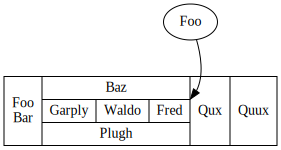
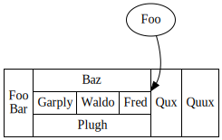

<p align="center">
  
</p>

------

**GiGraph DOT** is a solution for generating graphs or diagrams in the <a href="https://en.wikipedia.org/wiki/DOT_(graph_description_language)" target="_blank">DOT language</a>. The output generated by this library is a textual script that may be visualized and/or converted to an image using the <a href="https://www.graphviz.org/download" target="_blank">Graphviz</a> software. There are handy visualization tools like <a href="https://marketplace.visualstudio.com/items?itemName=EFanZh.graphviz-preview" target="_blank">Graphviz Preview</a> for <a href="https://code.visualstudio.com" target="_blank">Visual Studio Code</a> (you will need to install <a href="https://www.graphviz.org/download" target="_blank">Graphviz</a> as well) or online tools like <a href="http://viz-js.com" target="_blank">Viz.js</a> or <a href="http://magjac.com/graphviz-visual-editor" target="_blank">Graphviz Visual Editor</a> where you paste the generated script to view your graph.

For a complete documentation of the DOT language and visualization capabilities of available software, please refer to <a href="https://graphviz.gitlab.io/documentation" target="_blank">Graphviz - Graph Visualization Software</a>.


**Available on NuGet**: [](https://www.nuget.org/packages/GiGraph.Dot/)

**Built with** <a href="https://docs.microsoft.com/en-US/dotnet/standard/net-standard#net-implementation-support" target="_blank">.NET Standard 2.0</a> (compatible with *.NET Core 2.0* and above, *.NET Framework 4.6.1* and above).


**Special thanks** to <a href="https://www.jetbrains.com/?from=GiGraphDot" target="_blank">JetBrains</a> for providing me free of charge with their fantastic Rider IDE and tools!


<p align="center">
  
</p>


**‼️ If you have any suggestions or comments, feel free to create an issue. ‼️**


# Table of contents

- [Generating a graph](#generating-a-graph)
- [Graph building blocks](#graph-building-blocks)
  * [Graph](#graph)
  * [Attributes](#attributes)
    + [Global attributes](#global-attributes)
    + [Label justification and styling](#label-justification-and-styling)
      - [Label justification](#label-justification)
      - [Label placeholders](#label-placeholders)
      - [HTML-styled label](#html-styled-label)
  * [Nodes](#nodes)
    + [Record nodes](#record-nodes)
      - [Sub-records](#sub-records)
      - [Record builder](#record-builder)
      - [Customizing edge placement](#customizing-edge-placement)
    + [HTML-styled nodes](#html-styled-nodes)
      - [Customizing edge placement](#customizing-edge-placement-1)
    + [Node groups](#node-groups)
  * [Edges](#edges)
    + [Edge placement](#edge-placement)
    + [Arrowhead shapes](#arrowhead-shapes)
    + [Multicolor and multiline edges](#multicolor-and-multiline-edges)
    + [Endpoint groups](#endpoint-groups)
      - [Joining one node to multiple nodes](#joining-one-node-to-multiple-nodes)
      - [Joining multiple nodes to one node](#joining-multiple-nodes-to-one-node)
      - [Joining multiple nodes to multiple nodes](#joining-multiple-nodes-to-multiple-nodes)
      - [Endpoint group attributes](#endpoint-group-attributes)
    + [Edge sequences](#edge-sequences)
      - [A sequence of consecutive nodes](#a-sequence-of-consecutive-nodes)
      - [A sequence of consecutive nodes and groups of nodes](#a-sequence-of-consecutive-nodes-and-groups-of-nodes)
      - [Sequence attributes](#sequence-attributes)
  * [Subgraphs](#subgraphs)
  * [Clusters](#clusters)
    + [Clusters as endpoints](#clusters-as-endpoints)
- [Examples](#examples)
  * [Customizing styles](#customizing-styles)
  * [Grouping nodes visually](#grouping-nodes-visually)
  * [Customizing node layout](#customizing-node-layout)
- [Script preferences](#script-preferences)
  * [Formatting preferences](#formatting-preferences)
  * [Syntax preferences](#syntax-preferences)
    + [Sorting elements](#sorting-elements)
- [Script subsections](#script-subsections)
- [Script annotation](#script-annotation)


# Generating a graph

For a basic scenario, create a new **DotGraph** instance and use its *Edges* collection to define connections between nodes. In order to generate the output DOT script, call the ***Build*** extension method on the graph. And that's mostly it.

Here's a simple *Hello World!* graph example with two nodes joined by an edge.

```c#
using System;
using GiGraph.Dot.Entities.Graphs;
using GiGraph.Dot.Extensions;

// create a new graph (directed/undirected)
var graph = new DotGraph(directed: true);

// add an edge that joins two nodes: 'Hello' and 'World!'
graph.Edges.Add("Hello", "World!");

// build the output script
Console.WriteLine(graph.Build());

// (.gv and .dot are the default extensions)
graph.SaveToFile("example.gv");
```

Here's what you get on the console and in the file:


Here's how the script is visualized:

<p align="center">
  
</p>
And here's an example of an undirected version of the same graph:

```c#
var graph = new DotGraph(directed: false);
...
```


<p align="center">
  
</p>


# Graph building blocks


## Graph

The graph is represented by the **DotGraph** class. There are two types of graphs:

- **directed** (the edges are presented as arrows),
- **undirected** (the edges are presented as lines).

```c#
var graph = new DotGraph(directed: false);
```

A graph may also be *strict*. Strict graph forbids the creation of multi-edges. For example, there may be at most one edge with a given tail node and head node in the directed case.

```c#
var graph = new DotGraph(strict: true);
```


## Attributes

Every element of the graph, including the graph itself, has **attributes**. These are for instance: background color, style, node shape, arrowhead shape, and various others, depending on the context. When an attribute is not specified explicitly, its default value depends on the graph layout engine you use for visualization (see <a href="http://www.graphviz.org/doc/info/attrs.html" target="_blank">Graphviz documentation</a>). That default value is usually stated in the comment of the associated property.

There are over 170 different attributes listed in the <a href="http://www.graphviz.org/doc/info/attrs.html" target="_blank">documentation</a>, that may be set on the graph or on its elements. The library lets you set most of them conveniently by using properties on attribute collections available on the graph and other elements. Below are a few examples of setting attributes on the graph, on a node, and on an edge:

```c#
graph.Label = "My graph";
graph.Layout.Direction = DotLayoutDirection.LeftToRight;
graph.Canvas.BackgroundColor = Color.LightGray;
```


```c#
graph.Nodes.Add("Foo", node =>
{
    node.Label = "My Foo node";
    node.Style.FillStyle = DotNodeFillStyle.Normal;
    node.FillColor = Color.Blue;
});
```


```c#
graph.Edges.Add("Foo", "Bar", edge =>
{
    edge.Label = "My Foo-Bar edge";
    edge.Color = Color.Red;
});
```


In some cases you may come across an attribute that is not exposed as a property, but then you can still provide a key and a value for it manually. Here's an example:

```c#
node.Attributes.Collection.Set("fillcolor", "red:blue");
```

or using an attribute key const available in the *DotAttributeKeys* class:

```c#
node.Attributes.Collection.Set(DotAttributeKeys.FillColor, "red:blue");
```


You can also conveniently use specific types that represent attribute values to not have to care about syntactic details. For instance, the following code renders the same result as the example above:

```c#
node.Attributes.Collection.SetComplex("fillcolor", new DotGradientColor(Color.Red, Color.Blue));
```

And similarly when you want to use an enumeration type:

```c#
node.Attributes.Collection.SetEnum("shape", DotNodeShape.Circle);
```


If there is a case that you want your value to be written **as is** in the output DOT script, use the *SetCustom* method. It's similar to the first approach, but the value you provide doesn't undergo any further processing (normally, if it contains special characters, they have to be escaped so that they are interpreted correctly and don't break syntactic consistency of the output script). In this case, however, you have to take care of following the syntax rules by yourself for the provided value.

```c#
node.Attributes.Collection.SetCustom("fillcolor", "red:blue");
```


❕ Note, however, that when you can't find a property for the Graphviz attribute you would like to set, just use the attribute metadata dictionary on the graph or on any other element that has an attribute collection exposed. The metadata includes, among others, a property path for an associated Graphviz attribute key:

```c#
using GiGraph.Dot.Extensions;

var dict = graph.Attributes.GetMetadataDictionary();

// outputs "Hyperlink.Target"
Console.WriteLine(dict["target"].PropertyPath);
```

You can also do it the other way round:

```c#
using GiGraph.Dot.Extensions;

var meta = graph.Hyperlink.Attributes.GetMetadata(attr => attr.Target);

// outputs "target"
Console.WriteLine(meta.Key);
```


***‼️ If you come across an attribute that is not exposed as a property, and you find it necessary for your use case, please let me know by opening an issue. ‼️***


### Global attributes

Node and edge attributes may be specified on the graph, on the subgraph, or on the cluster level. This way the attributes (by the library design) apply to all elements within that scope, and you don't have to specify them individually, per element. This approach comes in handy when you want to apply certain styling, for instance, to all elements of the graph or subgraph/cluster at once. Attributes may be set directly on individual elements at the same time to override or extend the list of attributes set globally.

```c#
// node attributes on the graph level (they apply to all nodes of the graph)
graph.Nodes.Color = Color.Orange;
```

```c#
// edge attributes on the graph level (they apply to all edges of the graph)
graph.Edges.Color = Color.Red;
```

```dot
digraph
{
    node [ color = "orange" ]
    edge [ color = "red" ]
}
```


There might be cases when you will want to restore some attributes of specific elements to their *default* values used by the visualization engine. It may be achieved for some types of attributes by assigning them a blank value. The library, however, is designed in such a way that it does not render attributes with *null* values assigned to their corresponding properties. But there is a workaround: you can use the *Nullify* method on a collection of attributes, and specify the attribute to nullify either by a lambda expression, or by its key.

Consider the following example:

```c#
// global node color set on the graph level
graph.Nodes.Color = Color.Orange;

// this node will have the globally set color
graph.Nodes.Add("orange");

// this node will have a blank value assigned to the 'color' attribute
graph.Nodes.Add("restored", node =>
{
    // assign null to the attribute by using a lambda expression (recommended)
    node.Attributes.Nullify(a => a.Color);

    // or by specifying its key explicitly
    node.Attributes.Collection.Nullify("color");

    // the following wouldn't do the trick because it removes the attribute from the collection,
    // so it wouldn't appear in the output DOT script at all
    // node.Color = null;
});
```


<p align="center">
  
</p>


### Label justification and styling

Label is a textual attribute you can assign to the root graph and clusters (as a title), to nodes (as the text displayed within them), and to edges (as the text displayed next to them). It may be plain text, formatted text with special placeholders and justified lines, or the Graphviz-specific subset of HTML to style the text or formulate a custom table.


#### Label justification

The lines of text assigned to any *DotLabel* or <a href="http://www.graphviz.org/docs/attr-types/escString" target="_blank">DotEscapeString</a> type attribute may contain special escape sequences that left- or right-justify them. Below is an example how to format text using them implicitly (by the use of the *DotFormattedTextBuilder* class) or explicitly (by string concatenation).

```c#
graph.Nodes.Add("Foo", node =>
{
    node.Shape = DotNodeShape.Box;
    node.Size.Width = 3;

    // use text formatter
    node.Label = new DotFormattedTextBuilder()
        .AppendLine("Centered line")
        .AppendLeftJustifiedLine("Left-justified line")
        .AppendRightJustifiedLine("Right-justified line")
        .Build();

    // or string concatenation
    node.Label = "Centered line" + DotEscapeString.LineBreak +
        DotEscapeString.LeftJustifyLine("Left-justified line") +
        DotEscapeString.RightJustifyLine("Right-justified line");
});
```


<p align="center">
  
</p>


#### Label placeholders

The text assigned to any *DotLabel* or <a href="http://www.graphviz.org/docs/attr-types/escString" target="_blank">DotEscapeString</a> type attribute may contain placeholders. On graph visualization they are replaced with, for example, the graph identifier, the identifier of the current node, the definition of the current edge, etc. You can use them in text by concatenating fragments of the text with predefined placeholders exposed by the *DotEscapeString* class, or choose the *DotFormattedTextBuilder* class to compose the text more intuitively.

Below is an example presenting labels with element-specific escape sequences embedded, replaced with actual element identifiers on graph visualization.

```c#
var graph = new DotGraph("Label formatting");

// formatted text builder
graph.Label = new DotFormattedTextBuilder("Graph title: ")
    .AppendGraphIdPlaceholder()
    .Build();

// the same effect by string concatenation
graph.Label = "Graph title: " + DotEscapeString.GraphIdPlaceholder;


graph.Nodes.Add("Foo", node =>
{
    // formatted text builder
    node.Label = new DotFormattedTextBuilder("Node ")
        .AppendNodeIdPlaceholder()
        .Build();

    // the same effect by string concatenation
    node.Label = "Node " + DotEscapeString.NodeIdPlaceholder;
});


graph.Edges.Add("Foo", "Bar", edge =>
{
    // formatted text builder
    edge.Label = new DotFormattedTextBuilder("From ")
        .AppendTailNodeIdPlaceholder()
        .Append(" to ")
        .AppendHeadNodeIdPlaceholder()
        .Build();

    // the same effect by string concatenation
    edge.Label = "From " + DotEscapeString.TailNodeIdPlaceholder +
        " to " + DotEscapeString.HeadNodeIdPlaceholder;
});
```


<p align="center">
  
</p>


*⚠️ Note that if you prefer using string concatenation to embed mentioned escape sequences in your text, they should not be used as parameters of the string.Format method or of an interpolated string. The result would be treated as string then and the placeholders would just remain in the text when the graph is visualized.*


#### HTML-styled label

When it comes to customizing labels in terms of font, its size, color and style, the basic Graphviz-specific HTML is the only available solution. 

The <a href="http://www.graphviz.org/doc/info/shapes.html#html" target="_blank">Graphviz documentation</a> states that *the features and syntax supported by [...] labels are modeled on HTML. However, there are many aspects that are relevant to Graphviz labels that are not in HTML and, conversely, HTML allows various constructs which are meaningless in Graphviz*. Therefore, only a small subset of HTML elements is supported, with no CSS. The library lets you make use of all of the supported elements conveniently. In general, table, font, font styles, image, and a few other types of elements are valid for use in an HTML label.

For a complete list of supported elements and their attributes, you can study the <a href="http://www.graphviz.org/doc/info/shapes.html#html" target="_blank">documentation</a> and compose an HTML label by yourself, but there is an easier way. The *DotHtmlBuilder* class lets you compose and style a label with the set of HTML elements that Graphviz does support.

Consider the following example. For simplicity, it uses only a narrow subset of methods provided by the builder.

```c#
var graph = new DotGraph();

graph.Nodes.Add("Foo", node =>
{
    node.Shape = DotNodeShape.Rectangle;

    node.Label = new DotHtmlBuilder()
         // appends a <font> element to the builder, with a custom size, color and style
        .AppendStyledFont(new DotStyledFont(DotFontStyles.Bold, 20, Color.RoyalBlue),
            // specifies content of the parent <font> element
            font => font
                // appends any custom HTML
               .AppendHtml("&bull; ")
                // appends plain text and text embedded in another <font> tag with a color specified
               .AppendText("Foo ").AppendText("Bar", new DotFont(Color.Black))
        )
         // appends a <br/> element
        .AppendLine()
         // appends text embedded in the <i> and <u> elements
        .AppendStyledText("Baz", DotFontStyles.Italic | DotFontStyles.Underline)
         // returns a type that may be assigned directly to a label
        .Build();
});
```


<p align="center">
  
</p>

If you prefer to compose the label by yourself, however, type cast your HTML string to *DotHtmlString* or call the *AsHtml()* extension method on that string and assign the result to a label of an element:

```c#
using GiGraph.Dot.Extensions;

graph.Nodes.Add("Foo", node =>
{
    node.Shape = DotNodeShape.Rectangle;
    node.Label = @"<font color=""royalblue"" point-size=""20""><b>&bull; Foo <font color=""black"">Bar</font></b></font><br/><i><u>Baz</u></i>".AsHtml();
});
```


❕ Note that you can HTML-style not only node labels, but also those on the graph, cluster, and edge.


## Nodes

Nodes are identified by their **IDs**. The identifiers are used by edges to refer to them as the endpoints that they join. Node identifier is also used as a label by default if you don't specify its *Label* property explicitly, in which case it is displayed on the node.

A node may be added to the node collection of the root graph, of a subgraph, or of a cluster, but not necessarily. You have to do that when you want to set its attributes or when the node is an isolated node (not used as an endpoint of any edge). When an edge refers to a node that is not present in any node collection, the node will nevertheless appear on the graph, with its default and/or global attributes applied.

```c#
// adding a node to the node collection of the graph
graph.Nodes.Add("Foo", node =>
{
    node.Label = "Hello World!";
    node.Shape = DotNodeShape.Hexagon;
});
```

The code above is equivalent to:

```c#
var node = new DotNode("Foo")
{
    Label = "Hello World!",
    Shape = DotNodeShape.Hexagon
};

graph.Nodes.Add(node);
```

And renders:


<p align="center">
  
</p>


### Record nodes

The shape of a node is determined by the *Shape* attribute. By default it is an ellipse with a label, but you can change it to any other shape accepted by your Graphviz visualization tool. All supported shapes are available under the *DotNodeShape* enumeration, but two of them represent the record shape: *DotNodeShape.Record* and *DotNodeShape.RoundedRecord*. When you use either of these as the *Shape* attribute, you can assign a record (*DotRecord*) to the node's label. In that case the node will be presented in a table-like form.

```c#
using GiGraph.Dot.Extensions;

// for convenience, just use the ToRecordNode or ToRoundedRecordNode extension method on a node
graph.Nodes.Add("Foo").ToRecordNode(new DotRecord("Hello", "World!"));

// or set shape and label explicitly
graph.Nodes.Add("Foo", node =>
{
    node.Shape = DotNodeShape.Record;
    node.Label = new DotRecord("Hello", "World!");
});
```


<p align="center">
  
</p>


#### Sub-records

A *DotRecord* may be composed of textual fields (*DotRecordTextField*), as well as record fields (*DotRecord*), when you want to embed a sub-record inside a record. A record or a sub-record may also be flipped to change the orientation of its fields. By default, sub-records have an orientation opposite to the orientation of their parent record. The orientation of the root record, on the other hand, is dependent on the layout direction of the graph.

```c#
using GiGraph.Dot.Extensions;

// note that string is implicitly converted to DotRecordTextField here for convenience
graph.Nodes.Add("Foo").ToRecordNode(
    new DotRecord("Foo", new DotRecord("Bar", "Baz"), "Qux")
);
```


<p align="center">
  
</p>


#### Record builder

The *DotRecordBuilder* class facilitates building complex record nodes. To get an idea how to use it, consider the following examples that generate the same output script as the [previous one](#sub-records).

```c#
using GiGraph.Dot.Extensions;

var builder = new DotRecordBuilder()
   .AppendField("Foo")
   .AppendSubrecord("Bar", "Baz")
   .AppendField("Qux");

graph.Nodes.Add("Bar").ToRecordNode(builder.Build());
```

```c#
using GiGraph.Dot.Extensions;

graph.Nodes.Add("Bar").ToRecordNode(rb =>
{
    rb.AppendField("Foo")
      .AppendSubrecord("Bar", "Baz")
      .AppendField("Qux");
});
```


❕ Note that record fields support [line justification](#label-justification) and [placeholders](#label-placeholders), and the same *DotRecordBuilder* class handles these too.


#### Customizing edge placement

The fields of record nodes may have a **port** specified as well. The port may have a name that you refer to when defining an edge (see the [edges](#edges) section). This way you can decide which field of the record an edge tail or head is attached to. In the following example the field labeled 'Fred' has a port named 'port1' assigned. The edge that joins the two nodes refers to that port to attach the tail to it. See the code below for details.

<p align="center">
  
</p>


```c#
graph.Nodes.Add("Baz").ToRecordNode(rb1 => rb1
   .AppendField($"Foo{Environment.NewLine}Bar")
   .AppendSubrecord(rb2 => rb2
       .AppendField(tf => tf.AppendLeftJustifiedLine("Baz"))
       .AppendSubrecord(rb3 => rb3
           .AppendFields("Garply", "Waldo")
           .AppendField("Fred", "port1")
        )
       .AppendField(tf => tf.AppendRightJustifiedLine("Plugh"))
    )
   .AppendFields("Qux", "Quux")
);

graph.Edges.Add("Foo", "Bar", edge =>
{
    edge.Head.Endpoint.Port = new DotEndpointPort("port1", DotCompassPoint.NorthEast);
});
```


❕ Note that you can use either the *Port* property of an edge's *Tail.Endpoint* or *Head.Endpoint* for setting port parameters as in the example above, or the *Tail.Port* and *Head.Port* properties which specify the edge's attributes with the same final effect.

See also a similar example in the [HTML-styled nodes](#html-styled-nodes) section.


### HTML-styled nodes

As already indicated in the [HTML-styled label](#html-styled-label) section, nodes, among other elements, may have an HTML label assigned. Thanks to that, you can handle more complex node content arrangement and styling scenarios than in a record node for instance.

The example below presents a node visualized as a table composed using HTML. For simple text styling, however, please refer to the [HTML-styled label](#html-styled-label) section.

```c#
var graph = new DotGraph();

var table = new DotHtmlTable
{
    BorderWidth = 0,
    CellBorderWidth = 1,
    CellSpacing = 0,
    CellPadding = 4
};

table.AddRow(row =>
{
    row.AddCell($"Foo{Environment.NewLine}Bar", cell => cell.RowSpan = 3);

    row.AddCell(
        "Baz",
        cell =>
        {
            cell.ColumnSpan = 3;
            cell.HorizontalAlignment = DotHtmlTableCellHorizontalAlignment.Left;
        }
    );

    row.AddCell("Qux", cell => cell.RowSpan = 3);
    row.AddCell("Quux", cell => cell.RowSpan = 3);
});

table.AddRow(row =>
{
    row.AddCell("Garply");
    row.AddCell("Waldo");
    row.AddCell(
        "Fred",
        new DotStyledFont(DotFontStyles.Bold | DotFontStyles.Italic, Color.RoyalBlue),
        cell => cell.PortName = "port1"
    );
});

table.AddRow(row =>
    row.AddCell(
        "Plugh",
        cell =>
        {
            cell.ColumnSpan = 3;
            cell.HorizontalAlignment = DotHtmlTableCellHorizontalAlignment.Right;
        }
    )
);

// sets a borderless (plain) shape of the node so that the HTML table fully determines the shape
graph.Nodes.Add("Bar").ToHtmlTableNode(table);
```

The code above renders:


<p align="center">
  
</p>


An identical result may be achieved by composing the HTML table directly, as text, if this is the preferred approach:

```c#
using GiGraph.Dot.Extensions;

// the ToPlainHtmlNode extension method sets a borderless (plain) shape of the node so that the HTML table fully determines the shape
graph.Nodes.Add("Bar").ToPlainHtmlNode
(
    @"<table border=""0"" cellborder=""1"" cellspacing=""0"" cellpadding=""4"">
        <tr>
            <td rowspan=""3"">Foo<br/>Bar</td>
            <td colspan=""3"" align=""left"">Baz</td>
            <td rowspan=""3"">Qux</td>
            <td rowspan=""3"">Quux</td>
        </tr>
        <tr>
            <td>Garply</td>
            <td>Waldo</td>
            <td port=""port1""><font color=""royalblue""><b><i>Fred</i></b></font></td>
        </tr>
        <tr>
            <td colspan=""3"" align=""right"">Plugh</td>
        </tr>
    </table>"
);
```


#### Customizing edge placement

Similarly to the record node case, you can specify *ports* within the HTML table. As already mentioned, the port may have an individual name that you refer to when defining an edge (see the [edge](#edges) section). This way you can decide which field of the HTML table an edge tail or head is attached to. In the example above, the table field labeled 'Fred' has a port named 'port1' assigned, so it can be referred to by its name from an edge. See the following example that extends the code above with an edge.

```c#
// (here should be the code from the previous example)

// add an edge and specify a port attribute for its endpoint to attach it to the cell with that port assigned
graph.Edges.Add("Foo", "Bar").Head.Port = new DotEndpointPort("port1", DotCompassPoint.NorthEast);

// alternatively you can set the port directly on the endpoint
graph.Edges.Add("Foo", "Bar").Head.Endpoint.Port = new DotEndpointPort("port1", DotCompassPoint.NorthEast);
```


<p align="center">
  
</p>


### Node groups

When adding nodes to a graph, subgraph, or cluster, you can use a node group, which has a shared list of attributes for all the nodes within it. To do it, use one of the overloads of the *AddGroup* method on a node collection. This way you can generate a more concise output script if that's necessary (otherwise you can just add nodes in the standard way, one by one).

```c#
graph.Nodes.AddGroup
(
    nodeGroup =>
    {
        nodeGroup.Color = Color.Orange;
        nodeGroup.Shape = DotNodeShape.Hexagon;
    },
    "Foo", "Bar", "Baz"
);
```

You can also do it this way:

```c#
var nodeGroup = new DotNodeGroup("Foo", "Bar", "Baz");
nodeGroup.Color = Color.Orange;
nodeGroup.Shape = DotNodeShape.Hexagon;

graph.Nodes.Add(nodeGroup);
```

And the code renders:


<p align="center">
  
</p>


Note that there is also an ***AddRange*** method available on the node collection, and it differs from the mentioned *AddGroup* one in that it adds nodes with independent lists of attributes for each of them. The following script differs, but renders an identical visualization (because the same attributes are specified for each node in the range):

```c#
graph.Nodes.AddRange
(
    node =>
    {
        node.Color = Color.Orange;
        node.Shape = DotNodeShape.Hexagon;
    },
    "Foo", "Bar", "Baz"
);
```


## Edges

Edges **join two nodes**: a *tail* node and a *head* node (this naming convention is used in the library even though a graph may be undirected, in which case these terms are not relevant). Edges refer to nodes by their identifiers, but note that the nodes do not necessarily have to exist in the node collection of a graph, subgraph or cluster, and they will still be visualized.

```c#
graph.Edges.Add("Foo", "Bar");
```


### Edge placement

Edges support customizing which side of a node (and/or cell, when record or HTML table nodes are used) the head and/or tail of the edge is attached to. This can be done in two ways: either by using the *Port* property on the *Head* or *Tail* of the edge (which sets an edge attribute), or by using a property with the same name on a nested property named *Endpoint* (which sets a property directly on the endpoint). The actual difference is that attributes may be set globally within the scope of a graph, a subgraph or a cluster, so you can choose the first of the described approaches to specify an edge placement once for a given scope (see [global attributes](#global-attributes)).

The code below adds an edge, and specifies which sides of its endpoints it should be attached to.

```c#
graph.Edges.Add("Foo", "Bar", edge =>
{
    edge.Label = "Baz";
    edge.Color = Color.Blue;

    // the tail and the head of the edge will be attached to the left side of the nodes
    edge.Tail.Port = DotCompassPoint.West;
    edge.Head.Port = DotCompassPoint.West;

    // you can alternatively specify the compass points directly on the endpoint (the approach above sets attributes)
    edge.Tail.Endpoint.Port = DotCompassPoint.West;
    edge.Head.Endpoint.Port = DotCompassPoint.West;
});
```


<p align="center">
  
</p>


An edge may alternatively be created and added to an edge collection explicitly:

```c#
var edge = new DotEdge("Foo", "Bar");
edge.Tail.Endpoint.Port = DotCompassPoint.West;
edge.Head.Endpoint.Port = DotCompassPoint.West;

// or an alternative approach
edge = new DotEdge(
    new DotEndpoint("Foo", DotCompassPoint.North),
    new DotEndpoint("Bar", DotCompassPoint.South)
);

edge.Label = "Baz";
edge.Color = Color.Blue;

graph.Edges.Add(edge);
```


### Arrowhead shapes

An edge may have an arrowhead next to its head and/or tail node. By default, in a directed graph, an arrowhead appears only near the head node, but this behavior may be modified by setting the *Directions* property on an edge, or globally, in the edge collection's attributes on the graph. By setting this property you can choose whether the arrowhead appears next to the head node, next to the tail node, on both sides of the edge, or not at all.

The shape of the arrowhead may be <a href="http://www.graphviz.org/doc/info/arrows.html" target="_blank">customized</a>, and there are 42 possible combinations of shapes based on the set of 11 basic shapes. The combinations include:

- a filled and an empty version of a shape,
- side clipping that leaves visible only the part to the left or to the right of an edge.

What's more, the end of an edge may be composed of **multiple arrowheads**, each customized independently.

The example code below presents a few possible combinations of arrowheads:

```c#
// an edge with arrowheads on both sides
graph.Edges.Add("Foo", "Bar", edge =>
{
    edge.Directions = DotEdgeDirections.Both;

    edge.Tail.Arrowhead = DotArrowheadShape.Diamond;
    edge.Head.Arrowhead = DotArrowheadShape.Crow;
});

// some basic arrowhead variants 
graph.Edges.Add("Foo", "Bar").Head.Arrowhead = DotArrowhead.Empty();
graph.Edges.Add("Foo", "Bar").Head.Arrowhead = DotArrowhead.Empty(DotArrowheadParts.Right);
graph.Edges.Add("Foo", "Bar").Head.Arrowhead = DotArrowhead.Filled(DotArrowheadParts.Left);

// a composition of multiple arrowheads
graph.Edges.Add("Foo", "Bar").Head.Arrowhead = new DotCompositeArrowhead
(
    DotArrowheadShape.Tee,
    DotArrowheadShape.None, // may be used as a separator
    DotArrowhead.Empty(DotArrowheadShape.Diamond, DotArrowheadParts.Left)
);
```


<p align="center">
  
</p>


### Multicolor and multiline edges

By default, an edge is visualized as a single spline. There are two other variants available, however:

- a single spline with segments in specified colors,
- multiple parallel splines in specified colors.

Consider the following example:

```c#
using GiGraph.Dot.Extensions;

graph.Edges.Add("Foo", "Bar")
   .SetSegmentedStyle(new DotWeightedColor(Color.RoyalBlue, 0.5), Color.Turquoise);

graph.Edges.Add("Foo", "Bar")
   .SetMultilineStyle(Color.RoyalBlue, Color.Turquoise);
```

Note that in the case of multicolor segments, at least one color has to have a weight specified. The weight is interpreted as a length proportion of that segment in relation to other segments. Other colors may be provided without weights, in which case the lengths of their segments are distributed proportionally within the remaining part of an edge.


<p align="center">
  
</p>


### Endpoint groups

And edge joins two endpoints (nodes). However, in some cases you may want to join one endpoint to multiple endpoints or multiple endpoints to multiple endpoints. To achieve that, you can either specify multiple edges that have the same node identifier used as their head or tail endpoint, or simply use an endpoint group as the head and/or tail instead of a single node identifier. Such single edge definition is actually visualized as multiple edges. Note, however, that it has only one list of attributes, so when you set them, they will be applied to all these edges.

There are two types that represent endpoint groups: *DotEndpointGroup* and *DotSubgraphEndpoint*. For basic purposes, they may be used interchangeably, but the former enables you to specify a port for any endpoint in the group, which is not possible when *DotSubgraphEndpoint* is used.


#### Joining one node to multiple nodes

```c#
graph.Edges.AddOneToMany("Foo", "Bar", "Baz");

// the code above is equivalent to
var edge = new DotEdge<DotEndpoint, DotSubgraphEndpoint>(
    new DotEndpoint("Foo"),
    new DotSubgraphEndpoint("Bar", "Baz"));

graph.Edges.Add(edge);
```


<p align="center">
  
</p>


The example above uses the *DotSubgraphEndpoint* to represent a group of endpoints. In the DOT script they are represented by a subgraph. A similar effect may be achieved by using a *DotEndpointGroup*, which is rendered as a comma-separated list of node identifiers. With that approach, it is possible to specify ports for any endpoint in the group.

```c#
graph.Edges.Add(
    new DotEndpoint("Foo"),
    new DotEndpointGroup(
        new DotEndpoint("Bar", DotCompassPoint.NorthWest),
        new DotEndpoint("Baz", DotCompassPoint.NorthEast)
    ));

// the code above is equivalent to
var edge = new DotEdge<DotEndpoint, DotEndpointGroup>(
    "Foo", // converted implicitly to DotEndpoint
    new DotEndpointGroup(
        new DotEndpoint("Bar", DotCompassPoint.NorthWest),
        new DotEndpoint("Baz", DotCompassPoint.NorthEast)
    ));

graph.Edges.Add(edge);
```


<p align="center">
  
</p>


#### Joining multiple nodes to one node


```c#
graph.Edges.AddManyToOne("Baz", "Foo", "Bar");

// the code above is equivalent to
var edge = new DotEdge<DotSubgraphEndpoint, DotEndpoint>(
    new DotSubgraphEndpoint("Foo", "Bar"),
    new DotEndpoint("Baz"));

graph.Edges.Add(edge);
```

```dot
digraph
{
    { Foo Bar } -> Baz
}
```

<p align="center">
  
</p>


#### Joining multiple nodes to multiple nodes


```c#
graph.Edges.AddManyToMany(
    new DotSubgraphEndpoint("Foo", "Bar"),
    new DotSubgraphEndpoint("Baz", "Qux"));

// the code above is equivalent to
var edge = new DotEdge<DotSubgraphEndpoint, DotSubgraphEndpoint>(
    new DotSubgraphEndpoint("Foo", "Bar"),
    new DotSubgraphEndpoint("Baz", "Qux"));

graph.Edges.Add(edge);
```

```dot
digraph
{
    { Foo Bar } -> { Baz Qux }
}
```

<p align="center">
  
</p>


#### Endpoint group attributes

Attributes for an edge definition may be set either directly on its attribute collection, or by using a lambda expression passed by an argument of the *AddOneToMany*, *AddManyToOne*, *AddManyToMany* methods on an *Edges* collection.

```c#
graph.Edges.AddManyToMany(
    new DotSubgraphEndpoint("Foo", "Bar"),
    new DotSubgraphEndpoint("Baz", "Qux"),
    edge =>
    {
        // attributes specified here affect all edges drawn based on this entry
        edge.Color = Color.Red;
    });

// the code above is equivalent to
var edge = new DotEdge<DotSubgraphEndpoint, DotSubgraphEndpoint>(
    new DotSubgraphEndpoint("Foo", "Bar"),
    new DotSubgraphEndpoint("Baz", "Qux"));

edge.Color = Color.Red;

graph.Edges.Add(edge);
```

```dot
digraph
{
    { Foo Bar } -> { Baz Qux } [ color = red ]
}
```

<p align="center">
  
</p>


❕ Note that *DotEndpoint* is implicitly convertible from *string* (for convenience).


### Edge sequences

An edge sequence represented by the *DotEdgeSequence* class lets you define endpoints and/or endpoint groups in such a way that they join one another consecutively. This approach may be used as a simpler way to define a sequence of edges all at once, without the need to specify a separate edge for each connection between consecutive endpoints or endpoint groups. An edge sequence, however, has one list of attributes, so when you set them for the sequence, they will be applied to all edges that join the endpoints of the sequence.


#### A sequence of consecutive nodes

```c#
graph.Edges.AddSequence("Foo", "Bar", "Baz");

// the code above is equivalent to
var edgeSequence = new DotEdgeSequence("Foo", "Bar", "Baz");
graph.Edges.Add(edgeSequence);
```

```dot
digraph
{
    Foo -> Bar -> Baz
}
```

<p align="center">
  
</p>


#### A sequence of consecutive nodes and groups of nodes

```c#
graph.Edges.AddSequence(
    new DotEndpoint("Foo"),
    new DotSubgraphEndpoint("Bar", "Baz", "Qux"),
    new DotEndpoint("Quux"));

// the code above is equivalent to
var edgeSequence = new DotEdgeSequence(
    new DotEndpoint("Foo"),
    new DotSubgraphEndpoint("Bar", "Baz", "Qux"),
    new DotEndpoint("Quux"));

graph.Edges.Add(edgeSequence);
```

```dot
digraph
{
    Foo -> { Bar Baz Qux } -> Quux
}
```

<p align="center">
  
</p>


#### Sequence attributes

Attributes for a sequence may be set either directly on its attribute collection, or by using a lambda expression passed by an argument of the *AddSequence* method on the *Edges* collection of an element.

```c#
graph.Edges.AddSequence
(
    edge =>
    {
        // attributes specified here affect all edges in this sequence
        edge.Color = Color.Red;
    },
    "Foo",
    new DotSubgraphEndpoint("Bar", "Baz", "Qux"),
    new DotEndpoint("Quux", DotCompassPoint.North)
);

// the code above is equivalent to
var edgeSequence = new DotEdgeSequence(
    "Foo",
    new DotSubgraphEndpoint("Bar", "Baz", "Qux"),
    new DotEndpoint("Quux", DotCompassPoint.North));

edgeSequence.Color = Color.Red;

graph.Edges.Add(edgeSequence);
```

```dot
digraph
{
    Foo -> { Bar Baz Qux } -> Quux:n [ color = red ]
}
```

<p align="center">
  
</p>


## Subgraphs

A subgraph, represented by the **DotSubgraph** class, is a collection of nodes you can use when you want to have more granular control on the **style** of the nodes and edges it contains, or on the **layout** of the those nodes (this is valid for the ***dot*** layout engine only).

Note that a **subgraph does not have any border or fill**, as opposed to [cluster subgraph](#clusters) represented by the **DotCluster** class, which does support them.

Subgraph supports applying a common style to nodes and edges within it, as well as controlling the layout of those nodes in relation to the nodes outside it. The style may be customized by setting global node or edge attributes in the subgraph, whereas the layout may be adjusted by specifying a rank on the subgraph. To see an example, jump to the [customizing node layout](#customizing-node-layout) section.

There are several ways you can add a subgraph to a graph, and the code below presents some of them.

```c#
// add a subgraph with a custom content initialization
graph.Subgraphs.Add(DotRank.Same, subgraph =>
{
    subgraph.Nodes.AddRange("a", "b", "c");
});

// or simply (if only nodes are going to be specified)
graph.Subgraphs.AddWithNodes(DotRank.Same, "a", "b", "c");

// you can also create a new instance and initialize it manually
var subgraph = new DotSubgraph(DotRank.Same);
subgraph.Nodes.AddRange("a", "b", "c");

// or use a factory method to add nodes conveniently
subgraph = DotSubgraph.FromNodes(DotRank.Same, "a", "b", "c");

// global style settings are accepted as well for the elements inside
subgraph.Nodes.Shape = DotNodeShape.Box;

graph.Subgraphs.Add(subgraph);
```

```dot
digraph
{
    {
        rank = same

        a
        b
        c
    }
}
```


A subgraph may also be used as a group of endpoints (for details refer to [endpoint groups](#endpoint-groups) and [edge sequences](#edge-sequences)).


## Clusters

A cluster is represented by the **DotCluster** class. It is a special type of [subgraph](#subgraphs), whose appearance may be customized. If supported, the layout engine used to render a cluster subgraph will do the layout so that the nodes belonging to the cluster are drawn together, with the entire drawing of the cluster contained within a bounding rectangle. To see an example, go to [grouping nodes visually](#grouping-nodes-visually).

*⚠️ Note that cluster subgraphs are not part of the DOT language, but solely a syntactic convention adhered to by certain of the layout engines.*

*❕ When using clusters, make sure the visualization mode for clusters on the graph is DotClusterVisualizationMode.Bounded (this is the default value and does not have to be set explicitly).*

There are several ways you can add a cluster to a graph, and the code below presents some of them.

```c#
// add a cluster with custom content initialization
graph.Clusters.Add("My cluster 1", cluster =>
{
    cluster.Nodes.AddRange("a", "b", "c");
});

// or simply (if only nodes are going to be specified)
graph.Clusters.AddWithNodes("My cluster 1", "a", "b", "c");

// you can also create a new instance and initialize it manually
var cluster = new DotCluster("My cluster 1");
cluster.Nodes.AddRange("a", "b", "c");

// or use a factory method to add nodes conveniently
cluster = DotCluster.FromNodes("My cluster 1", "a", "b", "c");

// style settings are accepted as well for the elements inside
cluster.Nodes.Shape = DotNodeShape.Box;

graph.Clusters.Add(cluster);
```

```dot
digraph
{
    subgraph "cluster My cluster 1"
    {
        a
        b
        c
    }
}
```


### Clusters as endpoints

Clusters may be used as endpoints. In such case the edge is clipped to the cluster border instead of being connected to a node inside the cluster. To achieve that, define an edge that joins any node outside the cluster with a node inside the cluster. Then, on the same edge, assign the identifier of that cluster to the *ClusterId* attribute of the endpoint that refers to the node inside the cluster. Also, remember to enable clipping edges to cluster borders by setting the *AllowEdgeClipping* attribute for clusters on the graph. The following example presents the complete idea.

```c#
var graph = new DotGraph();

// required to enable clipping edges to cluster borders
graph.Clusters.AllowEdgeClipping = true;

// specify a cluster and add a node to it
graph.Clusters.Add("Cluster1", cluster =>
{
    cluster.Nodes.Add("Bar");
});

// the edge is defined outside the cluster, and the head endpoint name (Bar) refers to the node inside that cluster
graph.Edges.Add("Foo", "Bar", edge =>
{
    // by referring to the name of the cluster, the edge will be attached to the border of that cluster instead of the Bar node
    edge.Head.ClusterId = "Cluster1";
});
```

```dot
digraph
{
    compound = true

    subgraph "cluster Cluster1"
    {
        Bar
    }

    Foo -> Bar [ lhead = "cluster Cluster1" ]
}
```

<p align="center">
  
</p>


Note that for some layout engines (see *fdp*) cluster ID has to be specified directly as an edge endpoint identifier. To do that, use the *DotClusterEndpoint* class as an endpoint, with an identifier of the cluster to be used as the endpoint. See the example below.

```c#
var graph = new DotGraph();

// (optional if the layout engine is specified externally, e.g. by the command line)
graph.Layout.Engine = DotLayoutEngines.Fdp;

graph.Clusters.Add("Cluster1", cluster =>
{
    cluster.Nodes.Add("Bar");
});

graph.Edges.Add("Foo", new DotClusterEndpoint("Cluster1"));
```

```dot
digraph
{
    layout = fdp

    subgraph "cluster Cluster1"
    {
        Bar
    }

    Foo -> "cluster Cluster1"
}
```


# Examples

This chapter presents examples of styling, grouping nodes in clusters, and customizing graph layout.


## Customizing styles

The example below presents how individual graph elements may be customized. The initial lines of the source code set global node shape to rectangular, and its style to filled, so that a fill color may be applied. The nodes have: plain color fill, striped/wedged fill (with custom stripe/wedge proportions), gradient fill, and also dual color fill with custom area proportions. Edges, on the other hand, have the 'vee' shape set globally, and custom styles set individually: plain color, multicolor series or splines, and a dotted style.


<p align="center">
  
</p>


*❕ In the example below, groups of elements are embedded in subgraphs only to control the order they are visualized (for clarity). One of the subgraphs, however, is actually meaningful, and is used as an example of setting style for a custom group of elements.*


```c#
using System;
using System.Drawing;
using GiGraph.Dot.Entities.Graphs;
using GiGraph.Dot.Extensions;
using GiGraph.Dot.Types.Arrowheads;
using GiGraph.Dot.Types.Colors;
using GiGraph.Dot.Types.Edges;
using GiGraph.Dot.Types.Layout;
using GiGraph.Dot.Types.Nodes;
using GiGraph.Dot.Types.Styling;

var graph = new DotGraph();

// set left to right layout direction of the graph using graph attributes
graph.Layout.Direction = DotLayoutDirection.LeftToRight;
graph.Font.Name = "Helvetica";

// set global node attributes (for all nodes of the graph)
graph.Nodes.Shape = DotNodeShape.Rectangle;
graph.Nodes.Font.Name = graph.Font.Name;
graph.Nodes.SetGradientFill(Color.Turquoise, Color.RoyalBlue);

// set global edge attributes (for all edges of the graph)
graph.Edges.Head.Arrowhead = graph.Edges.Tail.Arrowhead = DotArrowheadShape.Vee;
graph.Edges.Font.Set(graph.Font.Name, 10);


// -- (subgraphs are used here only to control the order the elements are visualized, and may be removed) --

graph.Subgraphs.Add(sg =>
{
    // a dotted edge
    sg.Edges.Add("G", "H", edge =>
    {
        edge.Label = "DOTTED";
        edge.Style.LineStyle = DotLineStyle.Dotted;
    });
});

graph.Subgraphs.Add(sg =>
{
    // edges rendered as parallel splines
    sg.Edges.Add("E", "F", edge =>
    {
        edge.Label = "PARALLEL SPLINES";
        edge.Directions = DotEdgeDirections.Both;

        // this will render two parallel splines (but more of them may be specified)
        edge.SetMultilineStyle(Color.Turquoise, Color.RoyalBlue);
    });
});

graph.Subgraphs.Add(sg =>
{
    // nodes with a dual-color fill; fill proportions specified by the weight properties (this is actually a degenerate linear gradient fill)
    sg.Nodes.Add("C").SetGradientFill(Color.RoyalBlue, new DotWeightedColor(Color.Turquoise, 0.25));
    sg.Nodes.Add("D").SetGradientFill(new DotWeightedColor(Color.Navy, 0.25), Color.RoyalBlue);

    sg.Edges.Add("C", "D", edge =>
    {
        edge.Label = "MULTICOLOR SERIES";
        edge.Directions = DotEdgeDirections.Both;

        // this will render a multicolor edge where each color may optionally have an area proportion determined by the weight parameter
        edge.SetSegmentedStyle(
            new DotWeightedColor(Color.Turquoise, 0.33),
            new DotWeightedColor(Color.Gray, 0.33),
            Color.Navy);
    });
});

graph.Subgraphs.Add(sg =>
{
    // a rectangular node with a striped fill
    sg.Nodes.Add("STRIPED", node =>
    {
        node.Color = Color.Transparent;

        node.SetStripedFill(
            new DotWeightedColor(Color.Navy, 0.1),
            Color.RoyalBlue,
            Color.Turquoise,
            Color.Orange);
    });

    // a circular node with a wedged fill
    sg.Nodes.Add("WEDGED", node =>
    {
        node.Shape = DotNodeShape.Circle;
        node.Color = Color.Transparent;

        node.SetWedgedFill(
            Color.Orange,
            Color.RoyalBlue,
            new DotWeightedColor(Color.Navy, 0.1),
            Color.Turquoise);
    });

    sg.Edges.Add("STRIPED", "WEDGED");
});

// a subgraph example – to override global attributes for a group of nodes and/or edges
graph.Subgraphs.Add(sg =>
{
    sg.Nodes.Color = Color.RoyalBlue;
    sg.Nodes.FillColor = Color.Orange;
    sg.Nodes.Shape = DotNodeShape.Circle;

    sg.Edges.Color = Color.RoyalBlue;

    sg.Edges.Add("A", "B").Label = "PLAIN COLOR";
});

// build and save the script
Console.WriteLine(graph.Build());
graph.SaveToFile("example.gv");
```

```dot
digraph
{
    fontname = Helvetica
    rankdir = LR

    node [ fillcolor = "turquoise:royalblue", fontname = Helvetica, shape = rectangle, style = filled ]
    edge [ arrowhead = vee, arrowtail = vee, fontname = Helvetica, fontsize = 10 ]

    {
        G -> H [ label = DOTTED, style = dotted ]
    }

    {
        E -> F [ color = "turquoise:royalblue", dir = both, label = "PARALLEL SPLINES" ]
    }

    {
        C [ fillcolor = "royalblue:turquoise;0.25", style = filled ]
        D [ fillcolor = "navy;0.25:royalblue", style = filled ]

        C -> D [ color = "turquoise;0.33:gray;0.33:navy", dir = both, label = "MULTICOLOR SERIES" ]
    }

    {
        STRIPED [ color = transparent, fillcolor = "navy;0.1:royalblue:turquoise:orange", style = striped ]
        WEDGED [ color = transparent, fillcolor = "orange:royalblue:navy;0.1:turquoise", shape = circle, style = wedged ]

        STRIPED -> WEDGED
    }

    {
        node [ color = royalblue, fillcolor = orange, shape = circle ]
        edge [ color = royalblue ]

        A -> B [ label = "PLAIN COLOR" ]
    }
}
```


## Grouping nodes visually

In order to group nodes visually by displaying them in a rectangle, embed them in a [cluster](#clusters). Below is an example where two clusters are used to group several nodes. They are also used as logical endpoints in order for edges to be attached to their borders instead of a node inside them.

<p align="center">
  
</p>


Here's the code to generate it:

```c#
using System;
using System.Drawing;
using GiGraph.Dot.Entities.Graphs;
using GiGraph.Dot.Extensions;
using GiGraph.Dot.Types.Edges;
using GiGraph.Dot.Types.Layout;
using GiGraph.Dot.Types.Nodes;

var graph = new DotGraph(directed: true);

// set graph attributes
graph.Label = "Example Flow";
graph.Layout.Direction = DotLayoutDirection.LeftToRight;
graph.EdgeShape = DotEdgeShape.Orthogonal;

graph.Clusters.AllowEdgeClipping = true;

// set individual node styles
graph.Nodes.Add("Start").Shape = DotNodeShape.Circle;
graph.Nodes.Add("Decision").Shape = DotNodeShape.Diamond;
graph.Nodes.Add("Exit").Shape = DotNodeShape.DoubleCircle;


// --- define edges ---

graph.Edges.Add("Start", "Decision");

// (!) Note that CROSS-SUBGRAPH EDGES SHOULD BE DEFINED IN THE COMMON PARENT LEVEL GRAPH/SUBGRAPH
// (which is the root graph in this case)
graph.Edges.Add("Decision", "Cluster 1 Start", edge =>
{
    edge.Label = "yes";

    // attach the arrow to cluster border
    edge.Head.ClusterId = "Flow 1";
});

graph.Edges.Add("Decision", "Cluster 2 Start", edge =>
{
    edge.Label = "no";

    // attach the arrow to cluster border
    edge.Head.ClusterId = "Flow 2";
});

graph.Edges.Add("Cluster 1 Exit", "Exit").Tail.ClusterId = "Flow 1";
graph.Edges.Add("Cluster 2 Exit", "Exit").Tail.ClusterId = "Flow 2";


// --- add clusters ---

// (!) Note that even though clusters do not require an identifier, when you don't specify it
// for multiple of them, or specify the same identifier for multiple clusters,
// they will be treated as one cluster when visualized.

graph.Clusters.Add(id: "Flow 1", cluster =>
{
    cluster.BackgroundColor = Color.Turquoise;
    cluster.Label = "Flow 1";

    cluster.Edges.AddSequence("Cluster 1 Start", "Cluster 1 Node", "Cluster 1 Exit");
});

graph.Clusters.Add(id: "Flow 2", cluster =>
{
    cluster.Label = "Flow 2";
    cluster.BackgroundColor = Color.Orange;

    cluster.Edges.AddSequence("Cluster 2 Start", "Cluster 2 Node", "Cluster 2 Exit");
});

// build and save the script
Console.WriteLine(graph.Build());
graph.SaveToFile("example.gv");
```

```dot
digraph
{
    compound = true
    label = "Example Flow"
    rankdir = LR
    splines = ortho

    subgraph "cluster Flow 1"
    {
        bgcolor = turquoise
        label = "Flow 1"

        "Cluster 1 Start" -> "Cluster 1 Node" -> "Cluster 1 Exit"
    }

    subgraph "cluster Flow 2"
    {
        bgcolor = orange
        label = "Flow 2"

        "Cluster 2 Start" -> "Cluster 2 Node" -> "Cluster 2 Exit"
    }

    Start [ shape = circle ]
    Decision [ shape = diamond ]
    Exit [ shape = doublecircle ]

    Start -> Decision
    Decision -> "Cluster 1 Start" [ label = yes, lhead = "cluster Flow 1" ]
    Decision -> "Cluster 2 Start" [ label = no, lhead = "cluster Flow 2" ]
    "Cluster 1 Exit" -> Exit [ ltail = "cluster Flow 1" ]
    "Cluster 2 Exit" -> Exit [ ltail = "cluster Flow 2" ]
}
```


## Customizing node layout

Graph nodes are distributed within ranks (that is rows or columns, depending on the orientation of the graph). If the ***dot*** layout engine is used, you can customize the layout of groups of nodes by using [subgraphs](#subgraphs).

Consider the following graph with no layout customizations applied:

<p align="center">
  
</p>


As an example, let's place certain groups of nodes in the same ranks (columns in this case). To achieve that, the nodes have to be placed in subgraphs, and each of the subgraphs has to have an adequate **rank** attribute specified. Consider the following example.

<p align="center">
  
</p>


The nodes embedded in subgraphs with the *DotRank.Same* rank constraint are arranged in the same columns. Apart from those, the nodes *o*, *p*, and *t* in a subgraph with a rank *DotRank.Max*, are pushed together towards the rightmost border.

*❕ The ranks are vertical in these examples because the layout direction of the graph is left-to-right. When you change it to the default top-to-bottom orientation, the ranks will be oriented horizontally.*

The example above is generated by the following code. 

```c#
using System;
using GiGraph.Dot.Entities.Graphs;
using GiGraph.Dot.Extensions;
using GiGraph.Dot.Output.Options;
using GiGraph.Dot.Types.Layout;
using GiGraph.Dot.Types.Ranks;

var graph = new DotGraph(directed: false);
graph.Layout.Direction = DotLayoutDirection.LeftToRight;

graph.Edges.Add("e", "h");
graph.Edges.Add("g", "k");
graph.Edges.Add("r", "t");

graph.Edges.AddOneToMany("a", "b", "c", "d");
graph.Edges.AddOneToMany("b", "c", "e");
graph.Edges.AddOneToMany("c", "e", "f");
graph.Edges.AddOneToMany("d", "f", "g");
graph.Edges.AddOneToMany("f", "h", "i", "j", "g");
graph.Edges.AddOneToMany("h", "o", "l");
graph.Edges.AddOneToMany("i", "l", "m", "j");
graph.Edges.AddOneToMany("j", "m", "n", "k");
graph.Edges.AddOneToMany("k", "n", "r");
graph.Edges.AddOneToMany("l", "o", "m");
graph.Edges.AddOneToMany("m", "o", "p", "n");
graph.Edges.AddOneToMany("n", "q", "r");
graph.Edges.AddOneToMany("o", "s", "p");
graph.Edges.AddOneToMany("p", "t", "q");
graph.Edges.AddOneToMany("q", "t", "r");

// place the following groups of nodes in the same ranks
graph.Subgraphs.AddWithNodes(DotRank.Same, "b", "c", "d");
graph.Subgraphs.AddWithNodes(DotRank.Same, "e", "f", "g");
graph.Subgraphs.AddWithNodes(DotRank.Same, "h", "i", "j", "k");
graph.Subgraphs.AddWithNodes(DotRank.Same, "l", "m", "n");
graph.Subgraphs.AddWithNodes(DotRank.Same, "q", "r");

// place the three nodes in the maximum rank (rightmost in this case)
graph.Subgraphs.AddWithNodes(DotRank.Max, "o", "s", "p");


var options = new DotFormattingOptions
{
    Subgraphs = { SingleLine = true }
};

// build and save the script
Console.WriteLine(graph.Build(options));
graph.SaveToFile("example.gv", options);
```

And here's the complete DOT output with subgraphs:

```dot
graph
{
    rankdir = LR

    { rank = same  b c d }
    { rank = same  e f g }
    { rank = same  h i j k }
    { rank = same  l m n }
    { rank = same  q r }
    { rank = max  o s p }

    e -- h
    g -- k
    r -- t
    a -- { b c d }
    b -- { c e }
    c -- { e f }
    d -- { f g }
    f -- { h i j g }
    h -- { o l }
    i -- { l m j }
    j -- { m n k }
    k -- { n r }
    l -- { o m }
    m -- { o p n }
    n -- { q r }
    o -- { s p }
    p -- { t q }
    q -- { t r }
}
```


# Script preferences

The DOT generation engine of the library supports setting custom preferences for generating the output. These include **syntax preferences** and **formatting preferences**.


## Formatting preferences

Formatting preferences may be modified using the **DotFormattingOptions** class. If you want to change the indentation level, the indentation character, set a custom line break character/sequence, or generate the output as a single line, pass a customized formatting options instance to the **Build** or **SaveToFile** method on a graph instance.

```c#
var options = new DotFormattingOptions
{
    IndentationChar = '\t',
    IndentationSize = 1,
    Subgraphs = { SingleLine = true }
};

Console.WriteLine(graph.Build(options));
graph.SaveToFile("example.gv", options);
```

The [hello world](#generating-a-graph) example would be rendered like this after applying the options above:

```dot
digraph { Hello -> "World!" }
```


## Syntax preferences

Syntax preferences, on the other hand, may be modified using the **DotSyntaxOptions** class. You can, for example, force statement delimiters (*;*) at the end of lines or require identifiers to be quoted, even when it is not required.

```c#
var options = new DotSyntaxOptions
{
    PreferQuotedIdentifiers = true,
    PreferStatementDelimiter = true,
    Attributes = { PreferQuotedValue = true }
};

Console.WriteLine(graph.Build(syntaxOptions: options));
graph.SaveToFile("example.gv", syntaxOptions: options);
```

An example graph output based on the code above would be: 

```dot
digraph
{
    "Node1" [ shape = "box" ];

    "Hello" -> "World!";
}
```

And the same graph output without any custom preferences specified would be:

```dot
digraph
{
    Node1 [ shape = box ]

    Hello -> "World!"
}
```


### Sorting elements

Using mentioned **DotSyntaxOptions** and its *SortElements* property you can enable sorting elements of the output script alphabetically. This comes in handy when the graph is built based on input elements the order of which changes each time you generate the graph. Sometimes you may need to compare the output to its previous version, and in such cases you will want to distinguish only the actual semantic differences, not necessarily the lines that only moved from one place of the file to another, without changing semantics. When you enable this setting, all attribute lists, the lists of edges, nodes, subgraphs, and clusters, will always be ordered alphabetically. This way you should get more consistent outputs on every build.

*❕ Have in mind, however, that even though this feature does not affect the structure of the graph, it may affect the layout in some cases, but it won't probably matter for you in the described scenario.*


# Script subsections

By design, the library generates the output DOT script with elements written in the following order:

* global graph attributes,
* global node attributes,
* global edge attributes,
* subgraphs,
* clusters,
* nodes,
* edges.

The DOT grammar, however, lets you place individual elements in the script in any order. It may have an impact on the way the graph is laid out, or what attributes are actually applied to specific elements on visualization.

The subsections, as they are called in the library, are separate groups of elements. They are written consecutively, one section after another, in the order they are added to the collection of subsections on the graph instance level. The elements in each such section, on the other hand, are written in the order mentioned earlier.

⚠️ By using subsections you can split the DOT script into multiple sections, and, for instance, set different global attributes in any of them. Remember, however, that attributes set in one section have an impact on the elements that follow them in the output script. So as long as sections are written consecutively, setting attributes in any of them has an impact not only on the elements in that specific section, but also on elements in the sections that follow it.

*❗️ Note that in most cases you won't probably need to split the DOT script into sections. They give you the flexibility to control the order individual elements or groups of elements are written, but it isn't usually necessary. When you want to specify attributes for specific groups of elements of the graph, you will probably prefer using [subgraphs](#subgraphs), as they give you more granular control over the elements they contain, without affecting others.*

Consider the following example to see how the primary section (on the graph instance level), and subsections, are rendered in the output DOT script, and how their attributes impact graph visualization.

```c#
// the primary section (on the graph instance level)
graph.Annotation = "the example graph (the primary section)";

graph.Nodes.Attributes.Annotation = "set node color and style globally";
graph.Nodes.SetPlainColorFill(Color.Orange);

graph.Edges.Add("foo", "bar");

// the extra sections that will appear next
graph.Subsections.Add(subsection =>
{
    subsection.Annotation = "subsection 1 - override node color";
    subsection.Nodes.Color = Color.Turquoise;
    subsection.Edges.Add("baz", "qux");
});

graph.Subsections.Add(subsection =>
{
    subsection.Annotation = "subsection 2 - set default edge style";
    subsection.Edges.Style.LineStyle = DotLineStyle.Dashed;
    subsection.Edges.Add("quux", "fred");
});
```

```dot
// the example graph (the primary section)
digraph
{
    // set default node color and style
    node [ color = orange, style = filled ]

    foo -> bar

    /* subsection 1 - override node color */

    node [ color = turquoise ]

    baz -> qux

    /* subsection 2 - set default edge style */

    edge [ style = dashed ]

    quux -> fred
}
```

<p align="center">
  
</p>


# Script annotation

You can use script annotation (comments) simply by assigning text to the *Annotation* property of graph elements and collections. See the example code below and the result it renders.

```c#
// graph
graph.Annotation = "graph";
graph.Attributes.Annotation = "graph attributes";
graph.Attributes.SetValue(a => a.Label, "Foo Graph").Annotation = "label";

// node defaults
graph.Nodes.Attributes.Annotation = "global node attributes";
graph.Nodes.Shape = DotNodeShape.Rectangle;

// nodes
graph.Nodes.Annotation = "nodes";
graph.Nodes.Add("foo", node =>
{
    node.Annotation = "node comment";
    node.Attributes.Annotation = "node attributes";
    node.Attributes.SetValue(a => a.Label, "foo").Annotation = "label";
});

// edge defaults
graph.Edges.Attributes.Annotation = "global edge attributes";
graph.Edges.Head.Arrowhead = DotArrowheadShape.Curve;

// edges
graph.Edges.Annotation = "edges";
graph.Edges.Add("foo", "bar", edge =>
{
    edge.Annotation = "edge comment";

    edge.Head.Endpoint.Annotation = "head";
    edge.Tail.Endpoint.Annotation = "tail";

    edge.Attributes.Annotation = "edge attributes";
    edge.Attributes.SetValue(a => a.Color, Color.Red).Annotation = "color";
});

// subsections
graph.Subsections.Add(section =>
{
    section.Annotation = "subsection 1";

    // clusters
    section.Clusters.Annotation = "clusters";
    section.Clusters.Add("cluster 1").Annotation = "cluster";

    // subgraphs
    section.Subgraphs.Annotation = "subgraphs";
    section.Subgraphs.Add().Annotation = "subgraph";
});
```

```dot
// graph
digraph
{
    /* graph attributes */

    // label
    label = "Foo Graph"

    // global node attributes
    node [ shape = rectangle ]

    // global edge attributes
    edge [ arrowhead = curve ]

    /* nodes */

    // node comment
    foo [ /* node attributes */  /* label */ label = foo ]

    /* edges */

    // edge comment
    /* tail */ foo -> /* head */ bar [ /* edge attributes */  /* color */ color = red ]

    /* subsection 1 */

    /* subgraphs */

    // subgraph
    {
    }

    /* clusters */

    // cluster
    subgraph "cluster cluster 1"
    {
    }
}
```